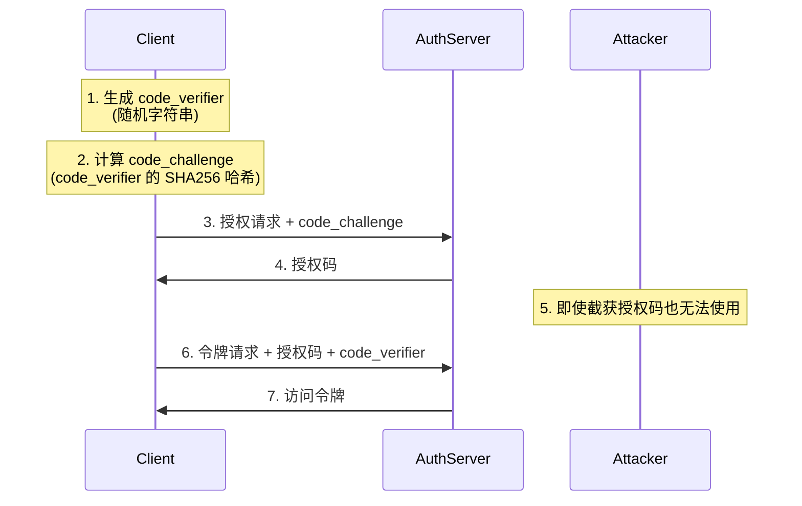

# OAuth2 授权码流程与 PKCE 机制

本文档详细解释了 OAuth2 授权码流程的测试脚本及其中使用的 PKCE 安全机制。

## 一、为什么需要 OAuth2？

相比直接使用用户名/密码认证，OAuth2 提供了以下优势：

### 1. 安全性
- 避免直接将用户凭证传递给第三方应用
- 访问令牌有限的作用域和生命周期
- 可以随时撤销访问权限而不需要更改密码

### 2. 职责分离
- 认证（Authentication）：验证用户身份
- 授权（Authorization）：控制资源访问权限
- 清晰的概念分离有助于系统设计和维护

### 3. 灵活性
- 支持多种认证方式（密码、社交账号、证书等）
- 可以为不同客户端设置不同的权限
- 支持单点登录（SSO）

### 4. 标准化
- 工业标准，有完善的安全考虑
- 大量现成的客户端实现库
- 便于与其他系统集成


### OAuth2 授权抽象流程

```
+--------+                               +---------------+
|        |--(A)- Authorization Request ->|   Resource    |
|        |                              |     Owner     |
|        |<-(B)-- Authorization Grant ---|               |
|        |                              +---------------+
|        |
|        |                              +---------------+
|        |--(C)-- Authorization Grant -->| Authorization |
| Client |                              |     Server    |
|        |<-(D)----- Access Token -------|               |
|        |                              +---------------+
|        |
|        |                              +---------------+
|        |--(E)----- Access Token ------>|    Resource   |
|        |                              |     Server    |
|        |<-(F)--- Protected Resource ---|               |
+--------+                              +---------------+
```

### OAuth2 授权码流程（带 PKCE）

```
+--------+                                          +---------------+
|        |                                         |               |
|        |                                         |     Auth      |
|        |                                         |    Server     |
|        |                                         |               |
|        |<-(A)-- Create Code Verifier            |               |
|        |        & Code Challenge                 |               |
|        |                                         |               |
|        |--(B)-- Authorization Request + Code Challenge --------->|
|        |                                         |               |
|        |<-(C)-- Authorization Code --------------|               |
|        |                                         |               |
|        |                                         |               |
|        |--(D)-- Authorization Code + Code Verifier ------------>|
|        |                                         |               |
|        |<-(E)-- Access Token + Refresh Token ---|               |
|        |                                         |               |
+--------+                                         +---------------+

步骤说明：
A. 客户端创建一个随机的 code_verifier 并计算其 code_challenge
B. 客户端将 code_challenge 连同授权请求发送给授权服务器
C. 授权服务器返回授权码
D. 客户端发送授权码和原始 code_verifier
E. 授权服务器验证 code_verifier，返回访问令牌和刷新令牌
```

这两个流程图展示了：

1. **OAuth2 抽象流程**：
   - 展示了参与方之间的基本交互
   - 包括资源所有者、客户端、授权服务器和资源服务器
   - 显示了从授权请求到访问受保护资源的完整流程

2. **授权码流程（带PKCE）**：
   - 展示了具体的授权码授权类型实现
   - 包含了 PKCE 安全增强机制
   - 详细展示了 code_verifier 和 code_challenge 的使用
   - 显示了完整的令牌交换过程

这些流程图有助于理解：
- OAuth2 的基本参与方和交互过程
- PKCE 如何增强授权码流程的安全性
- 客户端与授权服务器之间的具体交互步骤
- 令牌的获取和使用过程

## 二、授权码流程测试脚本解析

脚本见代码库根目录下的 `src/ffvtraceability-auth-server/scripts/test.sh`。

### 1. PKCE 参数生成
```bash
# 生成 code_verifier (随机字符串)
code_verifier=$(openssl rand -base64 32 | tr -d /=+ | cut -c -43)
echo "🔑 Code Verifier: $code_verifier"

# 生成 code_challenge (base64url-encode(sha256(code_verifier)))
code_challenge=$(printf "%s" "$code_verifier" | openssl sha256 -binary | base64url_encode)
echo "🔒 Code Challenge: $code_challenge"
```

### 2. 用户登录流程
```bash
# 获取登录页面和 CSRF token
csrf_token=$(curl -c cookies.txt -b cookies.txt -s http://localhost:9000/login | 
    sed -n 's/.*name="_csrf" type="hidden" value="\([^"]*\).*/\1/p')

# 执行登录请求
curl -X POST http://localhost:9000/login \
    -c cookies.txt -b cookies.txt \
    -H "Content-Type: application/x-www-form-urlencoded" \
    -d "username=admin" \
    -d "password=admin" \
    -d "_csrf=$encoded_csrf_token"
```

### 3. 授权请求
```bash
auth_page=$(curl -s \
    -c cookies.txt -b cookies.txt \
    "http://localhost:9000/oauth2/authorize?\
client_id=ffv-client&\
response_type=code&\
scope=openid%20read%20write&\
redirect_uri=${encoded_redirect_uri}&\
code_challenge=${code_challenge}&\
code_challenge_method=S256")
```

### 4. 用户授权确认
```bash
if echo "$auth_page" | grep -q "Consent required"; then
    curl -s \
        -c cookies.txt -b cookies.txt \
        "http://localhost:9000/oauth2/authorize" \
        -d "client_id=ffv-client" \
        -d "state=$state" \
        -d "scope=read" \
        -d "scope=write" \
        -d "scope=openid"
fi
```

### 5. 交换访问令牌
```bash
curl -X POST "http://localhost:9000/oauth2/token" \
    -H "Authorization: Basic $(echo -n 'ffv-client:secret' | base64)" \
    -d "grant_type=authorization_code" \
    -d "code=$encoded_auth_code" \
    -d "redirect_uri=$encoded_redirect_uri" \
    -d "code_verifier=$encoded_code_verifier"
```

## 三、PKCE 机制详解

### 1. PKCE 流程图



### 2. PKCE 工作原理

1. **code_verifier 生成**
   - 高熵随机字符串
   - 仅客户端保存
   - 用于后续身份证明

2. **code_challenge 计算**
   - SHA256(code_verifier)
   - Base64URL 编码
   - 单向操作，无法反推

3. **授权请求**
```http
GET /oauth2/authorize
    ?client_id=ffv-client
    &response_type=code
    &code_challenge=E9Melhoa2OwvFrEMTJguCHaoeK1t8URWbuGJSstw-cM
    &code_challenge_method=S256
```

4. **令牌请求**
```http
POST /oauth2/token
Content-Type: application/x-www-form-urlencoded

grant_type=authorization_code
&code=SplxlOBeZQQYbYS6WxSbIA
&code_verifier=dBjftJeZ4CVP-mB92K27uhbUJU1p1r_wW1gFWFOEjXk
```

### 3. 防止授权码拦截的原理

1. **verifier 保密性**
   - 只有原始客户端持有
   - 从不在传输过程中明文传递
   - 攻击者无法获取

2. **密码学保证**
   - challenge 基于单向哈希
   - 无法从 challenge 反推 verifier
   - 确保了 verifier 的唯一性

3. **绑定验证**
   - 服务器存储 challenge
   - 验证 verifier 的哈希值
   - 确保请求来自原始客户端

### 4. 适用场景

特别适合：
- 移动应用
- 单页应用（SPA）
- 无法安全存储客户端密钥的场景

## 四、总结

OAuth2 授权码流程配合 PKCE 机制提供了：
1. 完整的授权流程
2. 防止授权码拦截
3. 适合公共客户端
4. 无需客户端密钥
5. 更高的安全性

这种机制虽然看似复杂，但为现代应用提供了必要的安全保障。测试脚本帮助我们验证整个流程的正确性，确保授权服务器正常运行。
