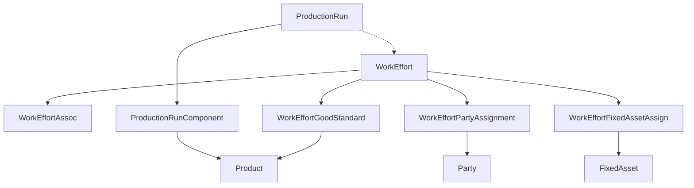
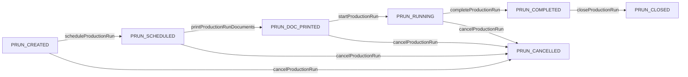
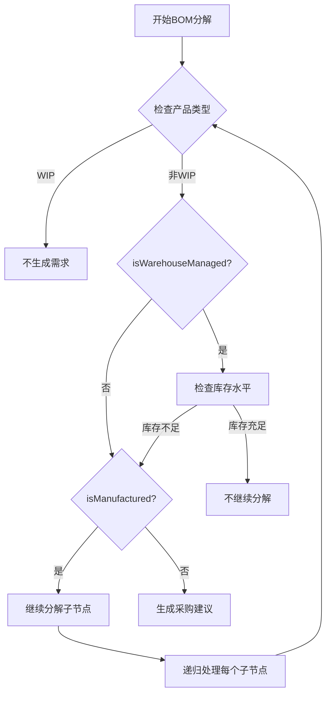
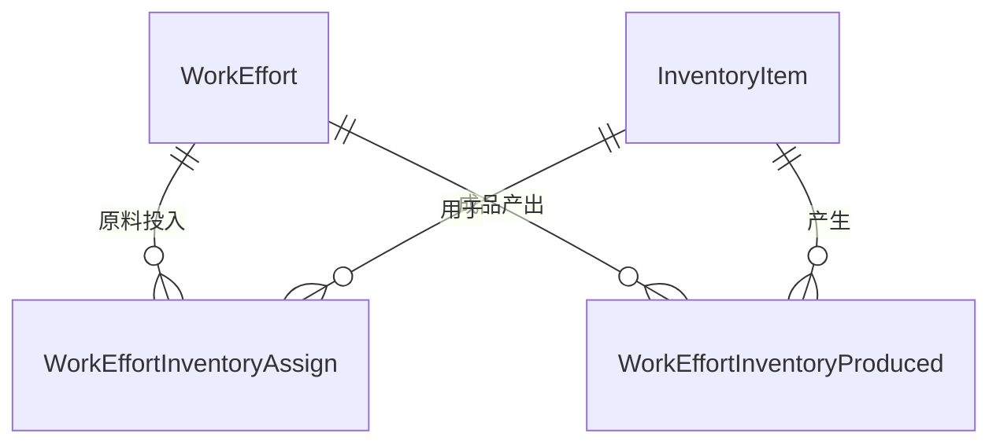

# OFBiz 制造模块分析

本文档面向初次接触ERP系统，特别是制造管理模块的开发人员。我们会从最基础的概念开始，帮助你理解制造管理系统是什么，以及如何使用OFBiz来开发制造管理功能。

## 1. 概述
作为一名刚接触ERP系统的开发人员，你可能会问：制造管理系统到底是什么？它解决什么问题？让我们通过一个简单的例子来理解：

想象一家生产蛋糕的工厂：
- 每天都会接到客户订购蛋糕的订单
- 需要准备面粉、鸡蛋、奶油等原料
- 要安排工人和烤箱进行生产
- 还要计算成本和管理库存

制造管理系统就是帮助工厂管理这些事情的软件。具体来说：

1. 什么是制造管理系统
   - 它是ERP系统中负责管理"如何生产产品"的模块
   - 帮助工厂决定：生产什么产品、什么时候生产、需要什么原料
   - 协调人员、设备、原料等资源，确保产品能按时生产出来

2. 生产方式的区别
   生产方式主要有两种：
   - 离散制造：每个产品是独立的个体
     * 例如：蛋糕、面包、饼干的生产
     * 特点：可以清楚地数出生产了多少个产品
   - 流程制造：产品是连续流动的
     * 例如：酱油、饮料的生产
     * 特点：产品通常按重量或体积计量
   - OFBiz主要用于第一种（离散制造），但也可以处理简单的流程制造

3. 生产模式的选择
   工厂通常有两种生产模式：
   - 按单生产(MTO: Make To Order)
     * 例如：定制生日蛋糕，客户订购后才生产
     * 特点：不会积压库存，但生产周期较长
   - 备货生产(MTS: Make To Stock)
     * 例如：标准面包，提前生产备库
     * 特点：可以立即发货，但可能会积压库存
   - 实际工厂通常两种模式都会用

4. 适用行业范围
   - 机械加工：零部件生产、设备组装等
   - 电子制造：电子产品装配、PCB生产等
   - 食品加工：食品包装、简单食品制造等
   - 其他离散制造：家具、服装、玩具等

5. 核心功能适用性
   - 生产订单管理：支持批次管理，适用于各类生产场景
   - BOM管理：可表达配方和物料清单，支持多级结构
   - 工艺路线：可定义各类加工工序，包括人工和机器操作
   - 资源管理：可管理设备和人力，记录工时和产能
   - 成本核算：支持标准成本和实际成本的计算

6. 制造管理系统的主要业务流程
   - 销售订单 -> 生产计划 -> 物料需求计划 -> 生产订单 -> 生产执行 -> 产品入库
   - 安全库存 -> 补货计划 -> 物料需求计划 -> 生产订单 -> 生产执行 -> 产品入库

7. 系统集成关系
   - 销售系统：接收订单需求，反馈生产进度
   - 库存系统：物料发料，产品入库
   - 采购系统：原材料采购需求
   - 成本系统：生产成本核算

8. 开发人员需要关注的重点
   - 数据模型：理解WorkEffort实体及其关联关系
   - 业务规则：掌握状态流转和数据一致性要求
   - 集成接口：了解与其他模块的交互方式
   - 性能优化：关注大数据量场景下的处理效率

OFBiz制造模块是一个面向离散制造业的生产管理系统,主要提供以下功能:

1. 生产计划管理
- 支持MTO(按单生产)和MTS(库存生产)两种模式
- 基于BOM的物料需求计划(MRP)
- 基于工艺路线的生产能力计划(CRP)
- 灵活的生产订单管理和跟踪

2. 工艺管理
- 多级BOM管理
- 工艺路线定义和维护
- 工序资源配置
- 工时标准管理

3. 资源管理
- 工作中心/设备管理
- 人力资源分配
- 产能平衡分析
- 资源利用率统计

4. 成本管理
- 标准成本核算
- 实际成本采集
- 差异分析
- 成本报表

## 2. 基础概念

在开始开发之前，我们需要理解一些核心概念。这些概念可能看起来有点抽象，让我们通过具体的例子来理解：

### 2.1 工作项(WorkEffort)
工作项(WorkEffort)是OFBiz中最重要的概念。想象一下蛋糕工厂的生产过程：
- 接到一个"生产100个蛋糕"的任务，这是一个工作项
- 这个任务包含"和面"、"烘烤"、"装饰"等步骤，每个步骤也是工作项
- 每个步骤都需要安排人员、设备和时间，这些信息都记录在工作项中

1. 基本属性：
- 工作名称：比如"生产巧克力蛋糕#12345"
- 计划开始时间：比如"2024-03-20 09:00"
- 预计完成时间：比如"2024-03-20 17:00"
- 当前状态：比如"已创建"、"进行中"、"已完成"

2. 关联功能：
- 时间记录：记录工人实际工作时间
- 人员分配：安排哪些工人负责这个任务
- 设备分配：需要使用哪些烤箱、搅拌机等设备
- 工作内容：具体的工艺要求和注意事项
- 状态变更：记录任务从开始到完成的过程

### 2.2 工作项类型
工作项有很多种类型，就像蛋糕工厂里的工作也有不同类型：

工作类型：
```xml
<!-- 生产相关类型 -->

<WorkEffortType description="Routing" hasTable="N" workEffortTypeId="ROUTING"/>
<WorkEffortType description="Routing Task" hasTable="N" workEffortTypeId="ROU_TASK"/>
<WorkEffortType description="Production Run Header" hasTable="N" workEffortTypeId="PROD_ORDER_HEADER"/>
<WorkEffortType description="Production Run Task" hasTable="N" workEffortTypeId="PROD_ORDER_TASK"/>
<WorkEffortType description="Fixed Asset Usage (rental)" hasTable="N" workEffortTypeId="ASSET_USAGE"/>
<WorkEffortType description="Event" hasTable="N" workEffortTypeId="EVENT"/>

<WorkEffortType description="Inbound Shipment" hasTable="N" parentTypeId="EVENT" workEffortTypeId="SHIPMENT_INBOUND"/>
<WorkEffortType description="Outbound Shipment" hasTable="N" parentTypeId="EVENT" workEffortTypeId="SHIPMENT_OUTBOUND"/> 

```


工作项的层次结构（以蛋糕生产为例）：

```
ROUTING (工艺路线：蛋糕的标准生产工艺)
    |
    +-- ROU_TASK (工艺工序：和面、烘烤、装饰等标准步骤)
            |
            +-- (定义每个步骤需要的设备、人力、工时等标准)

PROD_ORDER_HEADER (生产订单：生产100个蛋糕的具体任务)
    |
    +-- PROD_ORDER_TASK (生产订单工序：具体执行和面、烘烤、装饰)
            |
            +-- (记录实际使用的设备、人力、耗时等情况)
```

这种层次结构帮助我们：
- 区分标准工艺（ROUTING）和具体生产（PRODUCTION_RUN）
- 跟踪每个生产步骤的计划和实际执行情况
- 统计分析生产效率和成本

### 2.3 作业车间(JobShop)
让我们继续用蛋糕工厂的例子来理解作业车间：

想象一个蛋糕工厂的生产车间：
- 有多个工作区域：和面区、烤箱区、装饰区等
- 每个区域都有专门的设备和熟练工人
- 不同种类的蛋糕会按不同顺序使用这些区域
- 工人和设备可以灵活调配，今天做这种蛋糕，明天做那种蛋糕

1. 生产特征：
- 多品种：可以生产各种蛋糕（巧克力蛋糕、水果蛋糕等）
- 小批量：每种蛋糕按需少量生产（比如每天20个）
- 多工序：每个蛋糕都需要多个步骤（和面、烘烤、装饰等）
- 灵活性：可以随时调整生产计划（增加热销品种，减少滞销品种）

2. 组织特点：
- 按工序布局：同类设备放一起（比如所有烤箱都在烤箱区）
- 灵活路线：不同蛋糕有不同制作流程（有的需要冷藏，有的不需要）
- 资源共享：同一个烤箱可以用来烤不同种类的蛋糕
- 复杂调度：要协调多个订单、多个工序、多个工人和设备

3. 管理要求：
- 工艺管理：每种蛋糕都要有标准配方和制作步骤
- 计划排程：合理安排每天的生产任务和工作时间
- 进度跟踪：随时知道每个订单做到哪一步了
- 资源平衡：避免某些工人或设备太忙，而其他闲置

### 2.4 工艺路线(Routing)
工艺路线就是产品的"制作说明书"。还是以蛋糕为例：

1. 基本要素：
- 工序清单：比如"和面->烘烤->冷却->装饰->包装"
- 工序顺序：必须先和面再烤，先冷却再装饰
- 工作地点：和面在和面区，烘烤在烤箱区
- 标准时间：和面需要30分钟，烤制需要45分钟

2. 技术参数：
- 设备参数：比如烤箱型号、温度设置
- 工艺参数：比如搅拌速度、烘烤温度
- 质量要求：比如蛋糕颜色、口感标准
- 操作要求：比如装饰图案的规范

3. 应用功能：
- 生产计划：知道每个工序需要多长时间，好安排生产计划
- 能力计算：知道每个工序需要什么设备和人员，好分配资源
- 成本核算：知道每个工序的标准工时，好计算人工和设备成本
- 质量控制：知道每个工序的要求，好控制产品质量

4. 在系统中的体现：
```xml
<!-- 工艺路线主表 -->
<WorkEffort workEffortId="CAKE_STD_ROUTE"
            workEffortTypeId="ROUTING"
            workEffortName="标准蛋糕生产工艺"/>

<!-- 具体工序 -->
<WorkEffort workEffortId="CAKE_TASK_1"
            workEffortTypeId="ROU_TASK"
            workEffortParentId="CAKE_STD_ROUTE"
            workEffortName="和面"
            sequenceNum="10"
            estimatedMilliSeconds="1800000"/>  <!-- 30分钟 -->

<WorkEffort workEffortId="CAKE_TASK_2"
            workEffortTypeId="ROU_TASK"
            workEffortParentId="CAKE_STD_ROUTE"
            workEffortName="烘烤"
            sequenceNum="20"
            estimatedMilliSeconds="2700000"/>  <!-- 45分钟 -->
```

## 3. 核心数据模型

在理解了基础概念后，我们来看看系统是如何存储这些数据的。还是用蛋糕工厂的例子来说明：

### 3.1 工作项实体关系
想象我们要记录"生产100个巧克力蛋糕"这个任务，需要记录哪些信息：

#### 基础关联

- 人员分配(WorkEffortPartyAssignment)：
  * 记录谁来做这个任务：比如"张师傅负责和面"
  * 记录谁来检查：比如"李主管负责质检"
- 设备分配(WorkEffortFixedAssetAssign)：
  * 记录用什么设备：比如"使用1号烤箱"
  * 记录使用时间：比如"9:00-10:00使用搅拌机"
- 物料关联(WorkEffortGoodStandard)：
  * 记录需要什么原料：比如"面粉10kg，鸡蛋20个"
  * 记录产出什么产品：比如"巧克力蛋糕100个"
- 工序关联(WorkEffortAssoc)：
  * 记录工序顺序：比如"必须先和面才能烘烤"

WorkEffortGoodStandard 实体解释：

1. 名称解释
- WorkEffort：工作项，可以是生产订单、工艺路线等
- Good：物品，可以是产品或原材料
- Standard：标准，表示标准用量或产出

2. 主要用途
- 记录工作项需要的标准物料清单
- 记录工作项产出的标准产品数量
- 例如：生产一个蛋糕(WorkEffort)标准需要多少面粉、鸡蛋(Good)

3. 关键字段
```xml
<entity entity-name="WorkEffortGoodStandard">
    <field name="workEffortId" type="id"/>         <!-- 工作项ID -->
    <field name="productId" type="id"/>            <!-- 物品ID -->
    <field name="workEffortGoodStdTypeId" type="id"/> <!-- 关联类型 -->
    <field name="statusId" type="id"/>             <!-- 状态 -->
    <field name="estimatedQuantity" type="fixed-point"/> <!-- 标准数量 -->
</entity>
```

4. 常用的关联类型(workEffortGoodStdTypeId)：
- PRUNT_PROD_NEEDED：生产需要的原材料
- PRUN_PROD_DELIV：生产产出的产品
- ROU_PROD_TEMPLATE：工艺路线的标准用料

这个实体在生产管理中起到了连接"工作"和"物品"的桥梁作用，记录了它们之间的标准数量关系。

而实际的消耗和产出记录在不同的实体中：

1. 实际物料消耗
- 记录在 WorkEffortInventoryAssign 实体中
- 关键字段：
  * workEffortId：生产订单ID
  * inventoryItemId：具体的库存项ID
  * quantity：实际使用数量
- 这个实体记录了生产过程中实际领用和使用的物料明细

2. 实际产品产出
- 记录在 WorkEffortInventoryProduced 实体中
- 关键字段：
  * workEffortId：生产订单ID
  * inventoryItemId：产出产品的库存项ID
  * quantity：实际产出数量
- 这个实体记录了生产过程中实际完工入库的产品明细

简单来说：
- WorkEffortGoodStandard：记录"应该"用多少、产出多少（计划数据）
- WorkEffortInventoryAssign：记录"实际"用了多少（执行数据）
- WorkEffortInventoryProduced：记录"实际"产出了多少（执行数据）

这种设计可以方便地进行计划与实际的对比分析，计算物料的损耗率等。


#### 生产相关

- 生产订单(ProductionRun)：
  * 整个生产任务的主单据
  * 记录要生产什么、生产多少、什么时候完成
- 生产用料(ProductionRunComponent)：
  * 记录具体用了哪些原料
  * 记录每种原料用了多少
- 生产工序(ProductionRunTask)：
  * 记录具体的生产步骤
  * 记录每个步骤的完成情况

需要注意的是，以上三个概念并不是实际的数据库表，而是在 Java 代码中的业务逻辑封装：

1. ProductionRun 类
- 定义在 applications/manufacturing/src/main/java/org/apache/ofbiz/manufacturing/jobshopmgt/ProductionRun.java
- 这是一个业务逻辑封装类，它组合了多个实际的数据库实体：
  * 使用 WorkEffort 表存储生产订单基本信息 (workEffortTypeId = "PROD_ORDER_HEADER")
  * 使用 WorkEffortGoodStandard 表存储产品和物料信息
  * 使用 WorkEffortAssoc 表存储工序关系
- 提供了一系列方便操作生产订单的方法

2. ProductionRunComponent
- 这不是一个独立的类，而是 ProductionRun 类中处理生产组件的逻辑
- 实际数据存储在：
  * WorkEffortGoodStandard 表 (workEffortGoodStdTypeId = "PRUNT_PROD_NEEDED")
  * 记录生产订单需要的物料清单

3. ProductionRunTask
- 同样不是独立的类，是 ProductionRun 类中处理生产工序的逻辑
- 实际数据存储在：
  * WorkEffort 表 (workEffortTypeId = "PROD_ORDER_TASK")
  * WorkEffortAssoc 表存储工序之间的关系

它们的关系可以表示为：
```
WorkEffort (PROD_ORDER_HEADER)  <-- ProductionRun 类
    |
    +-- WorkEffortGoodStandard  <-- ProductionRunComponent (逻辑概念)
    |
    +-- WorkEffort (PROD_ORDER_TASK) <-- ProductionRunTask (逻辑概念)
```

这种设计的好处是：
1. 隐藏了底层复杂的数据结构
2. 提供了更直观的业务操作接口
3. 把分散在多个表中的数据整合在一起

#### 工艺路线相关

- 工艺路线(Routing)：
  * 产品的标准制作流程
  * 比如"巧克力蛋糕的标准配方和工艺"
- 工艺工序(RoutingTask)：
  * 标准流程中的每个步骤
  * 比如"和面30分钟，烤45分钟"
- 工序关系(RoutingTaskAssoc)：
  * 记录步骤之间的顺序
  * 比如"装饰必须等蛋糕完全冷却"

需要注意的是，以上概念并不是实际的数据库表，而是在业务逻辑中的封装：

1. Routing（工艺路线）
- 实际存储在 WorkEffort 表中 (workEffortTypeId = "ROUTING")
- 表示一个产品的标准生产工艺流程
- 例如：一个标准蛋糕的完整制作流程

2. 工艺工序
- 实际存储在 WorkEffort 表中 (workEffortTypeId = "ROU_TASK")
- 表示工艺路线中的具体步骤
- 与 Routing 通过 WorkEffortAssoc 表关联
- 例如：和面、烘烤、装饰等具体工序

3. 工序关系
- 存储在 WorkEffortAssoc 表中
- 记录工序之间的顺序关系
- 使用 workEffortAssocTypeId = "ROUTING_COMPONENT" 标识

它们的关系可以表示为：
```
WorkEffort (ROUTING)  <-- 工艺路线
    |
    +-- WorkEffortAssoc (ROUTING_COMPONENT) <-- 工序关系
    |
    +-- WorkEffort (ROU_TASK) <-- 工艺工序
```
 
这种设计的优点：
1. 复用了通用的 WorkEffort 框架
1. 可以灵活定义工序之间的关系
2. 支持工序的各种属性（时间、资源等）


### 3.2 生产订单实体

生产订单(ProductionRun)是一个特殊的WorkEffort实体，用于管理生产过程。让我们通过蛋糕生产的例子来理解：

1. 核心属性
- workEffortId: 生产订单ID（例如：PROD_2024_001）
- workEffortTypeId: PROD_ORDER_HEADER
- workEffortName: 生产订单名称（例如："3月20日巧克力蛋糕生产任务"）
- estimatedStartDate: 计划开始日期
- estimatedCompletionDate: 计划完成日期
- quantityToProduce: 计划生产数量（例如：100个）
- facilityId: 生产工厂

2. 状态流转
一个生产订单从创建到结束会经历以下状态：
- PRUN_CREATED: 已创建(初始状态)
- PRUN_SCHEDULED: 已排程(已分配资源和时间)
- PRUN_DOC_PRINTED: 已打印文档(可以开始生产)
- PRUN_RUNNING: 生产中(至少有一个任务已开始)
- PRUN_COMPLETED: 已完成(所有任务都已完成)
- PRUN_CLOSED: 已关闭(完成所有后续处理)
- PRUN_CANCELLED: 已取消(终止生产)

3. 关联实体
生产订单需要关联以下实体来记录完整的生产信息：
- WorkEffortGoodStandard: 关联产出物料(PRUN_PROD_DELIV)和投入物料(PRUN_PROD_NEEDED)
  * 例如：记录需要的原料（面粉、鸡蛋）和产出的成品（蛋糕）
- WorkEffortAssoc: 生产任务之间的关联(WORK_EFF_PRECEDENCY)
  * 例如：和面必须在烘烤之前完成
- WorkEffortPartyAssignment: 人员分配
  * 例如：张师傅负责和面工序
- WorkEffortFixedAssetAssign: 设备分配
  * 例如：使用1号烤箱烘烤
- WorkEffortSkillStandard: 技能要求
  * 例如：需要具备烘焙技能

### 3.3 BOM结构

BOM(Bill Of Material，物料清单)是产品的"配方表"。让我们继续用蛋糕的例子来理解：

1. BOM的基本概念：
- 一个巧克力蛋糕的BOM包含：
  * 面粉：500克
  * 鸡蛋：4个
  * 牛奶：200ml
  * 巧克力：100克
- 如果是夹心蛋糕，还会包含子BOM：
  * 奶油夹心：
    - 淡奶油：100ml
    - 糖：50克

2. 在系统中的实现：
```java
// From applications/manufacturing/src/main/java/org/apache/ofbiz/manufacturing/bom/BOMTree.java
public class BOMTree {
    public static final int EXPLOSION = 0;  // BOM分解(展开)
    public static final int IMPLOSION = 1;  // BOM反查(倒查)
    public static final int EXPLOSION_MANUFACTURING = 2;  // 仅分解需要制造的部分
    
    private BOMNode root;
    private String bomTypeId;
    private int type;
    
    // 举例：分解巧克力夹心蛋糕的BOM
    // - EXPLOSION：列出所有原料（面粉、鸡蛋、奶油、糖等）
    // - IMPLOSION：查询某个原料（如奶油）用在哪些产品中
    // - EXPLOSION_MANUFACTURING：只关注需要自制的部分（如奶油夹心）
    
    public BOMTree(String productId, String bomTypeId, Timestamp inDate, 
                  int type, Delegator delegator, LocalDispatcher dispatcher, 
                  GenericValue userLogin) throws GenericEntityException {
        this.bomTypeId = bomTypeId;
        this.type = type;
        root = new BOMNode(productId, delegator, dispatcher, userLogin);
        root.setTree(this);
        
        if (type == EXPLOSION || type == EXPLOSION_MANUFACTURING) {
            root.loadChildren(inDate);
        } else if (type == IMPLOSION) {
            root.loadParents(inDate);
        }
    }
}

// From applications/manufacturing/src/main/java/org/apache/ofbiz/manufacturing/bom/BOMNode.java
public class BOMNode {
    private GenericValue product;
    private List<BOMNode> children;
    private BOMTree tree;
    private GenericValue productAssoc;
    private Delegator delegator;
    private LocalDispatcher dispatcher;
    
    public BOMNode(GenericValue productAssoc, BOMNode parentNode, Delegator delegator,
                  LocalDispatcher dispatcher, GenericValue userLogin) throws GenericEntityException {
        this.productAssoc = productAssoc;
        this.delegator = delegator;
        this.dispatcher = dispatcher;
        this.tree = parentNode.getTree();
        this.product = productAssoc.getRelatedOne("AssocProduct", false);
        children = new LinkedList<>();
    }
    
    public void loadChildren(Timestamp inDate) throws GenericEntityException {
        // 获取有效的BOM组件
        List<GenericValue> productComponents = EntityQuery.use(delegator)
            .from("ProductAssoc")
            .where("productId", getProduct().getString("productId"),
                  "productAssocTypeId", getBOMTypeId())
            .filterByDate(inDate)
            .queryList();

        for (GenericValue productComponent : productComponents) {
            // 制造型BOM分解时，只处理需要制造的产品
            if (tree.getType() == BOMTree.EXPLOSION_MANUFACTURING) {
                GenericValue component = productComponent.getRelatedOne("AssocProduct", false);
                if (!"Y".equals(component.getString("isManufactured"))) {
                    continue;
                }
            }
            // 创建并递归加载子节点
            BOMNode child = new BOMNode(productComponent, this, delegator, dispatcher, userLogin);
            child.loadChildren(inDate);
            children.add(child);
        }
    }
}
```

3. BOM的处理方式：
```java
// 示例：如何使用BOM树
BOMTree tree = new BOMTree("CHOC_CAKE", "MANUF_COMPONENT", 
                          UtilDateTime.nowTimestamp(), 
                          BOMTree.EXPLOSION,  // 完全展开所有原料
                          delegator, dispatcher, userLogin);

// 获取所有原料清单
List<BOMNode> allComponents = tree.getAllNodes();
for (BOMNode node : allComponents) {
    String productId = node.getProduct().getString("productId");
    BigDecimal quantity = node.getQuantity();
    // ... 处理每种原料
}
```

4. 实际应用：
- 计算原料需求：知道生产100个蛋糕需要多少原料
- 成本核算：计算每个蛋糕的材料成本
- 替代料管理：某种原料缺货时可以用什么替代
- 配方版本控制：记录配方的变更历史

### 3.4 实体关系图

让我们通过实体关系图来理解系统是如何存储和关联这些数据的。还是以蛋糕生产为例：



核心实体说明（以蛋糕生产为例）：

1. WorkEffort（工作项）
   - 可以是一个生产订单："生产100个巧克力蛋糕"
   - 可以是一个工序："和面"、"烘烤"、"装饰"
   - 可以是一个工艺路线："标准蛋糕生产工艺"

2. WorkEffortGoodStandard（物料关联）
   - 记录生产需要的原料：面粉、鸡蛋、奶油等
   - 记录生产产出的产品：巧克力蛋糕

3. WorkEffortPartyAssignment（人员分配）
   - 记录谁负责和面：张师傅
   - 记录谁负责烘烤：李师傅
   - 记录谁负责质检：王主管

4. WorkEffortFixedAssetAssign（设备分配）
   - 记录使用哪台搅拌机
   - 记录使用哪个烤箱
   - 包含使用的时间段

5. WorkEffortAssoc（工作项关联）
   - 记录工序之间的顺序：和面->烘烤->装饰
   - 记录工序与生产订单的关系
   - 记录工艺路线与工序的关系


从 XML 数据模型以及示例来理解这些实体的关系：

```xml
<!-- From applications/datamodel/entitydef/workeffort-entitymodel.xml -->
    <entity entity-name="WorkEffortGoodStandard" package-name="org.apache.ofbiz.workeffort.workeffort" title="Work Effort Good Standard">
        <field name="workEffortId" type="id"></field>
        <field name="productId" type="id"></field>
        <field name="workEffortGoodStdTypeId" type="id"></field>
        <field name="fromDate" type="date-time"></field>
        <field name="thruDate" type="date-time"></field>
        <field name="statusId" type="id"></field>
        <field name="estimatedQuantity" type="floating-point"></field>
        <field name="estimatedCost" type="currency-amount"></field>
        <prim-key field="workEffortId"/>
        <prim-key field="productId"/>
        <prim-key field="workEffortGoodStdTypeId"/>
        <prim-key field="fromDate"/>
        <relation type="one" fk-name="WKEFF_GDSTD_WEFF" rel-entity-name="WorkEffort">
            <key-map field-name="workEffortId"/>
        </relation>
        <relation type="one" fk-name="WKEFF_GDSTD_TYPE" rel-entity-name="WorkEffortGoodStandardType">
            <key-map field-name="workEffortGoodStdTypeId"/>
        </relation>
        <relation type="one" fk-name="WKEFF_GDSTD_PROD" rel-entity-name="Product">
            <key-map field-name="productId"/>
        </relation>
        <relation type="one" fk-name="WKEFF_GDSTD_STTS" rel-entity-name="StatusItem">
            <key-map field-name="statusId"/>
        </relation>
    </entity>
```

**实体关系说明：**

WorkEffortGoodStandard 实体记录了生产过程中产出产品的关联信息，包括所对应的成品、投入物料及其状态。

1. **WorkEffortGoodStandard实体**
   - 通过workEffortId关联到具体的生产活动(WorkEffort)
   - 通过productId关联到具体的产品(Product)
   - 通过workEffortGoodStdTypeId定义关联类型
   - 使用estimatedQuantity和estimatedCost记录计划产量和成本

2. **关联类型说明**

下面的WorkEffortGoodStandardType和WorkEffortAssocType实体展示了系统如何定义和管理这些关系。

WorkEffortGoodStandardType 等实体的 Seed Data：

```xml
<!-- From applications/datamodel/data/seed/WorkEffortSeedData.xml -->
    <WorkEffortGoodStandardType workEffortGoodStdTypeId="ROU_PROD_TEMPLATE" description="Product and Routing Association" hasTable="N"/>
    <WorkEffortGoodStandardType workEffortGoodStdTypeId="PRUN_PROD_DELIV" description="Production Run and Product to Deliver Association" hasTable="N"/>
    <WorkEffortGoodStandardType workEffortGoodStdTypeId="PRUNT_PROD_NEEDED" description="Production Run Task and Needed Product Association" hasTable="N"/>
    <WorkEffortGoodStandardType workEffortGoodStdTypeId="PRUNT_PROD_DELIV" description="Production Run Task and Deliverable Product Association" hasTable="N"/>
    <WorkEffortGoodStandardType workEffortGoodStdTypeId="GENERAL_SALES" description="Product to Represent General Sales of the WorkEffort" hasTable="N"/>

    <WorkEffortAssocType description="Breakdown/Detail" hasTable="N" workEffortAssocTypeId="WORK_EFF_BREAKDOWN"/>
    <WorkEffortAssocType description="Dependency" hasTable="N" workEffortAssocTypeId="WORK_EFF_DEPENDENCY"/>
    <WorkEffortAssocType description="Concurrency" hasTable="N" parentTypeId="WORK_EFF_DEPENDENCY" workEffortAssocTypeId="WORK_EFF_CONCURRENCY"/>
    <WorkEffortAssocType description="Precedency" hasTable="N" parentTypeId="WORK_EFF_DEPENDENCY" workEffortAssocTypeId="WORK_EFF_PRECEDENCY"/>
    <WorkEffortAssocType description="Template of" hasTable="N" workEffortAssocTypeId="WORK_EFF_TEMPLATE"/>

    <!-- For Routing definition, (workEffort Template) -->
    <WorkEffortAssocType description="Routing and Routing Task Association" hasTable="N" workEffortAssocTypeId="ROUTING_COMPONENT"/>

    <!-- Default routing -->
    <!-- Used when no explicit routing is associated to a product -->
    <WorkEffort workEffortId="DEFAULT_ROUTING" workEffortTypeId="ROUTING" currentStatusId="ROU_ACTIVE" workEffortName="Default Routing" description="Default Routing" revisionNumber="1" quantityToProduce="0"/>
    <WorkEffort workEffortId="DEFAULT_TASK" workEffortTypeId="ROU_TASK" workEffortPurposeTypeId="ROU_ASSEMBLING" currentStatusId="ROU_ACTIVE" workEffortName="Default Routing Task" description="Default Routing Task" revisionNumber="1" estimatedMilliSeconds="0" estimatedSetupMillis="0"/>
    <WorkEffortAssoc workEffortIdFrom="DEFAULT_ROUTING" workEffortIdTo="DEFAULT_TASK" workEffortAssocTypeId="ROUTING_COMPONENT" sequenceNum="10" fromDate="2004-09-24 15:09:38.736"/>
```

另外一个 Demo 数据文件的片段：

```xml
<!-- From applications/datamodel/data/demo/OrderDemoData.xml -->
    <WorkEffort workEffortId="SCTASK01" workEffortTypeId="ROU_TASK" workEffortPurposeTypeId="ROU_ASSEMBLING" currentStatusId="ROU_ACTIVE" 
    workEffortName="Stock out" description="Components" revisionNumber="1" fixedAssetId="DEMO_BOOK_GROUP" estimatedMilliSeconds="600000" 
    estimatedSetupMillis="0"/>
    <WorkEffort workEffortId="SCTASK02" workEffortTypeId="ROU_TASK" workEffortPurposeTypeId="ROU_ASSEMBLING" currentStatusId="ROU_ACTIVE" 
    workEffortName="Preparation" description="Preparation" revisionNumber="1" fixedAssetId="DEMO_BOOK_GROUP" estimatedMilliSeconds="900000" 
    estimatedSetupMillis="0"/>
    <WorkEffort workEffortId="SCROUT01" workEffortTypeId="ROUTING" currentStatusId="ROU_ACTIVE" workEffortName="Pizza preparation" 
    description="Scanning preparation" revisionNumber="1" quantityToProduce="0"/>
    <WorkEffortGoodStandard workEffortId="SCROUT01" productId="CFSV1001" workEffortGoodStdTypeId="ROU_PROD_TEMPLATE" statusId="WEGS_CREATED" 
    fromDate="2011-01-01 00:00:00.0"/>
    <WorkEffortAssoc workEffortIdFrom="SCROUT01" workEffortIdTo="SCTASK01" workEffortAssocTypeId="ROUTING_COMPONENT" sequenceNum="10" 
    fromDate="2011-01-01 00:00:00.0"/>
    <WorkEffortAssoc workEffortIdFrom="SCROUT01" workEffortIdTo="SCTASK02" workEffortAssocTypeId="ROUTING_COMPONENT" sequenceNum="20" 
    fromDate="2011-01-01 00:00:00.0"/>
```

**关联类型详细说明：**

1. **产品关联类型(WorkEffortGoodStandardType)**
   - `ROU_PROD_TEMPLATE`: 定义产品与其标准工艺路线的关联
   - `PRUN_PROD_DELIV`: 生产运行与最终交付产品的关联
   - `PRUNT_PROD_NEEDED`: 生产任务所需的原材料/组件关联
   - `PRUNT_PROD_DELIV`: 生产任务产出的产品关联
   - `GENERAL_SALES`: 用于一般销售场景的产品关联


2. **工作任务关联类型(WorkEffortAssocType)**
   - `WORK_EFF_BREAKDOWN`: 用于将复杂任务分解为子任务
   - `WORK_EFF_DEPENDENCY`: 定义任务间的依赖关系
     * `WORK_EFF_CONCURRENCY`: 可并行执行的任务
     * `WORK_EFF_PRECEDENCY`: 需要按顺序执行的任务（先决条件）
   - `WORK_EFF_TEMPLATE`: 用于定义可重用的任务模板
   - `ROUTING_COMPONENT`: 工艺路线与具体工序任务的关联

3. **默认工艺路线配置**
   系统提供了默认工艺路线(`DEFAULT_ROUTING`)和默认任务(`DEFAULT_TASK`)，用于处理未指定具体工艺路线的产品生产场景。这确保了生产系统的鲁棒性。

> 注：理论上这些模型可以通过一系列关联实体来表达复杂的生产关系，有能力支持实现多产品产出。

## 4. 核心业务流程

在理解了基础概念和数据模型后，让我们来看看系统是如何处理实际业务的。作为新手，你可能会问：
- 一个生产订单是如何从创建到完成的？
- 系统是如何计算需要多少原料的？
- 工艺路线是如何与生产订单关联的？

让我们通过具体的例子来一步步理解这些流程。

### 4.1 生产订单管理

让我们通过一个具体的例子来理解生产订单是如何处理的。假设我们需要生产100个巧克力蛋糕：

首先，让我们看看一个生产订单从开始到结束会经历哪些状态：

生产订单状态流转：


这个流程图看起来可能有点复杂，让我们用实际的例子来理解每个状态：

1. PRUN_CREATED（已创建）
   - 生产订单刚创建完成
   - 已确定生产什么产品、生产多少
   - 就像蛋糕店老板说："明天要做100个巧克力蛋糕"

2. PRUN_SCHEDULED（已排程）
   - 已安排生产时间和资源
   - 确定使用哪些设备和人员
   - 就像安排："明天9点，张师傅用1号烤箱做这批蛋糕"

3. PRUN_DOC_PRINTED（已打印）
   - 生产文档已准备就绪
   - 包括工艺卡、领料单等
   - 就像准备好："配方表、原料清单、操作步骤说明"

4. PRUN_RUNNING（生产中）
   - 实际生产工作已开始
   - 可以记录生产进度
   - 就像："张师傅已经开始和面了，一会儿就要开始烤制"

5. PRUN_COMPLETED（已完成）
   - 产品已全部生产完成
   - 等待成本核算等后续处理
   - 就像："100个蛋糕都已经做好了，正在冷却"

6. PRUN_CLOSED（已关闭）
   - 所有后续工作都已完成
   - 包括成本核算、质量检验等
   - 就像："已经统计好用了多少原料，花了多少成本，蛋糕质量也检查过了"

7. PRUN_CANCELLED（已取消）
   - 生产订单被取消
   - 需要处理已领用的物料
   - 就像："烤箱坏了，今天这批蛋糕不能做了，已领的面粉先退回仓库"

关键处理代码：
```java
// From applications/manufacturing/src/main/java/org/apache/ofbiz/manufacturing/jobshopmgt/ProductionRunServices.java
/**
 * 生产订单状态变更服务
 * 处理生产订单从创建到完成的整个生命周期
 */
public static Map<String, Object> changeProductionRunStatus(DispatchContext dctx, Map<String, ? extends Object> context) {
    Delegator delegator = dctx.getDelegator();
    LocalDispatcher dispatcher = dctx.getDispatcher();
    String workEffortId = (String) context.get("workEffortId");
    String statusId = (String) context.get("statusId");
    GenericValue userLogin = (GenericValue) context.get("userLogin");
    Locale locale = (Locale) context.get("locale");
    
    try {
        // 1. 获取生产订单信息
        GenericValue workEffort = EntityQuery.use(delegator)
            .from("WorkEffort")
            .where("workEffortId", workEffortId)
            .queryOne();
        if (workEffort == null) {
            return ServiceUtil.returnError(UtilProperties.getMessage(resource, 
                "ManufacturingProductionRunNotFound", locale));
        }
        
        String currentStatusId = workEffort.getString("currentStatusId");
        // 2. 根据不同的状态转换调用相应的处理服务
        if ("PRUN_CREATED".equals(currentStatusId) && "PRUN_SCHEDULED".equals(statusId)) {
            // 2.1 排程：分配资源和时间
            return ProductionRunServices.scheduleProductionRun(dctx, context);
            
        } else if ("PRUN_SCHEDULED".equals(currentStatusId) && "PRUN_DOC_PRINTED".equals(statusId)) {
            // 2.2 打印：准备生产文档
            return ProductionRunServices.printProductionRunDocuments(dctx, context);
            
        } else if ("PRUN_DOC_PRINTED".equals(currentStatusId) && "PRUN_RUNNING".equals(statusId)) {
            // 2.3 启动：开始生产
            Map<String, Object> serviceContext = new HashMap<>(context);
            serviceContext.put("startAllTasks", "Y");
            return ProductionRunServices.startProductionRun(dctx, serviceContext);
            
        } else if ("PRUN_RUNNING".equals(currentStatusId) && "PRUN_COMPLETED".equals(statusId)) {
            // 2.4 完成：结束生产
            return ProductionRunServices.completeProductionRun(dctx, context);
        }
        
        // 3. 如果状态转换无效，返回错误
        return ServiceUtil.returnError(UtilProperties.getMessage(resource,
            "ManufacturingProductionRunStatusNotChangeable",
            UtilMisc.toMap("currentStatusId", currentStatusId, "statusId", statusId), locale));
            
    } catch (GenericEntityException e) {
        Debug.logError(e, MODULE);
        return ServiceUtil.returnError(e.getMessage());
    }
}
```

每个状态转换服务的主要处理内容：

```java
// 1. 生产订单排程
public static Map<String, Object> scheduleProductionRun(DispatchContext dctx, Map<String, ? extends Object> context) {
    try {
        // 检查资源可用性
        // 分配设备和人员
        // 设置计划时间
        // 更新状态为PRUN_SCHEDULED
    }
}

// 2. 打印生产文档
public static Map<String, Object> printProductionRunDocuments(DispatchContext dctx, Map<String, ? extends Object> context) {
    try {
        // 生成工艺卡
        // 生成领料单
        // 生成质检单
        // 更新状态为PRUN_DOC_PRINTED
    }
}

// 3. 启动生产
public static Map<String, Object> startProductionRun(DispatchContext dctx, Map<String, ? extends Object> context) {
    try {
        // 执行物料发料
        // 记录开始时间
        // 启动第一个工序
        // 更新状态为PRUN_RUNNING
    }
}

// 4. 完成生产
public static Map<String, Object> completeProductionRun(DispatchContext dctx, Map<String, ? extends Object> context) {
    try {
        // 检查所有工序是否完成
        // 产品入库
        // 计算实际成本
        // 更新状态为PRUN_COMPLETED
    }
}
```

#### 4.1.1 创建生产订单

关键处理代码：
```java
// From applications/manufacturing/src/main/java/org/apache/ofbiz/manufacturing/jobshopmgt/ProductionRunServices.java

/**
 * 创建生产订单
 * 主要步骤:
 * 1. 检查产品是否存在工艺路线关联
 * 2. 检查产品是否有物料清单(BOM)
 * 3. 检查工艺路线是否包含工序
 * 4. 创建生产订单主记录(WorkEffort)
 * 5. 创建生产订单与产品的关联(WorkEffortGoodStandard)
 * 6. 对工艺路线中的每个工序:
 *    - 创建生产订单工序(WorkEffort)
 *    - 对于第一道工序,创建所有未关联工序的物料需求
 *    - 对于每个工序,创建该工序关联的物料需求
 */
public static Map<String, Object> createProductionRun(DispatchContext ctx, Map<String, ? extends Object> context) {
    // 1. 获取输入参数
    String productId = (String) context.get("productId");
    Timestamp startDate = (Timestamp) context.get("startDate"); 
    BigDecimal quantity = (BigDecimal) context.get("pRQuantity");
    String facilityId = (String) context.get("facilityId");
    String routingId = (String) context.get("routingId");

    // 2. 获取产品的工艺路线
    Map<String, Object> routingResult = dispatcher.runSync("getProductRouting", 
        UtilMisc.toMap("productId", productId, "workEffortId", routingId));
    GenericValue routing = (GenericValue) routingResult.get("routing");
    List<GenericValue> routingTasks = (List<GenericValue>) routingResult.get("tasks");

    // 3. 获取物料清单
    List<BOMNode> components = getManufacturingComponents(productId, quantity);

    // 4. 创建生产订单主记录
    String productionRunId = delegator.getNextSeqId("WorkEffort");
    Map<String, Object> productionRunFields = UtilMisc.toMap(
        "workEffortId", productionRunId,
        "workEffortTypeId", "PROD_ORDER_HEADER",
        "workEffortPurposeTypeId", "WEPT_PRODUCTION_RUN",
        "currentStatusId", "PRUN_CREATED"
        // ... 其他字段
    );
    GenericValue productionRun = delegator.create("WorkEffort", productionRunFields);

    // 5. 创建生产订单工序
    Timestamp taskStartDate = startDate;
    boolean first = true;
    for (GenericValue routingTask : routingTasks) {
        // 5.1 创建工序记录
        String taskId = delegator.getNextSeqId("WorkEffort");
        Map<String, Object> taskFields = UtilMisc.toMap(
            "workEffortId", taskId,
            "workEffortTypeId", "PROD_ORDER_TASK",
            "workEffortParentId", productionRunId,
            // ... 其他字段
        );
        GenericValue task = delegator.create("WorkEffort", taskFields);

        // 5.2 创建物料需求
        for (BOMNode component : components) {
            if (isComponentNeededForTask(component, routingTask, first)) {
                createWorkEffortGoodStandard(taskId, component);
            }
        }
        first = false;
        taskStartDate = getNextTaskStartDate(taskStartDate, task);
    }

    return ServiceUtil.returnSuccess(productionRunId);
}
```

方法 `getManufacturingComponents` 的实现：

```java
// From applications/manufacturing/src/main/java/org/apache/ofbiz/manufacturing/bom/BOMServices.java
/**
 * 获取生产所需的制造组件(物料清单)
 * 主要功能:
 * 1. 读取产品的物料清单(BOM)
 * 2. 如果需要,进行配置
 * 3. 返回所需的组件列表
 */
public static Map<String, Object> getManufacturingComponents(DispatchContext dctx, Map<String, ? extends Object> context) {
    // 1. 基础参数准备
    String productId = (String) context.get("productId");    // 产品ID
    BigDecimal quantity = (BigDecimal) context.get("quantity") ?? BigDecimal.ONE;  // 生产数量
    Boolean excludeWIPs = (Boolean) context.get("excludeWIPs") ?? Boolean.TRUE;    // 是否排除在制品
    
    // 2. 获取物料清单树
    BOMTree tree = new BOMTree(
        productId,                     // 产品
        "MANUF_COMPONENT",            // BOM类型:制造组件
        fromDate,                     // 生效日期
        BOMTree.EXPLOSION_SINGLE_LEVEL, // 展开方式:单层
        delegator, dispatcher, userLogin
    );
    
    // 3. 设置根节点数量
    tree.setRootQuantity(quantity);
    
    // 4. 获取组件列表
    List<BOMNode> components = new LinkedList<>();
    tree.print(components, excludeWIPs);  // 打印BOM树到组件列表
    if (!components.isEmpty()) {
        components.remove(0);  // 移除根节点(产品本身)
    }
    
    // 5. 获取工艺路线
    String workEffortId = null;
    Map<String, Object> routingResult = dispatcher.runSync("getProductRouting", 
        UtilMisc.toMap("productId", productId, "ignoreDefaultRouting", "Y"));
    GenericValue routing = (GenericValue)routingResult.get("routing");
    
    // 6. 如果找不到工艺路线,尝试查找虚拟产品的工艺路线
    if (routing == null) {
        String virtualProductId = tree.getRoot().getProduct().getString("productId");
        routingResult = dispatcher.runSync("getProductRouting", 
            UtilMisc.toMap("productId", virtualProductId));
        routing = (GenericValue)routingResult.get("routing");
    }
    
    // 7. 准备返回结果
    Map<String, Object> result = new HashMap<>();
    result.put("components", components);  // 原始组件列表
    
    // 8. 转换为更易用的Map格式
    List<Map<String, Object>> componentsMap = new LinkedList<>();
    for (BOMNode node : components) {
        componentsMap.add(UtilMisc.toMap(
            "product", node.getProduct(),
            "quantity", node.getQuantity()
        ));
    }
    result.put("componentsMap", componentsMap);
    
    return result;
}
```

使用了EXPLOSION_SINGLE_LEVEL进行单层展开。这样设计的原因是：
1. 生产订单的特点：
  - 生产订单关注的是直接需要的物料
  - 每个物料可能有自己的生产订单
  - 形成独立的生产层级管理
2. 业务逻辑：
  - 如果某个组件也需要生产，会创建另一个生产订单
  - 这种方式让生产计划更灵活
  - 可以分别管理不同层级的生产进度
3. MRP的作用：
  - 完整的多层展开是在MRP(物料需求计划)中进行的
  - MRP会考虑所有层级的物料需求
  - 生成相应的生产订单或采购建议

#### 4.1.2 产品工艺路线获取

在OFBiz中，产品与工艺路线(Routing)的关联通过`getProductRouting`服务实现：

```groovy
Map getProductRouting() {
    Map result = success()

    // 1. 处理日期参数
    Timestamp filterDate = parameters.applicableDate ?: UtilDateTime.nowTimestamp()

    GenericValue routingGS = null
    GenericValue routing = null
    List tasks = null
    Map lookupRouting = [
        productId: parameters.productId,
        workEffortGoodStdTypeId: 'ROU_PROD_TEMPLATE'
    ]

    // 2. 按workEffortId查找
    if (parameters.workEffortId) {
        lookupRouting.workEffortId = parameters.workEffortId
        routingGS = from('WorkEffortGoodStandard')
                .where(lookupRouting)
                .filterByDate(filterDate)
                .queryFirst()

        // 2.1 如果没找到且是变体产品，查找虚拟产品的工艺路线
        if (!routingGS) {
            GenericValue virtualProductAssoc = from('ProductAssoc')
                    .where(
                        productIdTo: parameters.productId,
                        productAssocTypeId: 'PRODUCT_VARIANT'
                    )
                    .filterByDate(filterDate)
                    .queryFirst()
            if (virtualProductAssoc) {
                lookupRouting.productId = virtualProductAssoc.productId
                routingGS = from('WorkEffortGoodStandard')
                        .where(lookupRouting)
                        .filterByDate(filterDate)
                        .queryFirst()
            }
        }
    }
    // 3. 直接查找产品关联的工艺路线
    else {
        routingGS = from('WorkEffortGoodStandard')
                .where(lookupRouting)
                .filterByDate(filterDate)
                .queryFirst()

        // 3.1 同样尝试查找虚拟产品的工艺路线
        if (!routingGS) {
            GenericValue virtualProductAssoc = from('ProductAssoc')
                    .where(
                        productIdTo: parameters.productId,
                        productAssocTypeId: 'PRODUCT_VARIANT'
                    )
                    .filterByDate(filterDate)
                    .queryFirst()
            if (virtualProductAssoc) {
                lookupRouting.productId = virtualProductAssoc.productId
                routingGS = from('WorkEffortGoodStandard')
                        .where(lookupRouting)
                        .filterByDate(filterDate)
                        .queryFirst()
            }
        }
    }

    // 4. 获取工艺路线记录
    if (routingGS) {
        routing = from('WorkEffort')
                .where(workEffortId: routingGS.workEffortId)
                .queryOne()
    }
    // 5. 使用默认工艺路线
    else if (!parameters.ignoreDefaultRouting || parameters.ignoreDefaultRouting == 'N') {
        routing = from('WorkEffort')
                .where(workEffortId: 'DEFAULT_ROUTING')
                .queryOne()
    }

    // 6. 获取工序列表
    if (routing) {
        tasks = from('WorkEffortAssoc')
                .where(
                    workEffortIdFrom: routing.workEffortId,
                    workEffortAssocTypeId: 'ROUTING_COMPONENT'
                )
                .orderBy('sequenceNum')
                .filterByDate()
                .queryList()
    }

    // 7. 返回结果
    result.routing = routing
    result.tasks = tasks
    return result
}
```

关键业务规则：

1. 工艺路线查找优先级：
   - 指定的工艺路线(workEffortId)
   - 产品关联的工艺路线
   - 虚拟产品的工艺路线
   - 默认工艺路线(DEFAULT_ROUTING)

2. 日期有效性：
   ```groovy
   // 支持指定日期或使用当前时间
   Timestamp filterDate = parameters.applicableDate ?: UtilDateTime.nowTimestamp()
   
   // 查询时过滤有效期
   from('WorkEffortGoodStandard')
       .where(lookupRouting)
       .filterByDate(filterDate)  // 确保在有效期内
       .queryFirst()
   ```

3. 变体产品处理：
   ```groovy
   // 查找虚拟产品关联
   GenericValue virtualProductAssoc = from('ProductAssoc')
           .where(
               productIdTo: parameters.productId,
               productAssocTypeId: 'PRODUCT_VARIANT'
           )
           .filterByDate(filterDate)
           .queryFirst()
   ```

4. 工序排序：
   ```groovy
   // 按序号获取工序列表
   tasks = from('WorkEffortAssoc')
           .where(
               workEffortIdFrom: routing.workEffortId,
               workEffortAssocTypeId: 'ROUTING_COMPONENT'
           )
           .orderBy('sequenceNum')  // 确保工序顺序正确
           .filterByDate()
           .queryList()
   ```

这种实现的优点：
1. 代码简洁清晰，充分利用了Groovy的特性
2. 查询条件和过滤逻辑集中处理
3. 支持灵活的工艺路线继承机制
4. 提供了默认工艺路线作为兜底方案

在OFBiz中，虚拟产品和变体产品是一种父子关系。

数据模型定义：

```text
<!-- ProductAssoc实体中定义了产品间的关联 -->
<ProductAssoc 
    productId="VIRTUAL_CHOCOLATE_CAKE"     <!-- 虚拟产品 -->
    productIdTo="CHOC_CAKE_STANDARD"       <!-- 具体变体 -->
    productAssocTypeId="PRODUCT_VARIANT"   <!-- 关联类型：产品变体 -->
    fromDate="2024-01-01 00:00:00.0"/>
```

示例：

```text
虚拟产品：巧克力蛋糕(VIRTUAL_CHOCOLATE_CAKE)
├── 变体1：标准款(CHOC_CAKE_STANDARD)
│   ├── 特点：标准配方
│   └── 价格：100元
├── 变体2：豪华款(CHOC_CAKE_DELUXE)
│   ├── 特点：双层夹心
│   └── 价格：150元
└── 变体3：迷你款(CHOC_CAKE_MINI)
    ├── 特点：6寸小型
    └── 价格：60元
```

这种设计的优点：
1. 数据共享：
   - 虚拟产品可以定义通用的工艺路线
   - 所有变体都可以继承使用
   - 减少数据重复维护
2. 灵活性：
   - 变体可以覆盖虚拟产品的工艺路线
   - 可以定制特定变体的生产方式
   - 支持产品族的差异化管理
3. 维护性：
   - 集中管理通用的工艺路线
   - 便于工艺改进和更新
   - 降低维护工作量

这种虚拟产品和变体的设计，让系统能够既支持产品族的统一管理，又能处理具体变体的个性化需求。


#### 4.1.3 WIP(在制品)处理策略

在OFBiz的制造模块中，WIP(Work In Process，在制品)有特殊的处理机制。让我们通过代码分析来理解这个机制：

1. WIP的定义：
```xml
<!-- 在Product实体中 -->
<field name="productTypeId" type="id">
    <!-- 产品类型:
         - WIP: Work In Process(在制品)
         - FINISHED_GOOD: 成品
         - RAW_MATERIAL: 原材料
    -->
</field>
```

2. BOM树的展开处理：
```java
public void print(List<BOMNode> arr, BigDecimal quantity, int depth, boolean excludeWIPs) {
    // 1. 计算当前节点的实际需求数量
    this.quantity = quantity.multiply(quantityMultiplier).multiply(scrapFactor);
    
    // 2. 将当前节点添加到列表
    arr.add(this);
    
    // 3. 递归处理子节点
    for (BOMNode childNode : childrenNodes) {
        // 关键判断：是否跳过WIP类型的产品
        if (excludeWIPs && "WIP".equals(childNode.getProduct().getString("productTypeId"))) {
            continue;  // 跳过WIP节点
        }
        childNode.print(arr, this.quantity, depth + 1, excludeWIPs);
    }
}
```

3. 生产订单创建时的WIP处理：
```java
public Map<String, Object> createManufacturingOrder(...) {
    // 如果当前产品是WIP或需要制造
    if (isManufactured(ignoreSupplierProducts)) {
        // 1. 先处理子节点的生产订单
        for (BOMNode childNode : childrenNodes) {
            Map<String, Object> childResult = childNode.createManufacturingOrder(...);
            // 记录子生产订单ID和完成时间
            childProductionRuns.add(childResult.get("productionRunId"));
            updateEndDate(childResult.get("endDate"));
        }
        
        // 2. 创建当前节点的生产订单
        Map<String, Object> result = dispatcher.runSync("createProductionRun", ...);
        
        // 3. 建立生产订单之间的依赖关系
        for (String childProductionRun : childProductionRuns) {
            delegator.create("WorkEffortAssoc", 
                UtilMisc.toMap(
                    "workEffortIdFrom", childProductionRun,
                    "workEffortIdTo", productionRunId, 
                    "workEffortAssocTypeId", "WORK_EFF_PRECEDENCY"
                )
            );
        }
    }
}
```

4. WIP的业务处理策略：

   a. BOM展开策略：
      - 创建生产订单时默认排除WIP(excludeWIPs=true)
      - 使用单层展开(EXPLOSION_SINGLE_LEVEL)
      - 为每个WIP创建独立的生产订单

   b. 生产订单处理：
      - WIP组件会创建独立的生产订单
      - 通过WorkEffortAssoc建立订单间的依赖关系
      - 确保按正确的顺序执行生产

5. 实际应用示例：
```
产品：高级蛋糕
├── 蛋糕胚(WIP)
│   ├── 面粉(原料)
│   ├── 鸡蛋(原料)
│   └── 糖(原料)
└── 奶油装饰(WIP)
    ├── 奶油(原料)
    └── 水果(原料)

生成的生产订单：
1. 生产订单A：制作蛋糕胚
   - 领料：面粉、鸡蛋、糖
   - 工序：和面、烘烤
   
2. 生产订单B：准备奶油装饰
   - 领料：奶油、水果
   - 工序：打发、切割
   
3. 生产订单C：最终组装
   - 使用：蛋糕胚、奶油装饰
   - 工序：组装、冷藏
```

6. 这种设计的优点：

   a. 生产管理优势：
      - 可以独立管理每个WIP的生产过程
      - 便于跟踪和控制中间产品的质量
      - 支持并行生产，提高效率

   b. 库存管理优势：
      - WIP可以独立库存管理
      - 支持WIP的批次管理
      - 可以设置WIP的安全库存

   c. 计划排程优势：
      - 可以灵活安排WIP的生产时间
      - 支持多级生产的依赖关系
      - 便于处理生产瓶颈

7. 实施建议：
   - 合理规划WIP节点，不要过度细分
   - 考虑WIP的保质期和存储条件
   - 设置适当的安全库存和提前期
   - 注意WIP之间的产能平衡


#### 4.1.4 物料分配策略

在生产订单中，物料是如何分配给各个工序的？

处理逻辑是：
1. 如果BOM中的物料指定了routingWorkEffortId：
   - 该物料只会分配给指定的工序
   - 数量就是BOM中定义的数量
2. 如果BOM中的物料没有指定routingWorkEffortId：
   - 该物料会被分配到第一道工序
   - 所有数量都分配给第一道工序
   - 后续工序如果需要使用，从第一道工序领用


BOM中的物料定义：

```xml
    <entity entity-name="ProductAssoc"
            package-name="org.apache.ofbiz.product.product"
            title="Product Association">
      <field name="productId" type="id"></field>
      <field name="productIdTo" type="id"></field>
      <field name="productAssocTypeId" type="id"></field>
      <field name="fromDate" type="date-time"></field>
      <field name="thruDate" type="date-time"></field>
      <field name="sequenceNum" type="numeric"></field>
      <field name="reason" type="long-varchar"></field>
      <field name="quantity" type="fixed-point"></field>
      <field name="scrapFactor" type="fixed-point"></field>
      <field name="instruction" type="long-varchar"></field>
      <field name="routingWorkEffortId" type="id"></field>
      <field name="estimateCalcMethod" type="id"></field>
      <field name="recurrenceInfoId" type="id"></field>
      <prim-key field="productId"/>
      <prim-key field="productIdTo"/>
      <prim-key field="productAssocTypeId"/>
      <prim-key field="fromDate"/>
    </entity>
```


数据示例：

```xml
<!-- ProductAssoc 实体中的 routingWorkEffortId 字段 -->
    <ProductAssoc productId="FINAL_PRODUCT" 
             productIdTo="RAW_MATERIAL" 
             productAssocTypeId="MANUF_COMPONENT"
             routingWorkEffortId="TASK_1"
             quantity="1.0"/>

<!-- From applications/datamodel/data/demo/AccountingDemoData.xml -->
    <!-- Bill of materials definition: -->
    <ProductAssoc productId="PROD_MANUF" productIdTo="MAT_A_COST" productAssocTypeId="MANUF_COMPONENT" fromDate="2005-12-31 00:01:00.0" sequenceNum="10" quantity="2.0"/>
    <ProductAssoc productId="PROD_MANUF" productIdTo="MAT_B_COST" productAssocTypeId="MANUF_COMPONENT" fromDate="2005-12-31 00:01:00.0" sequenceNum="20" quantity="3.0"/>

    <!-- Product Routing definition: -->
    <!-- this routing is composed of one task -->
    <!-- the task is executed in the fixed asset WORKCENTER_COST; the setup time is 10 minutes (600000 milliseconds); the unit task time is 5 minutes (300000 milliseconds) -->
    <WorkEffort workEffortId="ROUTING_COST" workEffortTypeId="ROUTING" currentStatusId="ROU_ACTIVE" workEffortName="Demo Routing for Costing" description="Demo Routing for Costing" revisionNumber="1" quantityToProduce="0"/>
    <WorkEffort workEffortId="TASK_COST" workEffortTypeId="ROU_TASK" workEffortPurposeTypeId="ROU_ASSEMBLING" currentStatusId="ROU_ACTIVE" workEffortName="Demo Routing Task for Costing" description="Demo Routing Task for Costing" revisionNumber="1" fixedAssetId="WORKCENTER_COST" estimatedMilliSeconds="300000" estimatedSetupMillis="600000"/>
    <WorkEffortAssoc workEffortIdFrom="ROUTING_COST" workEffortIdTo="TASK_COST" workEffortAssocTypeId="ROUTING_COMPONENT" sequenceNum="10" fromDate="2005-12-31 00:01:00.0"/>
    <WorkEffortGoodStandard workEffortId="ROUTING_COST" productId="PROD_MANUF" workEffortGoodStdTypeId="ROU_PROD_TEMPLATE" statusId="WEGS_CREATED" fromDate="2005-12-31 00:01:00.0"/>
    <!-- Cost information for the task -->
    <!-- This is the cost derived from fixed assets' usage; variableCost is per minute (perMilliSeconds=60000) -->
    <CostComponentCalc costComponentCalcId="TASK_COST_CALC" description="Indirect cost (power supply)" currencyUomId="USD" fixedCost="1" variableCost="2" perMilliSecond="60000"/>
    <WorkEffortCostCalc workEffortId="TASK_COST" costComponentTypeId="OTHER_COST" costComponentCalcId="TASK_COST_CALC" fromDate="2005-12-31 00:01:00.0"/>
```

物料分配逻辑：

```java
// 遍历工序
for (GenericValue routingTask : routingTasks) {
    // ...创建生产订单工序...
    
    // 处理物料需求
    for (BOMNode node : components) {
        GenericValue productAssoc = node.getProductAssoc();
        String routingWorkEffortId = productAssoc.getString("routingWorkEffortId");
        
        // 如果物料指定了工序，且是当前工序
        if (routingWorkEffortId != null && 
            routingWorkEffortId.equals(routingTask.getString("workEffortId"))) {
            createWorkEffortGoodStandard(taskId, node);
        }
        // 如果物料没有指定工序，且这是第一道工序
        else if (routingWorkEffortId == null && first) {
            createWorkEffortGoodStandard(taskId, node);
        }
    }
}
```

处理策略：

1. 集中领料模式：
   - 所有未指定工序的物料默认在第一道工序领取
   - 便于仓库集中发料
   - 减少多次领料的管理成本

2. 特殊需求处理：
   - 某些物料必须在特定工序使用
   - 可以通过`routingWorkEffortId`指定
   - 比如：装饰工序专用的奶油

3. 实际应用场景：
```
蛋糕生产示例：
工序1(和面)：
  - 面粉 10kg
  - 鸡蛋 30个
  - 糖 2kg
工序2(烘烤)：
  [使用工序1领取的原料]
工序3(装饰)：
  - 奶油 5kg (专门在这道工序领取)
```

注意事项：

1. 默认行为：
   - 物料在第一道工序全部领取
   - 后续工序使用前序工序的物料

2. 特殊情况：
   - 通过`routingWorkEffortId`指定物料使用的工序
   - 适用于必须在特定工序使用的物料

3. 实施建议：
   - 需要合理规划物料存放和转移
   - 可能需要中间仓库或工序间缓存区
   - 要考虑物料的保质期限制


### 4.2 BOM分解实现

```java
// 伪代码：基于 applications/manufacturing/src/main/java/org/apache/ofbiz/manufacturing/bom/BOMServices.java
// 简化后的核心逻辑，实际实现更复杂
public static Map<String, Object> getBOMTree(DispatchContext dctx, Map<String, ? extends Object> context) {
    Delegator delegator = dctx.getDelegator();
    LocalDispatcher dispatcher = dctx.getDispatcher();
    String productId = (String) context.get("productId");
    String bomTypeId = (String) context.get("bomTypeId");
    String type = (String) context.get("type");  // EXPLOSION, IMPLOSION, EXPLOSION_MANUFACTURING
    
    try {
        // 创建并初始化BOM树
        BOMTree tree = new BOMTree(productId, bomTypeId, 
                                 (Timestamp) context.get("inDate"),
                                 Integer.parseInt(type),
                                 delegator, dispatcher,
                                 (GenericValue) context.get("userLogin"));
        
        // 返回BOM树结构
        Map<String, Object> results = ServiceUtil.returnSuccess();
        results.put("tree", tree);
        results.put("rootProduct", tree.getRootNode().getProduct());
        return results;
        
    } catch (Exception e) {
        return ServiceUtil.returnError("Error creating BOM tree: " + e.getMessage());
    }
}

// 伪代码：用于说明BOM树的基本结构和分解策略
// 实际实现在BOMTree类中更复杂
public class BOMTree {
    public static final int EXPLOSION = 0;           // 完全展开所有层级
    public static final int IMPLOSION = 1;          // 反查(原料)使用情况
    public static final int EXPLOSION_MANUFACTURING = 2;  // 仅展开需制造的部分
    
    private BOMNode root;
    private int type;
    
    public BOMTree(String productId, String bomTypeId, Timestamp inDate, int type,
                   Delegator delegator, LocalDispatcher dispatcher, 
                   GenericValue userLogin) {
        this.type = type;
        // 创建根节点并根据类型加载BOM结构
        root = new BOMNode(productId, delegator);
        if (type == EXPLOSION || type == EXPLOSION_MANUFACTURING) {
            root.loadChildren(inDate);
        } else if (type == IMPLOSION) {
            root.loadParents(inDate);
        }
    }
}
```

分解策略的主要区别：
- EXPLOSION: 完全展开所有层级的BOM，不考虑产品属性，用于成本核算和物料清单查询
- IMPLOSION: 反向追溯BOM结构，用于分析某个组件(原料、材料)被哪些产品使用
- EXPLOSION_MANUFACTURING: 在展开过程中过滤掉不需要制造的产品，用于生产计划中的物料需求计算

### 4.3 物料需求计划(MRP)

> 注：MES(Manufacturing Execution System)与MRP的区别
> - MRP主要关注计划层面：
>   * 处理需求预测和订单
>   * 进行物料需求计算
>   * 生成生产和采购计划
>   * 关注"做什么"和"需要什么"
> - MES主要关注执行层面：
>   * 实时监控生产过程
>   * 采集工序和设备数据
>   * 跟踪物料和批次流转
>   * 关注"怎么做"和"做得如何"
> - 两者通常配合使用：
>   * MRP负责计划和调度
>   * MES负责执行和监控
>   * 形成计划-执行-反馈的闭环


让我们继续用蛋糕工厂的例子来理解MRP:

#### 4.3.1 什么是MRP
想象你是蛋糕工厂的生产计划员:
- 销售部门说:"下周要发货100个巧克力蛋糕"
- 你需要计算:需要准备多少面粉、鸡蛋、巧克力...
- 还要考虑:什么时候开始生产、原料什么时候要到货...

这就是MRP要解决的问题:
1. 计算需要什么物料
2. 需要多少数量
3. 什么时候需要
4. 如何获得(生产还是采购)

#### 4.3.2 MRP的输入
1. 需求来源
   - 销售订单:"客户订购的100个巧克力蛋糕"
   - 安全库存:"蛋糕必须保持50个库存"
   - 预测需求:"预计春节销量会增加200个"

2. 供应信息
   - 现有库存:"仓库还有30个蛋糕"
   - 在途采购:"面粉已经订了100kg,下周到"
   - 在产订单:"正在生产50个蛋糕"

3. 基础数据
   - 物料清单(BOM):"一个蛋糕需要面粉0.5kg、鸡蛋4个..."
   - 提前期:"从和面到成品需要4小时"
   - 批量规则:"面粉最少订购100kg"

#### 4.3.3 MRP的处理过程
1. 总需求计算
   - 收集所有需求(订单+安全库存+预测)
   - 按照时间排序
   - 计算每个时间段的需求量

2. 净需求计算
   - 减去现有库存
   - 减去在途供应
   - 得出还需要补充的数量

3. 供应计划生成
   - 对于自制件:生成生产订单建议
   - 对于外购件:生成采购订单建议
   - 考虑提前期,倒推计划时间

#### 4.3.4 MRP的输出
系统通过MrpEvent记录整个计划过程:

1. 事件类型
- INITIAL_QOH: 期初库存("目前仓库有30个蛋糕")
- REQUIRED_MRP: 因库存低于最小值而产生的计划需求
- MRP_REQUIREMENT: MRP需求事件
- MANUF_ORDER_RECP: 生产订单接收("今天会完工50个蛋糕")
- MANUF_ORDER_REQ: 生产订单需求
- PROP_MANUF_O_RECP: 计划生产订单接收
- PUR_ORDER_RECP: 采购订单接收("面粉明天到货")
- PROD_REQ_RECP: 产品需求接收
- PROP_PUR_O_RECP: 计划采购订单接收
- SALES_ORDER_SHIP: 销售订单发货("下周要发100个蛋糕")
- SALES_FORECAST: 销售预测
- PROP_TRANSFER_RECP: 计划调拨接收
- ERROR: 错误事件


1. 事件记录结构
```xml
<entity entity-name="MrpEvent">
    <field name="mrpId"/>           <!-- 计划批次 -->
    <field name="productId"/>       <!-- 物料 -->
    <field name="eventDate"/>       <!-- 日期 -->
    <field name="eventType"/>       <!-- 类型 -->
    <field name="eventQuantity"/>   <!-- 数量 -->
    // ... 其他字段 ...
</entity>
```

1. 计划结果
- 时间表:"5月1日开始生产,5月3日完工"
- 生产订单:"需要新建3张生产订单"
- 采购订单:"需要采购面粉200kg"
- 能力需求:"需要3个工人工作8小时"

#### 4.3.5 系统实现
在理解了MRP的业务概念后,让我们来看看系统是如何实现的:

```java
// 基于 applications/manufacturing/src/main/java/org/apache/ofbiz/manufacturing/mrp/MrpServices.java
public static Map<String, Object> executeMrp(DispatchContext ctx, Map<String, ? extends Object> context) {
    Delegator delegator = ctx.getDelegator();
    LocalDispatcher dispatcher = ctx.getDispatcher();
    String facilityId = (String) context.get("facilityId");
    String manufacturingFacilityId = (String) context.get("manufacturingFacilityId");
    
    // 1. 生成MRP事件ID
    String mrpId = delegator.getNextSeqId("MrpEvent");
    
    // 2. 初始化MRP事件
    Map<String, Object> serviceResult = dispatcher.runSync("initMrpEvents", UtilMisc.toMap(
        "mrpId", mrpId,
        "facilityId", facilityId,
        "manufacturingFacilityId", manufacturingFacilityId,
        "userLogin", userLogin
    ));
    
    // 3. 按BOM层级处理物料需求
    long bomLevel = 0;
    int bomLevelWithNoEvent = 0;
    do {
        // 获取当前层级的MRP事件
        List<GenericValue> listInventoryEventForMRP = EntityQuery.use(delegator)
            .from("MrpEventView")
            .where(EntityCondition.makeCondition("billOfMaterialLevel", 
                   EntityOperator.EQUALS, bomLevel))
            .orderBy("productId", "eventDate")
            .queryList();
            
        if (listInventoryEventForMRP.isEmpty()) {
            bomLevelWithNoEvent++;
        } else {
            bomLevelWithNoEvent = 0;
            // 处理每个产品的供需平衡
            for (GenericValue event : listInventoryEventForMRP) {
                // 计算库存状况
                // 生成补货建议
                // 处理下级物料需求
            }
        }
        bomLevel++;
    } while (bomLevelWithNoEvent < 3); // 连续3个层级没有事件时停止
}
```

2. MRP事件初始化
```java
public static Map<String, Object> initMrpEvents(DispatchContext ctx, Map<String, ? extends Object> context) {
    // 1. 清除旧的MRP事件
    
    // 2. 收集需求来源
    // - 销售订单
    List<GenericValue> salesOrders = EntityQuery.use(delegator)
        .from("OrderHeaderAndItems")
        .where("orderTypeId", "SALES_ORDER",
               "statusId", "ORDER_APPROVED",
               "facilityId", facilityId)
        .queryList();
    
    // - 产品需求
    List<GenericValue> requirements = EntityQuery.use(delegator)
        .from("Requirement")
        .where("requirementTypeId", "PRODUCT_REQUIREMENT",
               "statusId", "REQ_APPROVED",
               "facilityId", facilityId)
        .queryList();
        
    // - 生产订单
    List<GenericValue> productionRuns = EntityQuery.use(delegator)
        .from("WorkEffortAndGoods")
        .where("workEffortGoodStdTypeId", "PRUN_PROD_DELIV",
               "statusId", "WEGS_CREATED",
               "facilityId", facilityId)
        .queryList();
        
    // - 销售预测
    // ... 其他需求来源
    
    // 3. 创建MRP事件记录
    for (GenericValue source : salesOrders) {
        createMrpEvent(mrpId, source, "SALES_ORDER_SHIP");
    }
    // ... 处理其他来源
}
```

3. 处理流程说明
- 系统按照BOM层级(billOfMaterialLevel)处理物料需求
- 对每个层级的产品：
  * 收集该产品的所有供需事件
  * 按时间顺序累计计算库存水平
  * 当库存低于最小库存时生成补货建议
  * 对于自制件，继续处理其下级物料需求
- 当连续3个层级都没有事件时，认为所有物料都已处理完成

4. 关键特性
- 支持多级BOM的物料需求分解
- 考虑了生产和采购的提前期
- 可以处理销售订单、预测、安全库存等多种需求
- 支持按工厂和仓库进行独立计划


#### 4.3.6 MrpEvent的应用流程

MrpEvent 生成后，主要用于以下业务流程：

1. 生成补货建议
```java
// 在 MrpServices.executeMrp() 中，当检测到库存不足时：
ProposedOrder proposedOrder = new ProposedOrder(product, facilityId, manufacturingFacilityId, 
    isBuilt, eventDate, qtyToStock);
proposedOrder.setMrpName(mrpName);

// 计算补货数量
proposedOrder.calculateQuantityToSupply(reorderQuantity, minimumStock, iteratorListInventoryEventForMRP);

// 创建补货建议
String requirementId = proposedOrder.create(ctx, userLogin);
```

2. 生成生产订单
- 对于自制件(isBuilt = true)，系统会：
  * 创建生产订单(PROD_ORDER_HEADER)
  * 生成工序任务(PROD_ORDER_TASK)
  * 创建物料需求(MANUF_ORDER_REQ)
  * 记录预计产出(MANUF_ORDER_RECP)

3. 生成采购需求
- 对于外购件，系统会：
  * 创建采购需求(Requirement)
  * 记录预计到货(PUR_ORDER_RECP)
  * 可以进一步转化为采购订单

4. 供需平衡分析
```java
// MrpServices.java 中的库存计算逻辑
BigDecimal stockTmp = findProductMrpQoh(mrpId, product, facilityId, dispatcher, delegator);

// 累计计算每个时间点的库存水平
for (GenericValue event : mrpEvents) {
    stockTmp = stockTmp.add(event.getBigDecimal("eventQuantity"));
    
    // 如果库存低于最小值，生成补货建议
    if (stockTmp.compareTo(minimumStock) < 0) {
        // 创建补货建议...
    }
}
```

5. 生产进度跟踪
- 通过比对MrpEvent中的计划事件和实际执行情况
- 可以分析：
  * 生产是否按计划进行
  * 物料是否按时到位
  * 产能是否满足需求

6. 库存预警
- 系统会监控MrpEvent预测的库存水平
- 当预测库存低于安全库存时：
  * 生成REQUIRED_MRP类型事件
  * 触发补货建议
  * 通知相关人员

7. 与其他模块的集成
- 采购模块：根据PUR_ORDER_RECP创建采购订单
- 生产模块：根据MANUF_ORDER_RECP创建生产订单
- 库存模块：根据各类RECP事件预测库存变化
- 销售模块：根据SALES_ORDER_SHIP安排发货

通过这种方式，MrpEvent在整个供应链管理中起到了承上启下的作用：
- 向上：响应销售订单和预测需求
- 向下：驱动生产计划和采购活动
- 横向：协调各个业务模块的运作


#### 4.3.7 BOM分解与MRP计算

Requirement(需求)是MRP中的关键概念之一：
- 定义: 记录生产或采购的需求信息
- 类型:
  * PRODUCT_REQUIREMENT: 产品需求,通常来自销售订单
  * INTERNAL_REQUIREMENT: 内部需求,通常是生产过程中的物料需求
- 状态流转:
  * REQ_PROPOSED: MRP生成的建议需求
  * REQ_APPROVED: 已审批的需求
  * REQ_ORDERED: 已转化为订单的需求
- 应用:
  * MRP根据计算结果创建需求记录
  * 需求可以进一步转化为生产订单或采购订单
  * 用于追踪需求的处理状态

1. BOM分解的整体逻辑



2. 关键判断点说明
- isWarehouseManaged判断:
  * 目的: 决定是否需要考虑库存约束
  * 时机: BOM分解过程中的首要检查
  * 判断依据: 
    - 产品类型(非WIP)
    - 是否有ProductFacility记录
    - 是否设置了库存参数(minimumStock/reorderQuantity)

- isManufactured判断:
  * 目的: 决定产品是自制还是外购
  * 时机: 在需要补货时进行判断
  * 判断依据:
    - 是否有子节点(BOM组件)
    - 是否有主供应商记录

3. WIP(在制品)产品的处理
- 定义：
  * WIP是一种产品类型(productTypeId="WIP")
  * 表示该产品定位为生产过程中的中间品/半成品
  * 这是产品的固有属性，而不是状态

- 特殊性：
  * 不生成需求记录：WIP产品在MRP计算中不会生成独立的需求
  * 不参与库存管理：不生成InventoryItem记录，只在工序中记录数量
  * 作为BOM组件：只在上级产品的BOM结构中出现
  * 工序级管理：通过生产工序的投入产出数量进行控制

- 不生成需求的原因：
  ```java
  // ProposedOrder.java
  public String create(DispatchContext ctx, GenericValue userLogin) {
      if ("WIP".equals(product.getString("productTypeId"))) {
          // No requirements for Work In Process products
          return null;
      }
      // ...
  }
  ```
  1. 计划逻辑：
     * WIP产品的需求完全由上级产品的生产计划决定
     * 不需要独立计算其需求和补货
     * 其数量已包含在上级产品的BOM分解中
  
  2. 生产管理：
     * 不生成独立的库存记录
     * 通过工序记录控制数量
     * 由生产节奏自然控制流转

- 设计思路分析：
   1. 基于精益生产(Lean Manufacturing)理念：
      * 最小化在制品库存
      * 通过生产节奏控制WIP
      * 强调流程而不是库存
   
   2. 符合JIT(Just In Time)生产方式：
     * WIP由上游工序直接供给下游工序
     * 不需要维护WIP库存
     * 减少中间环节的库存成本
   
   3. 适用场景：
     * 精益生产环境
     * 生产节奏稳定的场景
     * 工序间衔接紧密的制造
   
   4. 局限性：
     * 不适合复杂的离散制造
     * 难以支持严格的批次管理
     * 工序间需要缓存时支持不足


1. 代码实现示例

```java
// BOMNode.java中的分解逻辑
protected void loadChildren(String partBomTypeId, Date inDate, 
                          List<GenericValue> productFeatures, 
                          int type) throws GenericEntityException {
    // ...
    switch (type) {
        case BOMTree.EXPLOSION:
            oneChildNode.loadChildren(partBomTypeId, inDate, 
                                    productFeatures, BOMTree.EXPLOSION);
            break;
        case BOMTree.EXPLOSION_MANUFACTURING:
            // 关键判断: 对于制造类分解,先检查是否需要库存管理
            if (!oneChildNode.isWarehouseManaged(null)) {
                oneChildNode.loadChildren(partBomTypeId, inDate, 
                                        productFeatures, type);
            }
            break;
    }
    // ...
}

// MRP中的应用
if (stockTmp.compareTo(minimumStock) < 0) {
    // 库存不足时,根据isManufactured决定后续动作
    if (isManufactured()) {
        // 继续分解BOM,生成生产订单
        processBomComponent(mrpId, product, quantity...);
    } else {
        // 生成采购建议
        createPurchaseRequirement();
    }
}
```

5. 分解策略的业务意义
- 对WIP产品不生成需求:
  * 避免重复计算在制品需求
  * 简化生产过程中的物料计划
  * 通过工序记录控制流转
- 考虑库存约束:
  * 减少不必要的BOM分解
  * 优先使用现有库存满足需求
- 区分自制/外购:
  * 准确生成生产或采购建议
  * 合理安排物料供应方式

这种多层次的判断逻辑,使得OFBiz能够高效地进行BOM分解,并生成合理的物料需求计划。


#### 4.3.8 OFBiz制造模块的核心能力总结

通过对MRP实现的分析，我们可以看到OFBiz制造模块具备以下核心能力：

1. BOM分解能力
- 支持多层级BOM的递归分解
- 通过EXPLOSION_MANUFACTURING类型可以只对需要制造的产品进行BOM分解
- 考虑了BOM的有效期和替代料
- 支持BOM的展开(EXPLOSION，从成品到原料)和反查(IMPLOSION，从原料到成品)

2. 生产/采购决策
- 通过isManufactured方法智能判断自制品和外购品
- 基于产品是否有子节点和供应商记录进行判断
- 基于库存水平(stockTmp.compareTo(minimumStock))进行决策
- 对自制品继续分解BOM并生成下级需求
- 对外购品自动生成采购需求

3. 库存管理集成
- 通过ProductFacility记录管理库存参数
- 支持安全库存(minimumStock)管理
- 支持再订货量(reorderQuantity)的设定
- 可以处理批次和序列号管理

4. 时间计划处理
- 考虑了生产和采购的提前期
- 支持工作中心生产能力计算
- 可以处理多级制造的时间排程
- 提供了生产订单的动态调整能力

5. 需求预测整合
- 支持销售订单需求
- 支持安全库存需求
- 支持预测需求
- 可以处理独立需求和相关需求

6. 特殊产品类型处理
- 支持WIP(在制品)产品的特殊处理
- 针对不同产品类型采用不同的计划策略
- 优化了中间产品的库存管理
- 简化了生产过程中的物料计划

这些功能通过MRP服务进行统一处理，形成了一个完整的闭环：
1. 首先收集和分析各类需求
2. 然后进行BOM分解得到物料需求
3. 接着进行库存检查和供应决策
4. 最后生成相应的生产订单或采购建议

这种设计使得OFBiz能够有效支持从简单到复杂的各类制造场景，特别适合：
- 离散制造行业
- 多层级BOM的产品
- 混合生产模式(MTO+MTS)
- 需要严格库存管理的场景


### 4.4 工艺路线管理
工艺路线服务提供了工序和资源管理功能：

```java
// 简化示例代码：工艺路线管理相关服务
public static Map<String, Object> getEstimatedTaskTime(DispatchContext ctx, Map<String, ? extends Object> context) {
    Delegator delegator = ctx.getDelegator();
    LocalDispatcher dispatcher = ctx.getDispatcher();
    
    // 必填参数
    String taskId = (String) context.get("taskId");
    BigDecimal quantity = (BigDecimal) context.get("quantity");
    // 可选参数
    String productId = (String) context.get("productId");
    String routingId = (String) context.get("routingId");
    
    try {
        // 1. 获取工序任务信息
        GenericValue task = EntityQuery.use(delegator)
            .from("WorkEffort")
            .where("workEffortId", taskId)
            .queryOne();
        
        // 2. 计算预计工时
        long estimatedTaskTime = ProductionRun.getEstimatedTaskTime(
            task, quantity, productId, routingId, dispatcher);
        
        // 3. 返回结果
        Map<String, Object> result = ServiceUtil.returnSuccess();
        result.put("estimatedTaskTime", estimatedTaskTime);
        if (task != null && task.get("estimatedSetupMillis") != null) {
            result.put("setupTime", task.getBigDecimal("estimatedSetupMillis"));
        }
        if (task != null && task.get("estimatedMilliSeconds") != null) {
            result.put("taskUnitTime", task.getBigDecimal("estimatedMilliSeconds"));
        }
        return result;
    } catch (GenericEntityException e) {
        return ServiceUtil.returnError("Error getting task: " + e.getMessage());
    }
}
```

### 4.5 物料发料和产品入库

在OFBiz中，生产过程中的产品入库是通过 productionRunProduce 服务实现的：

```java
// From applications/manufacturing/src/main/java/org/apache/ofbiz/manufacturing/jobshopmgt/ProductionRunServices.java
public static Map<String, Object> productionRunProduce(DispatchContext dctx, Map<String, ? extends Object> context) {
    Delegator delegator = dctx.getDelegator();
    LocalDispatcher dispatcher = dctx.getDispatcher();
    GenericValue userLogin = (GenericValue) context.get("userLogin");
    // 生产订单ID
    String workEffortId = (String) context.get("workEffortId");
    // 生产数量
    BigDecimal quantity = (BigDecimal) context.get("quantity");
    
    try {
        // 1. 获取生产订单信息
        ProductionRun productionRun = new ProductionRun(workEffortId, delegator, dispatcher);
        if (!productionRun.exist()) {
            return ServiceUtil.returnError("生产订单不存在");
        }
        
        // 2. 记录生产数量
        Map<String, Object> serviceResult = dispatcher.runSync("createProductionRunProducedProduct",
            UtilMisc.toMap(
                "workEffortId", workEffortId,
                "quantity", quantity,
                "userLogin", userLogin
            ));
        
        return ServiceUtil.returnSuccess();
    } catch (Exception e) {
        return ServiceUtil.returnError("生产入库失败: " + e.getMessage());
    }
}
```

3. 注意事项：
- 发料时要检查库存：避免生产中途发现原料不够
- 记录批次信息：方便追踪每批产品用了哪些原料
- 及时更新库存：保证库存数据准确
- 做好质量控制：确保产品符合标准才入库

## 5. 业务场景实现

### 5.1 按订单生产(MTO)

```java
// 伪代码：用于说明按订单生产的基本流程
public static String createProductionRunForOrder(String orderId, 
                                               String orderItemSeqId) {
    // 1. 获取订单信息
    GenericValue orderItem = getOrderItem(orderId, orderItemSeqId);
    String productId = orderItem.getString("productId");
    BigDecimal quantity = orderItem.getBigDecimal("quantity");
    
    // 2. 创建生产订单
    return createProductionRun(productId, quantity, 
        orderItem.getTimestamp("shipDate"));
}
```

### 5.2 库存生产(MTS)

```java
// 伪代码：用于说明安全库存补货的基本逻辑
public static void processSafetyStock(String facilityId) {
    // 1. 获取安全库存设置
    List<GenericValue> productFacilities = getProductFacilities(facilityId);
    
    // 2. 检查库存并创建补货建议
    for (GenericValue productFacility : productFacilities) {
        if (needReplenishment(productFacility)) {
            createProposedOrder(productFacility);
        }
    }
}
```

### 5.3 多产品产出支持

WorkEffortGoodStandard 实体：

```xml
<!-- From applications/datamodel/entitydef/workeffort-entitymodel.xml -->
    <entity entity-name="WorkEffortGoodStandard" package-name="org.apache.ofbiz.workeffort.workeffort" title="Work Effort Good Standard">
        <field name="workEffortId" type="id"></field>
        <field name="productId" type="id"></field>
        <field name="workEffortGoodStdTypeId" type="id"></field>
        <field name="fromDate" type="date-time"></field>
        <field name="thruDate" type="date-time"></field>
        <field name="statusId" type="id"></field>
        <field name="estimatedQuantity" type="floating-point"></field>
        <field name="estimatedCost" type="currency-amount"></field>
        <prim-key field="workEffortId"/>
        <prim-key field="productId"/>
        <prim-key field="workEffortGoodStdTypeId"/>
        <prim-key field="fromDate"/>
        <relation type="one" fk-name="WKEFF_GDSTD_WEFF" rel-entity-name="WorkEffort">
            <key-map field-name="workEffortId"/>
        </relation>
        <relation type="one" fk-name="WKEFF_GDSTD_TYPE" rel-entity-name="WorkEffortGoodStandardType">
            <key-map field-name="workEffortGoodStdTypeId"/>
        </relation>
        <relation type="one" fk-name="WKEFF_GDSTD_PROD" rel-entity-name="Product">
            <key-map field-name="productId"/>
        </relation>
        <relation type="one" fk-name="WKEFF_GDSTD_STTS" rel-entity-name="StatusItem">
            <key-map field-name="statusId"/>
        </relation>
    </entity>
```

WorkEffortGoodStandardType 等实体的数据示例：

```xml
<!-- From applications/datamodel/data/seed/WorkEffortSeedData.xml -->
    <WorkEffortGoodStandardType workEffortGoodStdTypeId="ROU_PROD_TEMPLATE" description="Product and Routing Association" hasTable="N"/>
    <WorkEffortGoodStandardType workEffortGoodStdTypeId="PRUN_PROD_DELIV" description="Production Run and Product to Deliver Association" hasTable="N"/>
    <WorkEffortGoodStandardType workEffortGoodStdTypeId="PRUNT_PROD_NEEDED" description="Production Run Task and Needed Product Association" hasTable="N"/>
    <WorkEffortGoodStandardType workEffortGoodStdTypeId="PRUNT_PROD_DELIV" description="Production Run Task and Deliverable Product Association" hasTable="N"/>
    <WorkEffortGoodStandardType workEffortGoodStdTypeId="GENERAL_SALES" description="Product to Represent General Sales of the WorkEffort" hasTable="N"/>

    <WorkEffortAssocType description="Breakdown/Detail" hasTable="N" workEffortAssocTypeId="WORK_EFF_BREAKDOWN"/>
    <WorkEffortAssocType description="Dependency" hasTable="N" workEffortAssocTypeId="WORK_EFF_DEPENDENCY"/>
    <WorkEffortAssocType description="Concurrency" hasTable="N" parentTypeId="WORK_EFF_DEPENDENCY" workEffortAssocTypeId="WORK_EFF_CONCURRENCY"/>
    <WorkEffortAssocType description="Precedency" hasTable="N" parentTypeId="WORK_EFF_DEPENDENCY" workEffortAssocTypeId="WORK_EFF_PRECEDENCY"/>
    <WorkEffortAssocType description="Template of" hasTable="N" workEffortAssocTypeId="WORK_EFF_TEMPLATE"/>

    <!-- For Routing definition, (workEffort Template) -->
    <WorkEffortAssocType description="Routing and Routing Task Association" hasTable="N" workEffortAssocTypeId="ROUTING_COMPONENT"/>

    <!-- Default routing -->
    <!-- used when no explicit routing is associated to a product -->
    <WorkEffort workEffortId="DEFAULT_ROUTING" workEffortTypeId="ROUTING" currentStatusId="ROU_ACTIVE" workEffortName="Default Routing" description="Default Routing" revisionNumber="1" quantityToProduce="0"/>
    <WorkEffort workEffortId="DEFAULT_TASK" workEffortTypeId="ROU_TASK" workEffortPurposeTypeId="ROU_ASSEMBLING" currentStatusId="ROU_ACTIVE" workEffortName="Default Routing Task" description="Default Routing Task" revisionNumber="1" estimatedMilliSeconds="0" estimatedSetupMillis="0"/>
    <WorkEffortAssoc workEffortIdFrom="DEFAULT_ROUTING" workEffortIdTo="DEFAULT_TASK" workEffortAssocTypeId="ROUTING_COMPONENT" sequenceNum="10" fromDate="2004-09-24 15:09:38.736"/>
```


```xml
<!-- From applications/datamodel/data/demo/OrderDemoData.xml -->
    <WorkEffort workEffortId="SCTASK01" workEffortTypeId="ROU_TASK" workEffortPurposeTypeId="ROU_ASSEMBLING" currentStatusId="ROU_ACTIVE" workEffortName="Stock out" description="Components" revisionNumber="1" fixedAssetId="DEMO_BOOK_GROUP" estimatedMilliSeconds="600000" estimatedSetupMillis="0"/>
    <WorkEffort workEffortId="SCTASK02" workEffortTypeId="ROU_TASK" workEffortPurposeTypeId="ROU_ASSEMBLING" currentStatusId="ROU_ACTIVE" workEffortName="Preparation" description="Preparation" revisionNumber="1" fixedAssetId="DEMO_BOOK_GROUP" estimatedMilliSeconds="900000" estimatedSetupMillis="0"/>
    <WorkEffort workEffortId="SCROUT01" workEffortTypeId="ROUTING" currentStatusId="ROU_ACTIVE" workEffortName="Pizza preparation" description="Scanning preparation" revisionNumber="1" quantityToProduce="0"/>
    <WorkEffortGoodStandard workEffortId="SCROUT01" productId="CFSV1001" workEffortGoodStdTypeId="ROU_PROD_TEMPLATE" statusId="WEGS_CREATED" fromDate="2011-01-01 00:00:00.0"/>
    <WorkEffortAssoc workEffortIdFrom="SCROUT01" workEffortIdTo="SCTASK01" workEffortAssocTypeId="ROUTING_COMPONENT" sequenceNum="10" fromDate="2011-01-01 00:00:00.0"/>
    <WorkEffortAssoc workEffortIdFrom="SCROUT01" workEffortIdTo="SCTASK02" workEffortAssocTypeId="ROUTING_COMPONENT" sequenceNum="20" fromDate="2011-01-01 00:00:00.0"/>
```

以上是数据模型。

实际业务逻辑限制：
1. 一个生产任务关联多个投入物料(PRUNT_PROD_NEEDED)
2. 一个生产任务关联一个产出物料(PRUNT_PROD_DELIV)
3. 一个工艺路线关联多个工序任务(ROUTING_COMPONENT)

代码实现：
```java
// From applications/manufacturing/src/main/java/org/apache/ofbiz/manufacturing/jobshopmgt/ProductionRun.java
public class ProductionRun {
    private GenericValue productionRun;  // WorkEffort实体
    private GenericValue productionRunProduct;  // 产出产品关联
    private GenericValue productProduced;  // 产品基本信息
    private List<GenericValue> productionRunComponents;  // 投入物料清单
    private List<GenericValue> productionRunRoutingTasks;  // 生产工序任务
    private Delegator delegator;

    /**
     * get the Product GenericValue corresponding to the productProduced.
     *     In the same time this method read the quantity property from SGBD
     * @return the productProduced related object
     **/
    public GenericValue getProductProduced() {
        if (exist()) {
            if (productProduced == null) {
                try {
                    List<GenericValue> productionRunProducts = productionRun.getRelated("WorkEffortGoodStandard",
                            UtilMisc.toMap("workEffortGoodStdTypeId", "PRUN_PROD_DELIV"), null, false);
                    this.productionRunProduct = EntityUtil.getFirst(productionRunProducts);
                    quantity = productionRunProduct.getBigDecimal("estimatedQuantity");
                    productProduced = productionRunProduct.getRelatedOne("Product", true);
                } catch (GenericEntityException e) {
                    Debug.logWarning(e.getMessage(), MODULE);
                }
            }
            return productProduced;
        }
        return null;
    }
    
    // 获取生产订单的投入物料清单
    public List<GenericValue> getProductionRunComponents() {
        if (exist()) {
            if (productionRunComponents == null) {
                if (productionRunRoutingTasks == null) this.getProductionRunRoutingTasks();
                if (productionRunRoutingTasks != null) {
                    try {
                        productionRunComponents = new LinkedList<>();
                        GenericValue routingTask;
                        for (GenericValue productionRunRoutingTask : productionRunRoutingTasks) {
                            routingTask = productionRunRoutingTask;
                            productionRunComponents.addAll(routingTask.getRelated("WorkEffortGoodStandard",
                                    UtilMisc.toMap("workEffortGoodStdTypeId", "PRUNT_PROD_NEEDED"), null, false));
                        }
                    } catch (GenericEntityException e) {
                        Debug.logWarning(e.getMessage(), MODULE);
                    }
                }
            }
            return productionRunComponents;
        }
        return null;
    }

    // 获取生产订单的工序任务
    public List<GenericValue> getProductionRunRoutingTasks() {
        if (exist()) {
            if (productionRunRoutingTasks == null) {
                try {
                    productionRunRoutingTasks = productionRun.getRelated("ChildWorkEffort",
                            UtilMisc.toMap("workEffortTypeId", "PROD_ORDER_TASK"), UtilMisc.toList("priority"), false);
                } catch (GenericEntityException e) {
                    Debug.logWarning(e.getMessage(), MODULE);
                }
            }
            return productionRunRoutingTasks;
        }
        return null;
    }
}
```

## 6. 系统集成

### 6.1 与库存系统集成

生产管理系统与库存系统的集成主要体现在物料发料和产品入库两个环节。

#### 6.1.1 库存处理相关实体

1. 核心实体：
```xml
<!-- 工单库存分配 -->
<entity entity-name="WorkEffortInventoryAssign">
    <field name="workEffortId" type="id"/>        <!-- 工单ID -->
    <field name="inventoryItemId" type="id"/>     <!-- 库存项ID -->
    <field name="statusId" type="id"/>            <!-- 分配状态:WEGS_CREATED/WEGS_COMPLETED -->
    <field name="quantity" type="floating-point"/> <!-- 分配数量 -->
    <field name="reasonEnumId" type="id"/>        <!-- 原因枚举 -->
    <field name="description" type="description"/> <!-- 描述 -->
    <relation type="one" rel-entity-name="WorkEffort"/>
    <relation type="one" rel-entity-name="InventoryItem"/>
</entity>

<!-- 库存明细 -->
<entity entity-name="InventoryItemDetail">
    <field name="inventoryItemId" type="id"/>     <!-- 库存项ID -->
    <field name="inventoryItemDetailSeqId" type="id"/> <!-- 明细序号 -->
    <field name="availableToPromiseDiff" type="fixed-point"/>  <!-- ATP变化量 -->
    <field name="quantityOnHandDiff" type="fixed-point"/>      <!-- 实际库存变化量 -->
    <field name="workEffortId" type="id"/>        <!-- 关联工单ID -->
    <field name="reasonEnumId" type="id"/>        <!-- 变动原因 -->
    <field name="description" type="description"/> <!-- 变动说明 -->
</entity>
```

2. 数量字段类型选择：
- WorkEffortInventoryAssign.quantity 使用 floating-point：
  * 用于计划/分配数量
  * 需要频繁计算(如MRP运算)
  * 允许计算误差
  * 性能要求高

- InventoryItemDetail 使用 fixed-point：
  * 用于实际库存变动
  * 需要精确记账
  * 不允许有误差
  * 用于财务核算

#### 6.1.2 生产工单的库存处理流程

1. 工单状态与库存操作的对应关系：
```
PRUN_CREATED   (创建) -> 创建工单,但未分配物料
PRUN_SCHEDULED (排产) -> 创建 WorkEffortInventoryAssign 记录,分配物料
PRUN_DOC_PRINTED (打印工单) -> 准备物料
PRUN_RUNNING (开始生产) -> 创建 InventoryItemDetail 记录,实际扣减库存
PRUN_COMPLETED (完工) -> 创建产品入库记录
```

2. 发料服务实现：
```groovy
// applications/manufacturing/src/main/groovy/org/apache/ofbiz/manufacturing/jobshopmgt/ProductionRunServicesScript.groovy

def issueProductionRunComponents() {
    try {
        GenericValue productionRun = from("WorkEffort")
            .where("workEffortId", workEffortId)
            .queryOne()
            
        // 检查工单状态
        if (!"PRUN_RUNNING".equals(productionRun.getString("currentStatusId"))) {
            return error("工单状态不正确")
        }
        
        // 获取分配记录并执行发料
        List<GenericValue> assignments = from("WorkEffortInventoryAssign")
            .where("workEffortId", workEffortId)
            .queryList()
            
        // 使用事务控制
        boolean beganTransaction = false
        try {
            beganTransaction = TransactionUtil.begin()
            
            for (GenericValue assignment : assignments) {
                // 检查库存是否充足
                if (!isInventoryAvailable(assignment)) {
                    TransactionUtil.rollback(beganTransaction)
                    return error("物料库存不足")
                }
                
                // 创建库存明细记录
                Map createDetailCtx = [
                    inventoryItemId: assignment.inventoryItemId,
                    workEffortId: workEffortId,
                    availableToPromiseDiff: -assignment.quantity,
                    quantityOnHandDiff: -assignment.quantity,
                    reasonEnumId: "IID_PRODUCTION_RUN",
                    description: "Production Run Component Issue"
                ]
                runService("createInventoryItemDetail", createDetailCtx)
                
                // 更新分配状态
                assignment.statusId = "WEGS_COMPLETED"
                assignment.store()
            }
            
            TransactionUtil.commit(beganTransaction)
            return success()
        } catch (Exception e) {
            TransactionUtil.rollback(beganTransaction)
            throw e
        }
    } catch (Exception e) {
        return error(e.getMessage())
    }
}
```

3. 入库服务实现：
```groovy
def receiveProductionRunProduct() {
    try {
        // 检查工单状态
        GenericValue productionRun = from("WorkEffort")
            .where("workEffortId", workEffortId)
            .queryOne()
            
        if (!"PRUN_COMPLETED".equals(productionRun.getString("currentStatusId"))) {
            return error("工单未完工")
        }
        
        // 使用事务控制
        boolean beganTransaction = false
        try {
            beganTransaction = TransactionUtil.begin()
            
            // 创建产品库存记录
            Map createInventoryCtx = [
                productId: getProductionRunProduct(workEffortId),
                facilityId: parameters.facilityId,
                unitCost: getProductionCost(workEffortId),  // 计算生产成本
                quantityOnHand: parameters.quantity,
                availableToPromise: parameters.quantity,
                statusId: "INV_AVAILABLE",
                workEffortId: workEffortId
            ]
            
            GenericValue inventoryItem = runService("createInventoryItem", createInventoryCtx)
            
            // 创建库存明细
            Map createDetailCtx = [
                inventoryItemId: inventoryItem.inventoryItemId,
                workEffortId: workEffortId,
                availableToPromiseDiff: parameters.quantity,
                quantityOnHandDiff: parameters.quantity,
                reasonEnumId: "IID_PRODUCTION_RUN",
                description: "Production Run Product Receipt"
            ]
            runService("createInventoryItemDetail", createDetailCtx)
            
            TransactionUtil.commit(beganTransaction)
            return success()
        } catch (Exception e) {
            TransactionUtil.rollback(beganTransaction)
            throw e
        }
    } catch (Exception e) {
        return error(e.getMessage())
    }
}
```

#### 6.1.3 库存处理机制的特点

1. 分离设计：
- 物料分配与实际发料分离
- 计划数量与实际数量分离
- 库存锁定与库存消耗分离

2. 批次管理：
- 支持按批次发料
- 记录产品批次信息
- 可追溯物料批次关系

3. 事务一致性保证：
- 使用数据库事务确保库存操作的原子性
- 状态检查确保业务逻辑正确性
- 错误处理机制保证数据完整性

4. 性能优化考虑：
- 批量处理库存事务
- 异步更新统计数据
- 使用缓存减少数据库访问

5. 追溯路径：
```
InventoryItem(原料批次)
-> WorkEffortInventoryAssign  // 分配记录
-> WorkEffort(生产工单)
-> WorkEffortInventoryProduced // 产出记录  
-> InventoryItem(产品批次)
```

### 6.2 与销售系统集成

```java
// 伪代码：用于说明生产订单与销售系统的集成逻辑
// 实际实现分散在多个服务中，此处简化展示主要流程
public class ProductionRunOrderServices {
    
    // 1. 从销售订单创建生产订单
    public static Map<String, Object> createProductionRunFromOrder(DispatchContext dctx, Map<String, ? extends Object> context) {
        try {
            String orderId = (String) context.get("orderId");
            String orderItemSeqId = (String) context.get("orderItemSeqId");
            
            // 获取订单项信息
            GenericValue orderItem = EntityQuery.use(delegator)
                .from("OrderItem")
                .where("orderId", orderId,
                       "orderItemSeqId", orderItemSeqId)
                .queryOne();
            
            // 创建生产订单
            Map<String, Object> createCtx = UtilMisc.toMap(
                "productId", orderItem.getString("productId"),
                "quantity", orderItem.getBigDecimal("quantity"),
                "facilityId", context.get("facilityId"),
                "estimatedCompletionDate", orderItem.getTimestamp("estimatedDeliveryDate"));
            
            return dispatcher.runSync("createProductionRun", createCtx);
        } catch (Exception e) {
            return ServiceUtil.returnError("Error creating production run: " + e.getMessage());
        }
    }
    
    // 2. 生产订单完工后更新销售订单
    public static Map<String, Object> updateOrderOnCompletion(DispatchContext dctx, Map<String, ? extends Object> context) {
        try {
            String workEffortId = (String) context.get("workEffortId");
            String orderId = (String) context.get("orderId");
            
            // 更新订单项状态
            GenericValue orderItem = getRelatedOrderItem(workEffortId);
            if (orderItem != null) {
                orderItem.set("statusId", "ITEM_COMPLETED");
                orderItem.store();
            }
            
            return ServiceUtil.returnSuccess();
        } catch (Exception e) {
            return ServiceUtil.returnError("Error updating order: " + e.getMessage());
        }
    }
}
```

### 6.3 与成本核算集成

```java
// 伪代码：用于说明生产订单成本核算的基本流程
// 实际实现分散在多个服务中，此处简化展示主要流程
public class ProductionRunCostServices {
    
    // 1. 计算生产订单总成本
    public static Map<String, Object> calculateProductionRunCosts(DispatchContext dctx, Map<String, ? extends Object> context) {
        try {
            String workEffortId = (String) context.get("workEffortId");
            
            // 计算各类成本
            BigDecimal materialCost = calculateMaterialCosts(workEffortId);
            BigDecimal laborCost = calculateLaborCosts(workEffortId);
            BigDecimal overheadCost = calculateOverheadCosts(workEffortId);
            
            // 创建成本记录
            createCostComponent("ACTUAL_MAT_COST", materialCost, workEffortId);
            createCostComponent("ACTUAL_LAB_COST", laborCost, workEffortId);
            createCostComponent("ACTUAL_OTHER_COST", overheadCost, workEffortId);
            
            return ServiceUtil.returnSuccess();
        } catch (Exception e) {
            return ServiceUtil.returnError("Error calculating costs: " + e.getMessage());
        }
    }
    
    // 2. 计算标准成本差异
    public static Map<String, Object> calculateCostVariances(DispatchContext dctx, Map<String, ? extends Object> context) {
        try {
            String workEffortId = (String) context.get("workEffortId");
            
            // 获取标准成本和实际成本
            BigDecimal standardCost = getStandardCost(workEffortId);
            BigDecimal actualCost = getActualCost(workEffortId);
            
            // 计算差异
            BigDecimal variance = actualCost.subtract(standardCost);
            
            // 记录成本差异
            createCostVariance(workEffortId, variance);
            
            return ServiceUtil.returnSuccess();
        } catch (Exception e) {
            return ServiceUtil.returnError("Error calculating variances: " + e.getMessage());
        }
    }
}
```

## 7. 扩展开发示例

### 7.1 示例数据结构

```xml
<!-- From applications/datamodel/data/demo/WorkEffortDemoData.xml -->
<!-- 生产订单示例数据 -->
<WorkEffort workEffortId="DEMO_PROD_1" 
            workEffortTypeId="PROD_ORDER_HEADER"
            currentStatusId="PRUN_CREATED"
            workEffortName="Demo Production Run 1"
            description="Demo Production Run for Widget Assembly"/>

<!-- 生产任务示例数据 -->
<WorkEffort workEffortId="DEMO_PROD_1_TASK1"
            workEffortTypeId="PROD_ORDER_TASK"
            workEffortParentId="DEMO_PROD_1"
            workEffortName="Assembly Task 1"
            currentStatusId="PRUN_CREATED"
            estimatedStartDate="2020-01-01 00:00:00.0"
            estimatedCompletionDate="2020-01-02 00:00:00.0"
            estimatedSetupMillis="3600000"
            estimatedMilliSeconds="28800000"/>

<!-- 工艺路线示例数据 -->
<WorkEffort workEffortId="DEMO_ROUTING_1"
            workEffortTypeId="ROUTING"
            workEffortName="Widget Assembly Routing"
            description="Standard Widget Assembly Process"/>

<!-- 工序任务示例数据 -->
<WorkEffort workEffortId="DEMO_ROUTING_TASK_1"
            workEffortTypeId="ROU_TASK"
            workEffortParentId="DEMO_ROUTING_1"
            workEffortName="Component Assembly"
            sequenceNum="10"
            estimatedSetupMillis="1800000"
            estimatedMilliSeconds="7200000"/>
```

### 7.2 工艺路线与BOM集成示例

```java
// 伪代码：用于说明工艺路线和BOM如何集成
// 实际实现分散在多个服务中，此处简化展示核心逻辑
public class RoutingBomIntegrationServices {
    
    // 从工艺路线和BOM创建生产订单
    public static Map<String, Object> createProductionRunFromRoutingAndBom(DispatchContext dctx, 
            Map<String, ? extends Object> context) {
        try {
            String productId = (String) context.get("productId");
            String routingId = (String) context.get("routingId");
            BigDecimal quantity = (BigDecimal) context.get("quantity");
            
            // 1. 获取工艺路线任务
            List<GenericValue> routingTasks = getRoutingTasks(routingId);
            
            // 2. 获取BOM组件
            List<GenericValue> bomComponents = getBomComponents(productId);
            
            // 3. 创建生产订单
            String productionRunId = delegator.getNextSeqId("WorkEffort");
            createProductionRun(productionRunId, productId, quantity);
            
            // 4. 创建生产任务和组件关联
            for (GenericValue task : routingTasks) {
                createProductionTask(productionRunId, task);
            }
            for (GenericValue component : bomComponents) {
                createComponentAssoc(productionRunId, component);
            }
            
            return ServiceUtil.returnSuccess();
        } catch (Exception e) {
            return ServiceUtil.returnError("Error creating production run: " + e.getMessage());
        }
    }
}
```

### 7.3 生产能力计算示例

```java
// 伪代码：用于说明工作中心产能计算的基本逻辑
// 实际实现分散在多个服务中，此处简化展示关键计算过程
public class WorkCenterCapacityServices {
    
    // 计算工作中心在给定时间段内的产能负荷
    public static Map<String, Object> calculateWorkCenterLoad(DispatchContext dctx, 
            Map<String, ? extends Object> context) {
        try {
            String workCenterId = (String) context.get("workCenterId");
            Timestamp fromDate = (Timestamp) context.get("fromDate");
            Timestamp thruDate = (Timestamp) context.get("thruDate");
            
            // 1. 获取标准产能
            BigDecimal standardCapacity = getStandardCapacity(workCenterId);
            
            // 2. 获取已分配任务
            List<GenericValue> assignedTasks = getAssignedTasks(workCenterId, fromDate, thruDate);
            
            // 3. 计算负荷
            BigDecimal totalLoad = BigDecimal.ZERO;
            for (GenericValue task : assignedTasks) {
                totalLoad = totalLoad.add(calculateTaskLoad(task));
            }
            
            // 4. 计算产能利用率
            BigDecimal utilizationRate = totalLoad.divide(standardCapacity, 2, RoundingMode.HALF_UP);
            
            // 5. 返回结果
            Map<String, Object> result = ServiceUtil.returnSuccess();
            result.put("standardCapacity", standardCapacity);
            result.put("actualLoad", totalLoad);
            result.put("utilizationRate", utilizationRate);
            return result;
            
        } catch (Exception e) {
            return ServiceUtil.returnError("Error calculating capacity: " + e.getMessage());
        }
    }
}
```

### 8. 批次追溯实现

#### 8.1 现有追溯模型分析

1. 关键实体及关系


2. 主要实体定义：

```xml
<!-- 原料消耗记录 -->
<entity entity-name="WorkEffortInventoryAssign">
    <field name="workEffortId" type="id"/>        <!-- 生产订单ID -->
    <field name="inventoryItemId" type="id"/>     <!-- 原料库存批次ID -->
    <field name="statusId" type="id"/>
    <field name="quantity" type="floating-point"/> <!-- 使用数量 -->
    <relation type="one" rel-entity-name="WorkEffort"/>
    <relation type="one" rel-entity-name="InventoryItem"/>
</entity>

<!-- 产品产出记录 -->
<entity entity-name="WorkEffortInventoryProduced">
    <field name="workEffortId" type="id"/>        <!-- 生产订单ID -->
    <field name="inventoryItemId" type="id"/>     <!-- 产品库存批次ID -->
    <relation type="one" rel-entity-name="WorkEffort"/>
    <relation type="one" rel-entity-name="InventoryItem"/>
</entity>
```

3. 实体说明：
- WorkEffort：生产工单/工序
  * workEffortId: 工单号
  * workEffortTypeId: 工单类型(PROD_ORDER_TASK表示生产工序)
  * quantityToProduce: 计划产量
  * quantityProduced: 实际产量
  * quantityRejected: 报废数量

#### 8.2 追溯能力分析

1. 可以追溯的内容
- 成品批次与生产工单的关系
- 生产工单消耗的原料批次
- 工序间的产出数量关系

2. 无法追溯的内容
- WIP产品的批次流转(因WIP不生成InventoryItem)
- 工序间的具体物料批次对应关系
- 中间产品的质量检验记录

3. 追溯路径
- 向上追溯（产品->原料）：
```
InventoryItem(产品批次)
-> WorkEffortInventoryProduced 
-> WorkEffort(生产订单)
-> WorkEffortInventoryAssign
-> InventoryItem(原料批次)
```

- 向下追溯（原料->产品）：
```
InventoryItem(原料批次)
-> WorkEffortInventoryAssign
-> WorkEffort(生产订单)
-> WorkEffortInventoryProduced
-> InventoryItem(产品批次)
```

#### 8.3 局限性分析

1. 技术层面的局限
- WIP产品不生成InventoryItem记录
- 工序记录仅包含数量信息
- 缺乏批次流转的专门模型

2. 业务层面的影响
- 无法实现完整的物料批次追溯
- 难以定位中间环节的质量问题
- 不满足高要求行业的追溯需求

3. 合规性问题
- 不满足食品药品行业的全程追溯要求
- 难以支持ISO9000等质量体系的追溯要求
- 在召回等场景下难以精确定位问题批次

#### 8.4 替代方案分析

针对WIP产品批次追溯的局限性，一个直观的想法是：通过修改产品类型（不设置为WIP）来获得批次追溯能力。

1. 技术可行性：
```java
// 如果不设置为WIP类型，产品将：
- 生成MRP需求
- 创建InventoryItem记录
- 支持批次管理
```

2. 潜在问题：
- MRP计算问题：
```java
// MrpServices.java
if (stockTmp.compareTo(minimumStock) < 0) {
    // 会为中间品生成独立的补货建议
    // 导致重复计算需求
    // 影响计划准确性
}
```

- 库存管理问题：
```java
// ProductionRunServices.java
// 每道工序都会：
1. 消耗上道工序的库存
2. 生成本工序的库存
3. 转移到下道工序的库存
// 造成：
- 频繁的库存事务
- 库存数据冗余
- 增加系统负担
```

- 成本核算问题：
```java
// 每次库存转移都需要：
1. 计算库存价值
2. 生成会计分录
3. 更新成本记录
// 导致：
- 计算复杂度增加
- 成本数据膨胀
- 核算工作量增大
```

3. 方案对比：

使用WIP类型：
- 优点：
  * 符合精益生产理念
  * 简化系统处理逻辑
  * 减少数据冗余
- 缺点：
  * 批次追溯能力受限
  * 不适合某些行业需求

改用其他类型：
- 优点：
  * 获得完整的批次追溯能力
  * 满足严格的质量管理要求
- 缺点：
  * 违背系统设计初衷
  * 增加系统复杂度和负担
  * 可能影响MRP计算准确性

#### 8.5 基于 InventoryItemDetail 的批次追溯方案

通过分析代码库中的实际实现，我们发现可以考虑通过以下方式来简化实现批次追溯：

##### 8.5.1 WIP批次追溯方案

针对WIP产品的批次追溯，我们可以继续使用现有的实体模型，但采用特殊的 InventoryItemType：

1. 数据模型设计
```xml
<!-- 1. 添加新的库存类型 -->
<InventoryItemType inventoryItemTypeId="WIP_BATCH" description="WIP Batch for Tracing" hasTable="N"/>

<!-- 2. WIP批次库存项示例 -->
<InventoryItem inventoryItemId="WIP_BATCH_001" 
    inventoryItemTypeId="WIP_BATCH"
    productId="WIP_PRODUCT_001"
    lotId="LOT_001"
    quantityOnHand="0"
    availableToPromise="0"
    statusId="INV_WIP_TRACE"/>
    <!-- 使用专门的状态？ -->
```

2. 实现思路
- 保持产品的WIP类型不变
- 使用简化的库存记录方式
- 仅关注批次相关字段


3. 关键服务实现
```java
// 伪代码：用于说明WIP批次追踪的基本逻辑
public class WipBatchTraceServices {
    
    // 创建WIP批次记录
    public static Map<String, Object> createWipBatch(DispatchContext dctx, Map<String, ? extends Object> context) {
        try {
            // 1. 创建简化的InventoryItem记录
            Map<String, Object> createCtx = UtilMisc.toMap(
                "inventoryItemTypeId", "WIP_BATCH",
                "productId", context.get("productId"),
                "lotId", context.get("lotId"),
                "facilityId", context.get("facilityId"),
                "quantityOnHand", BigDecimal.ZERO,     // 不关注数量
                "availableToPromise", BigDecimal.ZERO,
                "statusId", "INV_TRACE_ON"
            );
            
            GenericValue wipBatch = delegator.makeValue("InventoryItem", createCtx);
            wipBatch.create();
            
            // 2. 建立与工序的关联（用于标识批次属于哪个工序）
            Map<String, Object> assignCtx = UtilMisc.toMap(
                "workEffortId", context.get("workEffortId"),
                "inventoryItemId", wipBatch.getString("inventoryItemId"),
                "quantity", BigDecimal.ONE  // 使用1表示批次关联
            );
            
            runService("createWorkEffortInventoryAssign", assignCtx);
            
            // 1.3 记录批次产出（用于追踪批次产生的来源）
            Map<String, Object> prodCtx = UtilMisc.toMap(
                "wipBatchId", wipBatch.getString("inventoryItemId"),
                "workEffortId", context.get("workEffortId")
            );
            recordWipProduction(dctx, prodCtx);
            
            return ServiceUtil.returnSuccess();
        } catch (Exception e) {
            return ServiceUtil.returnError(e.getMessage());
        }
    }
    
    // 2. 记录WIP批次的消耗
    public static Map<String, Object> recordWipConsumption(DispatchContext dctx, Map<String, ? extends Object> context) {
        try {
            // 创建库存明细记录（消耗）
            Map<String, Object> createDetailCtx = UtilMisc.toMap(
                "inventoryItemId", context.get("wipBatchId"),  // 被消耗的WIP批次
                "workEffortId", context.get("workEffortId"),   // 消耗发生的工序
                "availableToPromiseDiff", BigDecimal.ZERO,     // 不影响ATP
                "quantityOnHandDiff", BigDecimal.ONE.negate(), // -1表示批次被消耗
                "reasonEnumId", "WIP_CONSUMED",                // 新增的原因类型
                "description", "WIP batch consumed"
            );
            
            return dispatcher.runSync("createInventoryItemDetail", createDetailCtx);
        } catch (Exception e) {
            return ServiceUtil.returnError(e.getMessage());
        }
    }
    
    // 3. 记录WIP批次的产出
    private static Map<String, Object> recordWipProduction(DispatchContext dctx, Map<String, ? extends Object> context) {
        try {
            // 创建库存明细记录（产出）
            Map<String, Object> createDetailCtx = UtilMisc.toMap(
                "inventoryItemId", context.get("wipBatchId"),  // 产出的WIP批次
                "workEffortId", context.get("workEffortId"),   // 产出的工序
                "availableToPromiseDiff", BigDecimal.ZERO,     // 不影响ATP
                "quantityOnHandDiff", BigDecimal.ONE,          // +1表示批次被产出
                "reasonEnumId", "WIP_PRODUCED",                // 新增的原因类型
                "description", "WIP batch produced"
            );
            
            return dispatcher.runSync("createInventoryItemDetail", createDetailCtx);
        } catch (Exception e) {
            return ServiceUtil.returnError(e.getMessage());
        }
    }
}
```

4. 方案优势
- 保持现有模型：
  * 继续使用WIP产品类型的优势
  * 不影响现有MRP计算逻辑
  * 复用已有的实体关系
- 简化处理：
  * 不需要处理复杂的库存计算
  * 不涉及成本核算问题
  * 仅关注批次追踪需求
- 灵活性：
  * 可以按需启用批次追踪
  * 不影响其他业务流程
  * 易于扩展和定制

##### 8.5.2 常规产品批次追溯方案

对于非 WIP 产品，我们似乎也可以直接利用 InventoryItemDetail 实体来实现完整的批次追溯……

这种组合方案既保持了系统的简洁性，又满足了不同场景下的批次追溯需求。通过合理使用现有实体模型，可以用最小的改动实现完整的批次追溯功能。


