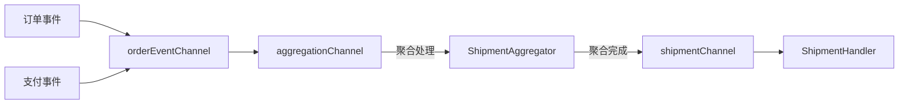

# Spring Events 与 Spring Integration

## 以一个业务场景为例讨论 Spring Events 的使用

### 业务场景

在一个 Spring 应用中，我们可能会遇到这样的需求场景：
当一个业务操作发生时，需要在数据库中标记某些数据待处理，同时后续还需要对这些数据进行进一步处理。例如：

1. **数据标记需求**
   - 在订单创建时，需要在数据库表中标记该订单需要后续处理
   - 这个标记操作必须在原始事务中完成，确保数据一致性
   - 不希望修改现有的订单创建逻辑，避免代码耦合

2. **异步处理需求**
   - 对已标记数据的处理可能比较耗时（如发送通知、更新相关统计等）
   - 这些处理不应该阻塞主业务流程
   - 需要在标记完成后异步执行这些操作

3. **代码复用需求**
   - 类似的标记-处理模式在多个业务场景中都会用到
   - 希望通过泛型机制来复用处理逻辑
   - 不同的处理器可以灵活匹配不同类型的事件

### 技术需求

基于上述业务场景，我们需要一个事件系统满足以下技术要求：

1. **混合处理模式**
   - 数据标记操作需要同步处理（在同一事务中）
   - 后续处理操作需要异步处理（避免阻塞）

2. **类型安全**
   - 事件定义支持泛型，可以传递不同类型的业务对象
   - 事件包含固定的基础信息（如事件ID、时间戳）
   - 支持在发布事件时提供额外的参数

3. **松耦合设计**
   - 业务代码只需要发布事件，不需要关心处理逻辑
   - 处理逻辑可以独立演进，不影响业务代码
   - 支持灵活添加新的事件处理器

### 解决方案

#### 1. 基础事件类设计

```java:events/BaseEvent.java
public class BaseEvent<T> {
    private final String eventId;
    private final LocalDateTime timestamp;
    private final T payload;
    
    public BaseEvent(T payload) {
        this.eventId = UUID.randomUUID().toString();
        this.timestamp = LocalDateTime.now();
        this.payload = payload;
    }
    
    // getters...
}
```

#### 2. 具体事件类型

```java:events/DatabaseMarkerEvent.java
// 同步事件：用于数据库标记
public class DatabaseMarkerEvent<T> extends BaseEvent<T> {
    private final String tableName;
    private final String markType;
    
    public DatabaseMarkerEvent(T payload, String tableName, String markType) {
        super(payload);
        this.tableName = tableName;
        this.markType = markType;
    }
    
    // getters...
}

// 异步事件：用于耗时处理
public class ProcessingEvent<T> extends BaseEvent<T> {
    private final String processingType;
    
    public ProcessingEvent(T payload, String processingType) {
        super(payload);
        this.processingType = processingType;
    }
    
    // getters...
}
```

#### 3. 事件配置

```java:config/EventConfig.java
@Configuration
@EnableAsync
public class EventConfig {
    
    @Bean
    public ApplicationEventMulticaster applicationEventMulticaster() {
        SimpleApplicationEventMulticaster eventMulticaster = new SimpleApplicationEventMulticaster();
        
        eventMulticaster.setErrorHandler(throwable -> {
            log.error("Error in event processing", throwable);
        });
        
        return eventMulticaster;
    }
    
    @Bean
    public Executor asyncEventExecutor() {
        ThreadPoolTaskExecutor executor = new ThreadPoolTaskExecutor();
        executor.setCorePoolSize(2);
        executor.setMaxPoolSize(5);
        executor.setQueueCapacity(25);
        executor.setThreadNamePrefix("AsyncEvent-");
        executor.initialize();
        return executor;
    }
}
```

#### 4. 事件监听器

```java:listeners/EventListeners.java
@Component
@Transactional
public class DatabaseMarkerListener {
    
    @Autowired
    private JdbcTemplate jdbcTemplate;
    
    @Autowired
    private ApplicationEventPublisher eventPublisher;
    
    @EventListener
    public void handleDatabaseMarker(DatabaseMarkerEvent<?> event) {
        // 在同一事务中标记数据
        String sql = String.format(
            "UPDATE %s SET needs_processing = true, mark_type = ? WHERE id = ?",
            event.getTableName()
        );
        
        jdbcTemplate.update(sql, event.getMarkType(), event.getPayload().getId());
        
        // 发布异步处理事件
        eventPublisher.publishEvent(new ProcessingEvent<>(
            event.getPayload(),
            "PROCESS_" + event.getMarkType()
        ));
    }
}

@Component
public class AsyncProcessingListener {
    
    @EventListener
    @Async("asyncEventExecutor")
    public void handleProcessing(ProcessingEvent<Order> event) {
        // 处理订单相关的异步操作
        processOrder(event.getPayload());
    }
    
    @EventListener
    @Async("asyncEventExecutor")
    public void handleProcessing(ProcessingEvent<UserData> event) {
        // 处理用户相关的异步操作
        processUser(event.getPayload());
    }
    
    private void processOrder(Order order) {
        // 耗时的订单处理逻辑
    }
    
    private void processUser(UserData user) {
        // 耗时的用户处理逻辑
    }
}
```

#### 5. 业务服务集成

```java:services/OrderService.java
@Service
@Transactional
public class OrderService {
    
    @Autowired
    private ApplicationEventPublisher eventPublisher;
    
    public void createOrder(Order order) {
        // 保存订单的原有业务逻辑
        orderRepository.save(order);
        
        // 发布事件来标记数据需要处理
        eventPublisher.publishEvent(new DatabaseMarkerEvent<>(
            order,
            "orders",
            "NEW_ORDER"
        ));
    }
}
```

### 方案特点

1. **事务一致性保证**
   - 数据库标记操作在原始事务中执行
   - 确保数据一致性

2. **类型安全**
   - 通过泛型支持不同类型的载荷
   - 编译时类型检查

3. **松耦合设计**
   - 业务代码与数据标记/处理逻辑解耦
   - 通过事件机制实现解耦

4. **灵活性**
   - 支持为不同类型数据添加专门的处理器
   - 处理器可以根据事件类型和泛型参数进行匹配

5. **错误处理**
   - 统一的错误处理机制
   - 异步操作的错误不影响主流程

### 使用示例

```java
// 处理订单
Order order = new Order();
eventPublisher.publishEvent(new DatabaseMarkerEvent<>(
    order,
    "orders",
    "NEW_ORDER"
));

// 处理用户
UserData user = new UserData();
eventPublisher.publishEvent(new DatabaseMarkerEvent<>(
    user,
    "users",
    "NEW_USER"
));
```

### 工作流程

1. 业务方法调用触发事件发布
2. 同步监听器在当前事务中处理数据库标记
3. 标记完成后发布异步处理事件
4. 异步监听器在独立线程中处理耗时操作

这个设计方案成功地实现了原始需求，提供了一个类型安全、松耦合且灵活的事件处理系统，同时保证了事务一致性和系统性能。


## Spring Events 异步处理的失败处理方案


下面讨论一个可能的解决方案，需要注意的是，这个方案引入了一些假设，比如处理逻辑的幂等性是可以实现的。


### 设计思路

1. **状态驱动设计**
   - 使用明确的状态枚举而非布尔值
   - 空状态表示无需处理
   - 状态转换反映处理进度

2. **幂等性保证**
   - 处理逻辑保证幂等
   - 支持重复处理
   - 状态不一致时仍然安全

3. **可见性优先**
   - 清晰的状态流转
   - 便于问题排查
   - 支持处理过程追踪

### 具体实现

#### 1. 处理状态定义

```java:enums/ProcessingStatus.java
public enum ProcessingStatus {
    PENDING("待处理"),
    PROCESSING("处理中"),
    COMPLETED("已处理"),
    FAILED("处理失败");
    
    private final String description;
    
    ProcessingStatus(String description) {
        this.description = description;
    }
    
    public String getDescription() {
        return description;
    }
}
```

#### 2. 业务表结构示例

```sql
CREATE TABLE orders (
    id BIGINT AUTO_INCREMENT PRIMARY KEY,
    /* 其他业务字段 */
    processing_status VARCHAR(20),
    processing_type VARCHAR(50),
    last_processing_time TIMESTAMP,
    processing_message TEXT,
    INDEX idx_processing (processing_status, processing_type)
);
```

#### 3. 事件监听器实现

```java:listeners/AsyncProcessingListener.java
@Component
@Slf4j
public class AsyncProcessingListener {
    
    @Autowired
    private OrderProcessor orderProcessor;
    
    @Autowired
    private JdbcTemplate jdbcTemplate;
    
    @EventListener
    @Async("asyncEventExecutor")
    public void handleProcessing(ProcessingEvent<Order> event) {
        Order order = event.getPayload();
        
        try {
            // 更新为处理中状态
            updateProcessingStatus(order.getId(), 
                ProcessingStatus.PROCESSING, 
                "开始处理订单");
            
            // 执行处理
            orderProcessor.process(order);
            
            // 处理成功，更新状态
            updateProcessingStatus(order.getId(), 
                ProcessingStatus.COMPLETED, 
                "订单处理成功");
            
        } catch (Exception e) {
            log.error("Failed to process order {}: {}", 
                order.getId(), e.getMessage());
            
            try {
                // 尝试更新失败状态，如果更新失败也没关系
                // 状态保持为 PROCESSING，后台任务会处理
                updateProcessingStatus(order.getId(), 
                    ProcessingStatus.FAILED, 
                    "处理失败：" + e.getMessage());
            } catch (Exception ex) {
                log.error("Failed to update status for order {}", 
                    order.getId(), ex);
            }
        }
    }
    
    private void updateProcessingStatus(Long orderId, 
                                      ProcessingStatus status, 
                                      String message) {
        jdbcTemplate.update("""
            UPDATE orders 
            SET processing_status = ?,
                processing_message = ?,
                last_processing_time = NOW()
            WHERE id = ?
            """, status.name(), message, orderId);
    }
}
```

#### 4. 后台处理任务

```java:scheduler/OrderProcessingScheduler.java
@Component
@Slf4j
public class OrderProcessingScheduler {
    
    @Autowired
    private OrderProcessor orderProcessor;
    
    @Autowired
    private JdbcTemplate jdbcTemplate;
    
    @Scheduled(fixedDelay = 300000) // 每5分钟执行一次
    public void processUnprocessedOrders() {
        List<Order> ordersToProcess = findOrdersToProcess();
        
        for (Order order : ordersToProcess) {
            try {
                // 更新为处理中状态
                updateProcessingStatus(order.getId(), 
                    ProcessingStatus.PROCESSING, 
                    "后台任务开始处理");
                
                // 执行处理
                orderProcessor.process(order);
                
                // 更新为完成状态
                updateProcessingStatus(order.getId(), 
                    ProcessingStatus.COMPLETED, 
                    "后台任务处理成功");
                
            } catch (Exception e) {
                log.error("Failed to process order {} in scheduler: {}", 
                    order.getId(), e.getMessage());
                
                try {
                    updateProcessingStatus(order.getId(), 
                        ProcessingStatus.FAILED, 
                        "后台任务处理失败：" + e.getMessage());
                } catch (Exception ex) {
                    log.error("Failed to update status for order {}", 
                        order.getId(), ex);
                }
            }
        }
    }
    
    private List<Order> findOrdersToProcess() {
        return jdbcTemplate.query("""
            SELECT * FROM orders 
            WHERE processing_status IN ('PENDING', 'PROCESSING', 'FAILED')
            AND processing_type = 'NEW_ORDER'
            ORDER BY id ASC 
            LIMIT 100
            """, orderRowMapper);
    }
}
```

#### 5. 业务服务集成

```java:services/OrderService.java
@Service
@Transactional
public class OrderService {
    
    @Autowired
    private ApplicationEventPublisher eventPublisher;
    
    public void createOrder(Order order) {
        // 保存订单，初始状态为 PENDING
        order.setProcessingStatus(ProcessingStatus.PENDING);
        order.setProcessingType("NEW_ORDER");
        orderRepository.save(order);
        
        // 发布处理事件
        eventPublisher.publishEvent(new ProcessingEvent<>(order));
    }
}
```

或者，参考上文，通过 `DatabaseMarkerEvent` 先发布“数据库标记”事件：

```java
// 发布者的代码
@Transactional
public void createOrder(Order order) {
    orderRepository.save(order);  // 实体进入持久化状态
    eventPublisher.publishEvent(new DatabaseMarkerEvent<>(order, ...));
}

// 监听器的代码
@EventListener
public void handleDatabaseMarker(DatabaseMarkerEvent<Order> event) {
    Order order = orderRepository.findById(event.getPayload().getId())
        .orElseThrow();  // 获取同一个实体实例
    order.setProcessingStatus(ProcessingStatus.PENDING);  // 修改这个实例
}
// 这里使用 findById 是安全的。
// 由于 @Transactional 注解，这个监听器方法与发布事件的方法在同一个事务中。
// 在同一个事务中，Hibernate 的一级缓存（Session）会确保同一个 ID 的实体只有一个实例，
// 所以 findById 会返回与之前 save 时完全相同的实体实例。
```

或者简化监听者的也可以这样写：

```java
// 监听者的代码
@Component
@Transactional
public class DatabaseMarkerListener {
    
    @Autowired
    private ApplicationEventPublisher eventPublisher;
    
    @EventListener
    public void handleDatabaseMarker(DatabaseMarkerEvent<Order> event) {
        Order order = event.getPayload();
        order.setProcessingStatus(ProcessingStatus.PENDING);
        order.setProcessingType(event.getMarkType());
        order.setLastProcessingTime(LocalDateTime.now());
        
        // 发布异步处理事件
        eventPublisher.publishEvent(new ProcessingEvent<>(order));
    }
}
```

### 方案优势

1. **状态清晰**
   - 明确的状态定义
   - 处理过程可追踪
   - 支持失败原因记录

2. **处理可靠**
   - 基于幂等性的重试机制
   - 状态不一致时仍然安全
   - 后台任务兜底保证

3. **易于维护**
   - 状态流转直观
   - 问题排查方便
   - 支持监控和告警

### 最佳实践

1. **状态设计**
   - 状态定义要清晰
   - 记录状态变更原因
   - 添加时间戳便于追踪

2. **处理策略**
   - 保证处理逻辑幂等
   - 合理设置重试间隔
   - 考虑并发处理能力

3. **监控建议**
   - 监控各状态记录数量
   - 关注 FAILED 状态积压
   - 设置状态停留时间告警

这个改进后的方案通过明确的状态定义，提供了更好的可见性和可维护性，同时保持了处理的可靠性和简单性。状态的流转更加清晰，也为后续的问题排查和系统监控提供了便利。


## Spring Events 与 Spring Integration


### 背景：企业集成模式

企业集成模式（Enterprise Integration Patterns，EIP）是一系列用于解决企业应用集成问题的设计模式，由 Gregor Hohpe 和 Bobby Woolf 在其著作《Enterprise Integration Patterns》中系统化地提出。这些模式主要解决以下问题：

1. **消息路由**：如何将消息发送到正确的目的地
2. **消息转换**：如何处理不同系统间的消息格式转换
3. **消息分割与聚合**：如何处理大消息的拆分和小消息的组合
4. **消息过滤**：如何过滤掉不需要的消息
5. **消息通道**：如何在系统间传递消息


### Spring Integration 简介

Spring Integration 是 Spring 生态系统中实现企业集成模式的框架，它提供了：

1. **声明式适配器**：用于连接各种外部系统
2. **消息通道抽象**：支持点对点和发布订阅模式
3. **消息路由能力**：基于内容、头部等信息进行路由
4. **消息转换器**：处理不同格式间的转换
5. **端点（Endpoint）**：处理消息的入口和出口

### Spring Events 与 Spring Integration 的对比

| 特性 | Spring Events | Spring Integration |
|------|--------------|-------------------|
| 范围 | 应用内部事件处理 | 跨系统消息集成 |
| 复杂度 | 相对简单 | 较为复杂 |
| 使用场景 | 单应用内的解耦 | 企业级系统集成 |
| 配置方式 | 注解为主 | DSL/XML/注解 |
| 扩展性 | 中等 | 很强 |


### 结合使用的优势

1. **增强的消息路由能力**
   - 可以基于事件内容进行复杂路由
   - 支持动态路由策略

2. **更强大的转换能力**
   - 事件可以无缝转换为各种消息格式
   - 支持复杂的转换链

3. **外部系统集成**
   - 可以将内部事件发送到外部系统
   - 支持多种协议和格式

4. **可靠性提升**
   - 利用 Spring Integration 的错误处理
   - 支持消息持久化

### 实践建议

1. **渐进式采用**
   - 先使用 Spring Events 满足基本需求
   - 在需要外部集成时引入 Spring Integration

2. **职责分离**
   - Spring Events 处理应用内事件
   - Spring Integration 处理系统间集成

3. **性能考虑**
   - 评估消息转换的开销
   - 合理配置缓冲区和线程池

4. **监控和管理**
   - 使用 Spring Integration 的监控特性
   - 实现消息追踪和审计

这种结合使用的方式既保持了 Spring Events 的简单性，又获得了 Spring Integration 的强大集成能力，特别适合那些需要处理复杂集成场景的应用。


## 使用 Spring Integration 与外部系统集成

### 场景需求

假设我们的系统需要：

1. **订单处理通知**
   - 当订单创建后，需要通知多个外部系统
   - 不同的外部系统可能需要不同格式的数据
   - 有些通知通过 Kafka 发送，有些通过 HTTP 接口

2. **灵活的路由策略**
   - VIP 客户的订单需要优先处理
   - 不同类型的订单发送到不同的处理队列
   - 某些特殊订单需要特殊处理流程

### 具体实现

#### 1. 事件网关配置
这个配置创建了一个统一的事件处理入口，类似一个"消息总线"。

```java:config/EventGatewayConfig.java
@Configuration
public class EventGatewayConfig {
    
    @Bean
    public MessageChannel eventChannel() {
        // 创建一个直接通道，用于事件传递
        return new DirectChannel();
    }
    
    @Bean
    @ServiceActivator(inputChannel = "eventChannel")
    public MessageHandler eventHandler() {
        return message -> {
            // 这里可以添加通用的处理逻辑
            // 比如日志记录、监控指标收集等
            BaseEvent<?> event = (BaseEvent<?>) message.getPayload();
            log.info("Received event: {}", event.getEventId());
        };
    }
    
    // 提供一个更简单的接口来发布事件
    @MessagingGateway
    public interface EventGateway {
        @Gateway(requestChannel = "eventChannel")
        void publishEvent(BaseEvent<?> event);
    }
}
```

#### 2. 事件格式转换
不同的外部系统可能需要不同格式的数据，这个组件负责转换。

```java:integration/EventMessageTransformer.java
@Component
public class EventMessageTransformer {
    
    @Transformer(inputChannel = "eventChannel", outputChannel = "messageChannel")
    public Message<?> transformEvent(Message<BaseEvent<?>> message) {
        BaseEvent<?> event = message.getPayload();
        
        // 转换为通用消息格式
        // 例如：订单事件转换为包含必要字段的消息
        return MessageBuilder
            .withPayload(event.getPayload())
            .setHeader("eventId", event.getEventId())
            .setHeader("timestamp", event.getTimestamp())
            // 可以添加更多的业务相关头信息
            .setHeader("orderType", getOrderType(event))
            .setHeader("customerLevel", getCustomerLevel(event))
            .build();
    }
}
```

#### 3. 事件路由配置
根据不同的业务规则将事件路由到不同的处理通道。

```java:integration/EventRouter.java
@Component
public class EventRouter {
    
    @Router(inputChannel = "eventChannel")
    public String routeEvent(BaseEvent<?> event) {
        // 根据事件类型和业务规则决定路由目标
        if (event instanceof DatabaseMarkerEvent) {
            // 数据库标记事件走数据库处理通道
            return "databaseChannel";
        } else if (event instanceof ProcessingEvent) {
            // 根据订单类型决定处理通道
            ProcessingEvent<?> processingEvent = (ProcessingEvent<?>) event;
            if (isVipOrder(processingEvent)) {
                return "vipProcessingChannel";
            }
            return "normalProcessingChannel";
        }
        return "defaultChannel";
    }
    
    private boolean isVipOrder(ProcessingEvent<?> event) {
        // 判断是否是 VIP 订单的业务逻辑
        return false;
    }
}
```

#### 4. 外部系统集成
配置与外部系统的集成，例如发送消息到 Kafka。

```java:integration/ExternalSystemIntegration.java
@Configuration
public class ExternalSystemIntegration {
    
    @Bean
    @ServiceActivator(inputChannel = "processingChannel")
    public MessageHandler kafkaHandler() {
        // 配置 Kafka 消息处理器
        KafkaProducerMessageHandler<String, String> handler = 
            new KafkaProducerMessageHandler<>(kafkaTemplate());
        
        // 设置目标 topic
        handler.setTopicExpression(new LiteralExpression("orders-topic"));
        
        return handler;
    }
    
    @Bean
    public KafkaTemplate<String, String> kafkaTemplate() {
        // Kafka 生产者配置
        return new KafkaTemplate<>(producerFactory());
    }
}
```

### 使用示例

```java:services/OrderService.java
@Service
public class OrderService {
    
    @Autowired
    private EventGateway eventGateway;
    
    public void processOrder(Order order) {
        // 发布订单处理事件
        eventGateway.publishEvent(new ProcessingEvent<>(order));
    }
}
```

### 实际应用场景

1. **订单处理流程**
   ```
   订单创建 -> 事件发布 -> 格式转换 -> 路由判断 ->
   ├── VIP订单 -> Kafka快速处理队列
   ├── 普通订单 -> 标准处理队列
   └── 特殊订单 -> 人工审核队列
   ```

2. **多系统通知**
   ```
   订单状态变更 -> 事件发布 ->
   ├── 转换为短信格式 -> 短信服务
   ├── 转换为邮件格式 -> 邮件服务
   └── 转换为APP推送格式 -> 推送服务
   ```

### 方案优势

1. **解耦合**
   - 业务代码只需要发布事件
   - 不需要关心具体的处理流程
   - 便于添加新的处理逻辑

2. **灵活性**
   - 可以动态改变处理流程
   - 支持复杂的路由规则
   - 便于处理特殊情况

3. **可维护性**
   - 各个组件职责清晰
   - 便于监控和排查问题
   - 支持灵活的配置调整


### Spring Integration 的通道实现选择

Spring Integration 提供了灵活的消息通道实现，可以根据实际需求选择合适的方案。

#### 是否需要消息代理？

Spring Integration 的通道实现不一定需要消息代理：

1. **无需消息代理的方案**
   - `DirectChannel`：直接的方法调用
   - `QueueChannel`：内存中的队列实现
   - 适用于单机部署，无需消息持久化的场景

2. **需要消息代理的场景**
   - 需要消息持久化
   - 需要跨 JVM 通信
   - 需要高可用和扩展性

#### 通道实现示例

```java:config/ChannelConfig.java
@Configuration
public class ChannelConfig {
    
    // 方案1：使用直接通道（方法调用，无需消息代理）
    @Bean
    public MessageChannel eventChannel() {
        return new DirectChannel();
    }
    
    // 方案2：使用内存队列（异步，无需消息代理）
    @Bean
    public MessageChannel eventChannel() {
        return new QueueChannel(100); // 容量为100的队列
    }
    
    // 方案3：使用 RabbitMQ 通道（需要消息代理）
    @Bean
    public MessageChannel eventChannel() {
        return Amqp.channel()
            .connectionFactory(connectionFactory)
            .queue("eventQueue")
            .get();
    }
    
    // 方案4：使用 Kafka 通道（需要消息代理）
    @Bean
    public MessageChannel eventChannel() {
        return Kafka.channel()
            .connectionFactory(kafkaConnectionFactory)
            .topic("eventTopic")
            .get();
    }
}
```

#### 业务代码的稳定性

得益于 Spring Integration 的良好抽象，业务代码可以保持稳定：

```java:services/OrderService.java
@Service
public class OrderService {
    @Autowired
    private EventGateway eventGateway;
    
    public void processOrder(Order order) {
        // 业务代码不需要关心底层实现
        eventGateway.publishEvent(new ProcessingEvent<>(order));
    }
}
```

#### 实现方案的演进

Spring Integration 支持系统实现的渐进式演进：

1. **起步阶段**
   - 使用 DirectChannel
   - 简单直接，无需额外依赖
   - 适合功能验证和开发测试

2. **异步需求**
   - 切换到 QueueChannel
   - 实现异步处理
   - 仍然无需外部依赖

3. **分布式需求**
   - 切换到 RabbitMQ 或 Kafka
   - 获得消息持久化和分布式能力
   - 业务代码无需改动

#### 方案优势

1. **灵活性**
   - 可以从简单实现开始
   - 根据需求逐步升级
   - 支持多种实现方式

2. **代码稳定**
   - 业务代码与实现解耦
   - 切换实现无需改代码
   - 降低维护成本

3. **渐进式采用**
   - 可以随业务增长逐步演进
   - 避免过度设计
   - 降低前期投入


#### Maven 依赖配置

根据不同的通道实现，需要添加相应的依赖：

```xml
<!-- Spring Integration 核心（必需）-->
<dependency>
    <groupId>org.springframework.integration</groupId>
    <artifactId>spring-integration-core</artifactId>
    <version>${spring-integration.version}</version>
</dependency>

<!-- 使用 RabbitMQ 时需要添加 -->
<dependency>
    <groupId>org.springframework.integration</groupId>
    <artifactId>spring-integration-amqp</artifactId>
    <version>${spring-integration.version}</version>
</dependency>

<!-- 使用 Kafka 时需要添加 -->
<dependency>
    <groupId>org.springframework.integration</groupId>
    <artifactId>spring-integration-kafka</artifactId>
    <version>${spring-integration.version}</version>
</dependency>
```

#### 消息代理配置

##### 1. 使用内存通道（无需消息代理）
```yaml:application.yml
# 无需特殊配置
spring:
  integration:
    channel:
      auto-create: true
```

##### 2. 使用 RabbitMQ 通道
```yaml:application.yml
spring:
  rabbitmq:
    host: ${RABBITMQ_HOST:localhost}
    port: ${RABBITMQ_PORT:5672}
    username: ${RABBITMQ_USER:guest}
    password: ${RABBITMQ_PASS:guest}
    # 可靠性配置
    publisher-confirm-type: correlated
    publisher-returns: true
```

##### 3. 使用 Kafka 通道
```yaml:application.yml
spring:
  kafka:
    bootstrap-servers: ${KAFKA_SERVERS:localhost:9092}
    producer:
      # 可靠性配置
      acks: all
      retries: 3
    consumer:
      group-id: ${spring.application.name}
      auto-offset-reset: earliest
```

#### 切换步骤说明

1. **从内存通道切换到消息代理**
   - 添加相应的 Maven 依赖
   - 添加消息代理的配置
   - 修改通道配置类（如前文的 ChannelConfig）
   - 业务代码无需改动

2. **在不同消息代理间切换**
   - 修改 Maven 依赖
   - 更新消息代理配置
   - 更新通道配置
   - 业务代码保持不变

#### 最佳实践建议

1. **环境隔离**
   - 开发环境可以使用内存通道
   - 测试环境可以使用轻量级的 RabbitMQ
   - 生产环境根据需求选择合适的消息代理

2. **配置外部化**
   - 使用配置中心管理消息代理配置
   - 通过环境变量注入敏感信息
   - 便于不同环境之间切换

3. **监控和运维**
   - 添加适当的日志记录
   - 配置监控指标
   - 设置告警阈值


### 消息通道类型对比

#### 内存通道

##### DirectChannel（点对点通道）
- 一条消息只会被一个消费者处理
- 使用轮询（Round-Robin）方式在多个消费者之间分发消息
- 同步处理：发送者线程会等待消费者处理完成
- 适用场景：需要确保消息被精确处理一次

```java
@Bean
public MessageChannel orderChannel() {
    return new DirectChannel();
}

// 消费者1
@ServiceActivator(inputChannel = "orderChannel")
public void processOrder1(Order order) {
    // 只有一个消费者会收到消息
}

// 消费者2
@ServiceActivator(inputChannel = "orderChannel")
public void processOrder2(Order order) {
    // 与消费者1轮流处理消息
}
```

##### PublishSubscribeChannel（发布订阅通道）
- 一条消息会被所有订阅者接收和处理
- 支持广播：每个消费者都会收到相同的消息
- 异步处理：发送者不会等待消费者处理完成
- 适用场景：需要多个系统同时处理同一个消息

```java
@Bean
public MessageChannel notificationChannel() {
    return new PublishSubscribeChannel();
}

// 消费者1
@ServiceActivator(inputChannel = "notificationChannel")
public void sendEmail(Order order) {
    // 发送邮件通知
}

// 消费者2
@ServiceActivator(inputChannel = "notificationChannel")
public void sendSMS(Order order) {
    // 同时发送短信通知
}
```

#### 使用消息代理时的实现

##### 1. RabbitMQ 实现
```java
@Bean
public MessageChannel orderChannel() {
    return Amqp.channel()
        .connectionFactory(connectionFactory)
        .queue("orders")        // 点对点队列
        .get();
}

@Bean
public MessageChannel notificationChannel() {
    return Amqp.channel()
        .connectionFactory(connectionFactory)
        .exchange("notifications")  // 发布订阅交换器
        .get();
}
```

##### 2. Kafka 实现
```java
@Bean
public MessageChannel orderChannel() {
    return Kafka.channel()
        .connectionFactory(kafkaConnectionFactory)
        .topic("orders")        // 单分区主题实现点对点
        .get();
}

@Bean
public MessageChannel notificationChannel() {
    return Kafka.channel()
        .connectionFactory(kafkaConnectionFactory)
        .topic("notifications") // 多消费者组实现发布订阅
        .get();
}
```

##### 消息代理支持说明

1. **RabbitMQ**
   - 点对点：使用普通队列
   - 发布订阅：使用 fanout 类型的交换器（Exchange）
   - 原生支持这两种模式

2. **Kafka**
   - 点对点：同一消费者组的多个消费者共同消费一个主题
   - 发布订阅：不同消费者组各自独立消费同一个主题
   - 通过消费者组机制实现这两种模式

3. **切换注意事项**
   - 从内存通道切换到消息代理需要添加相应配置
   - 消息的持久化和可靠性需要额外配置
   - 需要考虑消息序列化和反序列化


### 使用内嵌 RabbitMQ

#### Maven 依赖

```xml
<!-- Spring AMQP + 内嵌 RabbitMQ -->
<dependency>
    <groupId>org.springframework.boot</groupId>
    <artifactId>spring-boot-starter-amqp</artifactId>
</dependency>

<!-- 内嵌 RabbitMQ 服务器，仅用于开发和测试环境 -->
<dependency>
    <groupId>io.arivera.oss</groupId>
    <artifactId>embedded-rabbitmq</artifactId>
    <version>1.5.0</version>
    <scope>test</scope>  <!-- 仅用于测试 -->
</dependency>
```

#### 内嵌 RabbitMQ 配置

```java:config/EmbeddedRabbitConfig.java
@Configuration
@Profile("dev")  // 仅在开发环境启用
public class EmbeddedRabbitConfig {
    
    @Bean(initMethod = "start", destroyMethod = "stop")
    public EmbeddedRabbitMqServer embeddedRabbitMq() throws IOException {
        return new EmbeddedRabbitMqServer();
    }
    
    // 内部类用于启动内嵌 RabbitMQ
    private static class EmbeddedRabbitMqServer {
        private EmbeddedRabbitMq rabbitmq;
        
        public void start() throws IOException {
            EmbeddedRabbitMqConfig config = new EmbeddedRabbitMqConfig.Builder()
                .port(5672)
                .build();
            rabbitmq = new EmbeddedRabbitMq(config);
            rabbitmq.start();
        }
        
        public void stop() {
            if (rabbitmq != null) {
                rabbitmq.stop();
            }
        }
    }
}
```

#### 应用配置

```yaml:application.yml
spring:
  profiles:
    active: dev  # 开发环境
    
  rabbitmq:
    # 开发环境使用内嵌模式的配置
    host: localhost
    port: 5672
    username: guest
    password: guest
    
    # 消息确认机制
    listener:
      simple:
        acknowledge-mode: auto
        retry:
          enabled: true
          initial-interval: 2s
          max-attempts: 3
          multiplier: 2
```

#### 使用说明

1. **环境区分**
   - 开发环境（dev profile）：使用内嵌 RabbitMQ
   - 其他环境：使用独立部署的 RabbitMQ

2. **启动顺序**
   - 应用启动时会自动启动内嵌的 RabbitMQ
   - 应用关闭时会自动关闭内嵌的 RabbitMQ

3. **注意事项**
   - 内嵌 RabbitMQ 需要系统安装 Erlang 运行时
   - 仅推荐用于开发和测试环境
   - 每次启动都是全新的实例，数据不会持久化

4. **优势**
   - 开发环境无需额外部署 RabbitMQ
   - 保证了开发环境的独立性
   - 便于自动化测试


## Spring Events 与 Spring Integration 的结合使用

### 从 Spring Events 到 Spring Integration

在之前的讨论中，我们使用 Spring Events 实现了应用内的事件处理：

```java:services/OrderService.java
@Service
public class OrderService {
    @Autowired
    private ApplicationEventPublisher eventPublisher;
    
    public void createOrder(Order order) {
        orderRepository.save(order);
        // 发布事件来标记数据需要处理
        eventPublisher.publishEvent(new DatabaseMarkerEvent<>(
            order,
            "orders",
            "NEW_ORDER"
        ));
    }
}
```

这种方式很好地解决了应用内的事件处理需求。但是，当我们需要：
1. 将事件发送到外部系统（如 Kafka、RabbitMQ）
2. 对不同类型的事件进行复杂路由
3. 进行消息格式转换

这时，我们可以考虑将 Spring Events 与 Spring Integration 结合使用。

### 结合方式示例

#### 1. 通过事件监听器桥接

```java:integration/EventBridgeListener.java
@Component
public class EventBridgeListener {
    
    @Autowired
    private MessageChannel integrationChannel;
    
    @EventListener
    public void bridgeToIntegration(DatabaseMarkerEvent<?> event) {
        // 将 Spring Event 转换为 Spring Integration Message
        Message<?> message = MessageBuilder
            .withPayload(event)
            .setHeader("eventType", "DATABASE_MARKER")
            .build();
            
        // 发送到 Spring Integration 通道
        integrationChannel.send(message);
    }
}
```

这种方式的优点是：
- 保持原有的 Spring Events 代码不变
- 通过监听器实现与 Integration 的桥接
- 可以选择性地桥接特定类型的事件

#### 2. 在需要外部集成时使用 Spring Integration

比如，当我们需要将某些特定事件发送到 Kafka 时：

```java:integration/KafkaIntegrationConfig.java
@Configuration
public class KafkaIntegrationConfig {
    
    @Bean
    @ServiceActivator(inputChannel = "integrationChannel")
    public MessageHandler kafkaHandler() {
        // 仅处理需要发送到 Kafka 的事件
        return message -> {
            if (shouldSendToKafka(message)) {
                // 发送到 Kafka 的逻辑
            }
        };
    }
    
    private boolean shouldSendToKafka(Message<?> message) {
        return message.getPayload() instanceof DatabaseMarkerEvent;
    }
}
```

### 最佳实践建议

1. **保持简单**
   - 对于纯应用内的事件处理，继续使用 Spring Events
   - 只在确实需要外部集成时引入 Spring Integration

2. **清晰的边界**
   - Spring Events 处理应用内的事件流转
   - Spring Integration 处理与外部系统的集成

3. **渐进式采用**
   - 先用 Spring Events 实现核心功能
   - 需要外部集成时，通过监听器桥接到 Integration


## 附录：类、注解与依赖说明

### Maven 依赖

```xml
<!-- Spring Events 相关（包含在 spring-context 中）-->
<dependency>
    <groupId>org.springframework</groupId>
    <artifactId>spring-context</artifactId>
    <version>${spring.version}</version>
</dependency>
<!-- Spring Events 相关依赖说明 -->
<!-- 
在 Spring Boot 项目中，通常不需要显式添加 spring-context 依赖，
因为常用的 starter（如 spring-boot-starter-web）已经包含了这个依赖
-->

<!-- Spring Integration 核心 -->
<dependency>
    <groupId>org.springframework.integration</groupId>
    <artifactId>spring-integration-core</artifactId>
    <version>${spring-integration.version}</version>
</dependency>

<!-- Spring Integration Kafka（如果需要 Kafka 集成）-->
<dependency>
    <groupId>org.springframework.integration</groupId>
    <artifactId>spring-integration-kafka</artifactId>
    <version>${spring-integration.version}</version>
</dependency>
```

### 关键类和注解清单

#### 1. Spring Events 相关

**核心接口/类** (org.springframework.context.event)
- `ApplicationEventPublisher` (org.springframework.context)
- `ApplicationEventMulticaster` (org.springframework.context.event)
- `SimpleApplicationEventMulticaster` (org.springframework.context.event)

**注解**
- `@EventListener` (org.springframework.context.event.EventListener)
- `@Async` (org.springframework.scheduling.annotation.Async)
- `@EnableAsync` (org.springframework.scheduling.annotation.EnableAsync)
- `@Scheduled` (org.springframework.scheduling.annotation.Scheduled)

#### 2. Spring Integration 相关

**注解**
- `@ServiceActivator` (org.springframework.integration.annotation)
- `@MessagingGateway` (org.springframework.integration.annotation)
- `@Gateway` (org.springframework.integration.annotation)
- `@Transformer` (org.springframework.integration.annotation)
- `@Router` (org.springframework.integration.annotation)

**核心类**
- `MessageChannel` (org.springframework.messaging)
- `DirectChannel` (org.springframework.integration.channel)
- `MessageHandler` (org.springframework.messaging)
- `MessageBuilder` (org.springframework.integration.support)
- `KafkaProducerMessageHandler` (org.springframework.integration.kafka.outbound)

#### 3. 自定义类（文章中提到的）

**事件类**
- `BaseEvent<T>` (events)
- `DatabaseMarkerEvent<T>` (events)
- `ProcessingEvent<T>` (events)

**监听器**
- `DatabaseMarkerListener` (listeners)
- `AsyncProcessingListener` (listeners)

**配置类**
- `EventConfig` (config)
- `EventGatewayConfig` (config)
- `KafkaIntegrationConfig` (config)

**服务类**
- `OrderService` (services)
- `ProcessingTaskService` (services)
- `OrderProcessor` (services)

**集成相关**
- `EventBridgeListener` (integration)
- `EventMessageTransformer` (integration)
- `EventRouter` (integration)
- `ExternalSystemIntegration` (integration)

**枚举**
- `ProcessingStatus` (enums)

### 包结构建议

```
com.example.project/
├── config/
├── events/
├── listeners/
├── services/
├── integration/
├── enums/
└── model/
```

### 使用注意事项

1. Spring Events 的核心功能已包含在 spring-context 中
2. 使用 Spring Integration 需要额外引入相关依赖
3. 如果需要特定的集成（如 Kafka），需要引入对应的集成模块
4. 建议按功能模块组织包结构，保持代码的清晰和可维护性


## 附录：RabbitMQ 开发环境搭建方案

### 方案一：安装 Erlang 运行时

由于 RabbitMQ 是用 Erlang 语言开发的，使用内嵌 RabbitMQ 时需要安装 Erlang 运行时环境。

#### Windows 安装
```bash
# 使用 Chocolatey 包管理器
choco install erlang
```
或者从官网下载安装包：https://www.erlang.org/downloads

#### macOS 安装
```bash
# 使用 Homebrew
brew install erlang
```

#### Ubuntu/Debian 安装
```bash
# 添加 Erlang Solutions 仓库
wget https://packages.erlang-solutions.com/erlang-solutions_2.0_all.deb
sudo dpkg -i erlang-solutions_2.0_all.deb

# 更新包列表
sudo apt-get update

# 安装 Erlang
sudo apt-get install erlang
```

#### CentOS/RHEL 安装
```bash
# 添加 Erlang Solutions 仓库
curl -s https://packages.erlang-solutions.com/rpm/centos/erlang_solutions.repo > /etc/yum.repos.d/erlang.repo

# 安装 Erlang
yum install erlang
```

安装完成后，验证安装：
```bash
erl -version
```

### 方案二：使用 Docker（推荐）

使用 Docker 可以避免安装 Erlang，同时提供更一致的开发环境。

#### Docker Compose 配置

```yaml:docker-compose.yml
version: '3.8'
services:
  rabbitmq:
    image: rabbitmq:3-management  # 包含管理界面的版本
    ports:
      - "5672:5672"    # AMQP 协议端口
      - "15672:15672"  # 管理界面端口
    environment:
      - RABBITMQ_DEFAULT_USER=guest
      - RABBITMQ_DEFAULT_PASS=guest
    volumes:
      - rabbitmq_data:/var/lib/rabbitmq  # 数据持久化
    healthcheck:
      test: ["CMD", "rabbitmq-diagnostics", "check_port_connectivity"]
      interval: 30s
      timeout: 10s
      retries: 3

volumes:
  rabbitmq_data:
```

#### 基本使用命令

```bash
# 启动 RabbitMQ
docker-compose up -d rabbitmq

# 查看日志
docker-compose logs -f rabbitmq

# 停止服务
docker-compose down
```

#### 访问管理界面
- URL: http://localhost:15672
- 默认用户名/密码: guest/guest

### 方案对比

1. **Erlang 安装方案**
   - 优点：
     - 直接在本机运行，性能较好
     - 资源占用相对较少
   - 缺点：
     - 需要安装 Erlang
     - 不同系统安装方式不同
     - 可能遇到版本兼容问题

2. **Docker 方案（推荐）**
   - 优点：
     - 无需安装 Erlang
     - 环境一致性好
     - 提供管理界面
     - 支持数据持久化
     - 便于团队协作
   - 缺点：
     - 需要安装 Docker
     - 占用更多系统资源


## 附录：企业集成模式与 Spring Integration 实现

### 常用的企业集成模式

#### 1. 消息通道（Message Channel）
最基础的模式，提供消息传递的通道。

```java:config/ChannelConfig.java
@Configuration
public class ChannelConfig {
    
    @Bean
    public MessageChannel orderChannel() {
        return new DirectChannel();  // 点对点通道
    }
    
    @Bean
    public MessageChannel notificationChannel() {
        return new PublishSubscribeChannel();  // 发布订阅通道
    }
}
```

#### 2. 消息路由器（Message Router）
根据消息内容或元数据决定消息的目标通道。

```java:integration/OrderRouter.java
@Component
public class OrderRouter {
    
    @Router(inputChannel = "orderChannel")
    public String routeOrder(Order order) {
        if (order.getAmount() > 10000) {
            return "vipOrderChannel";
        } else if (order.isUrgent()) {
            return "urgentOrderChannel";
        }
        return "normalOrderChannel";
    }
}
```

#### 3. 消息过滤器（Message Filter）
根据条件过滤消息。

```java:integration/OrderFilter.java
@Component
public class OrderFilter {
    
    @Filter(inputChannel = "orderChannel", outputChannel = "validOrderChannel")
    public boolean filterOrder(Order order) {
        return order.getAmount() > 0 && order.getCustomerId() != null;
    }
}
```

#### 4. 消息转换器（Message Transformer）
转换消息的格式或内容。

```java:integration/OrderTransformer.java
@Component
public class OrderTransformer {
    
    @Transformer(inputChannel = "orderChannel", outputChannel = "processedChannel")
    public OrderDTO transformOrder(Order order) {
        return OrderDTO.builder()
            .orderId(order.getId())
            .customerName(order.getCustomer().getName())
            .totalAmount(order.getAmount())
            .status(order.getStatus())
            .build();
    }
}
```

#### 5. 消息分割器（Splitter）
将一个大消息分割成多个小消息。

```java:integration/OrderSplitter.java
@Component
public class OrderSplitter {
    
    @Splitter(inputChannel = "batchOrderChannel", outputChannel = "singleOrderChannel")
    public List<Order> splitBatchOrder(BatchOrder batchOrder) {
        return batchOrder.getOrders();
    }
}
```

#### 6. 消息聚合器（Aggregator）
将多个相关消息合并成一个消息。

```java:integration/OrderAggregator.java
@Component
public class OrderAggregator {
    
    @Aggregator(inputChannel = "orderItemChannel", outputChannel = "completeOrderChannel")
    public Order aggregateOrder(List<OrderItem> items) {
        return Order.builder()
            .items(items)
            .totalAmount(calculateTotal(items))
            .build();
    }
    
    private BigDecimal calculateTotal(List<OrderItem> items) {
        return items.stream()
            .map(OrderItem::getAmount)
            .reduce(BigDecimal.ZERO, BigDecimal::add);
    }
}
```

#### 7. 服务激活器（Service Activator）
将消息连接到服务的处理方法。

```java:integration/OrderProcessor.java
@Component
public class OrderProcessor {
    
    @Autowired
    private OrderService orderService;
    
    @ServiceActivator(inputChannel = "orderChannel")
    public void processOrder(Order order) {
        orderService.process(order);
    }
}
```

### 完整的集成流程示例

下面是一个结合多个模式的订单处理流程示例：

```java:config/OrderIntegrationConfig.java
@Configuration
public class OrderIntegrationConfig {
    
    @Bean
    public IntegrationFlow orderProcessingFlow() {
        return IntegrationFlows
            .from("orderChannel")
            // 过滤无效订单
            .filter(Order.class, order -> order.getAmount().compareTo(BigDecimal.ZERO) > 0)
            // 转换订单格式
            .transform(order -> {
                OrderDTO dto = new OrderDTO();
                // 转换逻辑
                return dto;
            })
            // 根据订单金额路由
            .<Order, String>route(order -> {
                if (order.getAmount().compareTo(new BigDecimal("10000")) > 0) {
                    return "vip";
                }
                return "normal";
            }, mapping -> mapping
                .subFlowMapping("vip", sf -> sf
                    .channel("vipOrderChannel")
                    .handle(vipOrderHandler()))
                .subFlowMapping("normal", sf -> sf
                    .channel("normalOrderChannel")
                    .handle(normalOrderHandler())))
            .get();
    }
    
    @Bean
    public MessageHandler vipOrderHandler() {
        return message -> {
            Order order = (Order) message.getPayload();
            // VIP订单处理逻辑
        };
    }
    
    @Bean
    public MessageHandler normalOrderHandler() {
        return message -> {
            Order order = (Order) message.getPayload();
            // 普通订单处理逻辑
        };
    }
}
```

### 实际应用场景

#### 1. 订单处理系统
```
订单创建 -> 验证过滤 -> 格式转换 -> 业务路由 ->
├── VIP订单处理
└── 普通订单处理
```

#### 2. 数据同步系统
```
数据变更 -> 分割大批量 -> 格式转换 -> 并行处理 -> 结果聚合
```

#### 3. 消息通知系统
```
事件发生 -> 消息转换 -> 多通道广播 ->
├── 邮件通知
├── 短信通知
└── APP推送
```

### Spring Integration 的优势

1. **声明式配置**
   - 使用注解或 Java 配置
   - 代码清晰易读
   - 便于维护

2. **模块化设计**
   - 各个组件职责单一
   - 易于测试和调试
   - 支持复用

3. **灵活性**
   - 支持多种集成模式
   - 可以组合使用
   - 支持自定义扩展

4. **可靠性**
   - 内置错误处理
   - 支持事务
   - 提供监控能力


## 附录：Spring Integration 与 Apache Camel 技术选型对比

### 1. 市场接受度和应用范围

#### Spring Integration
- **优势**:
  - Spring 生态系统的一部分，与 Spring Boot/Cloud 完美集成
  - 学习曲线相对平缓（对于熟悉 Spring 的开发者）
  - 配置简单，尤其是使用 Java DSL
  - 适合企业内部集成场景

- **局限**:
  - 社区活跃度相对较低
  - 组件和连接器数量少于 Camel
  - 主要在 Spring 生态系统内使用

#### Apache Camel
- **优势**:
  - 更成熟的集成框架
  - 庞大的组件库（300+）
  - 强大的路由能力
  - 框架无关性，可以在任何 Java 环境中使用
  - 社区非常活跃
  - 适合复杂的企业集成场景

- **局限**:
  - 学习曲线较陡
  - 配置相对复杂
  - 与 Spring 生态集成需要额外配置

### 2. 企业采用情况

#### Spring Integration
- **大型企业用户**:
  - Netflix (部分微服务架构)
  - Capital One (金融服务)
  - Alibaba (部分业务系统)
  - Pivotal/VMware (内部系统)
  - JPMorgan Chase (金融系统)

- **使用特点**:
  - 多见于 Spring 技术栈的企业
  - 常用于内部系统集成
  - 金融行业采用较多

#### Apache Camel
- **大型企业用户**:
  - Red Hat (主要贡献者)
  - Cisco Systems
  - Oracle
  - SAP
  - FedEx
  - Deutsche Bank
  - Swedbank
  - 多家电信公司 (如 Verizon)

- **使用特点**:
  - 企业级应用更广泛
  - 电信、金融、物流行业应用较多
  - 常用于复杂的系统集成项目

### 3. 社区活跃度

#### GitHub 统计 (截至2024年初)

**Spring Integration**:
- Stars: ~3.7k
- Forks: ~2.8k
- Contributors: ~350
- Latest Release: 活跃更新
- Issues 处理速度: 中等
- 主要贡献者: Pivotal/VMware 员工

**Apache Camel**:
- Stars: ~5.2k
- Forks: ~4.5k
- Contributors: ~1000+
- Latest Release: 非常活跃
- Issues 处理速度: 快
- 主要贡献者: Red Hat 员工和社区

### 4. 技术特点对比

#### Spring Integration 示例
```java
@Configuration
public class IntegrationConfig {
    @Bean
    public IntegrationFlow fileFlow() {
        return IntegrationFlows
            .from(Files.inboundAdapter(new File("/input")))
            .filter(msg -> ((File) msg).length() > 0)
            .transform(Files.toStringTransformer())
            .handle(msg -> System.out.println(msg))
            .get();
    }
}
```

#### Apache Camel 示例
```java
@Component
public class CamelRoute extends RouteBuilder {
    @Override
    public void configure() {
        errorHandler(deadLetterChannel("jms:queue:dead")
            .maximumRedeliveries(3)
            .redeliveryDelay(1000));

        from("file:input")
            .routeId("fileRoute")
            .filter(simple("${file:size} > 0"))
            .transform().simple("${file:content}")
            .to("log:output");
    }
}
```

### 5. 社区支持和资源

#### Spring Integration
- **文档质量**: 
  - 官方文档完善
  - Spring.io 集成指南
  - 示例代码丰富

- **学习资源**:
  - Spring 官方培训
  - Pluralsight 课程
  - Stack Overflow 活跃度中等

- **插件/扩展**:
  - 约 20+ 官方模块
  - 与 Spring Cloud 生态集成

#### Apache Camel
- **文档质量**:
  - 详尽的官方文档
  - 丰富的企业集成模式示例
  - Red Hat 官方支持

- **学习资源**:
  - Red Hat 培训课程
  - 多本专业书籍
  - Stack Overflow 活跃度高

- **插件/扩展**:
  - 300+ 官方组件
  - 活跃的第三方组件生态

### 6. 版本更新和维护

#### Spring Integration
```xml
<!-- 最新稳定版本 -->
<dependency>
    <groupId>org.springframework.integration</groupId>
    <artifactId>spring-integration-core</artifactId>
    <version>6.2.1</version>
</dependency>
```

- 更新频率: 每3-4个月
- 版本策略: 跟随 Spring Framework
- 长期支持: 通过 Spring 商业支持

#### Apache Camel
```xml
<!-- 最新稳定版本 -->
<dependency>
    <groupId>org.apache.camel</groupId>
    <artifactId>camel-core</artifactId>
    <version>4.3.0</version>
</dependency>
```

- 更新频率: 每1-2个月
- 版本策略: 独立发布周期
- 长期支持: 通过 Red Hat 商业支持

### 7. 选择建议

1. **选择 Spring Integration 当**:
- 项目已经在使用 Spring 技术栈
- 集成需求相对简单
- 团队熟悉 Spring 生态
- 主要是应用内部或简单的系统间集成

2. **选择 Apache Camel 当**:
- 需要处理复杂的企业集成场景
- 需要大量的第三方系统连接器
- 对性能和扩展性有较高要求
- 需要框架无关性
- 团队有专门的集成开发人员

3. **混合使用示例**:
```java
@Configuration
public class HybridConfig {
    // Spring Integration 处理内部消息流
    @Bean
    public IntegrationFlow internalFlow() {
        return IntegrationFlows
            .from("internalChannel")
            .handle(msg -> processInternally(msg))
            .get();
    }
    
    // Camel 处理外部系统集成
    @Component
    public class ExternalRoute extends RouteBuilder {
        @Override
        public void configure() {
            from("ftp://external")
                .to("aws-s3://backup")
                .to("direct:internalChannel");
        }
    }
}
```

### 8. 总结

1. Apache Camel 在企业采用和社区活跃度方面略胜一筹，但这并不意味着它一定是更好的选择。

2. 选择时需要考虑:
   - 具体项目需求
   - 团队技术栈
   - 长期维护成本
   - 系统集成的复杂度
   - 是否需要大量第三方连接器

3. Spring Integration 在 Spring 生态系统中仍然是一个非常可靠和实用的选择，特别是对于:
   - Spring 技术栈项目
   - 内部系统集成
   - 较简单的集成场景


## 附录：多事件聚合处理方案

### 场景描述
在电商系统中，创建发货单需要同时满足两个条件：
1. 订单已确认（来自订单事件流）
2. 付款已完成（来自支付事件流）

当这两个条件都满足时，系统需要：
1. 从两个事件中提取必要信息
2. 创建新的发货单实体
3. 触发后续的发货流程

这个场景非常适合使用 Spring Integration 的聚合器模式，它可以：
1. 自动关联相关的事件
2. 等待所有必要事件就绪
3. 处理超时和异常情况

### 实现方案

#### 1. 事件定义
```java:events/OrderEvent.java
@Data
@Builder
public class OrderEvent {
    private String orderId;
    private String customerId;
    private Address shippingAddress;
    private OrderStatus status;
}
```

```java:events/PaymentEvent.java
@Data
@Builder
public class PaymentEvent {
    private String paymentId;
    private String orderId;
    private BigDecimal amount;
    private PaymentStatus status;
}
```

#### 2. 聚合器实现
```java:integration/ShipmentAggregator.java
@Component
@Slf4j
public class ShipmentAggregator {
    
    @Aggregator(inputChannel = "aggregationChannel", 
                outputChannel = "shipmentChannel")
    private Shipment createShipment(List<Message<?>> messages) {
        OrderEvent orderEvent = null;
        PaymentEvent paymentEvent = null;
        
        for (Message<?> message : messages) {
            if (message.getPayload() instanceof OrderEvent) {
                orderEvent = (OrderEvent) message.getPayload();
            } else if (message.getPayload() instanceof PaymentEvent) {
                paymentEvent = (PaymentEvent) message.getPayload();
            }
        }
        
        return Shipment.builder()
            .orderId(orderEvent.getOrderId())
            .paymentId(paymentEvent.getPaymentId())
            .shippingAddress(orderEvent.getShippingAddress())
            .amount(paymentEvent.getAmount())
            .status(ShipmentStatus.CREATED)
            .build();
    }
    
    @CorrelationStrategy
    private Object correlateBy(Message<?> message) {
        if (message.getPayload() instanceof OrderEvent) {
            return ((OrderEvent) message.getPayload()).getOrderId();
        }
        return ((PaymentEvent) message.getPayload()).getOrderId();
    }
    
    @ReleaseStrategy
    private boolean canRelease(List<Message<?>> messages) {
        if (messages.size() != 2) return false;
        
        OrderEvent orderEvent = null;
        PaymentEvent paymentEvent = null;
        
        for (Message<?> message : messages) {
            Object payload = message.getPayload();
            if (payload instanceof OrderEvent) {
                orderEvent = (OrderEvent) payload;
            } else if (payload instanceof PaymentEvent) {
                paymentEvent = (PaymentEvent) payload;
            }
        }
        
        return orderEvent != null 
            && paymentEvent != null
            && orderEvent.getStatus() == OrderStatus.CONFIRMED
            && paymentEvent.getStatus() == PaymentStatus.SUCCESS;
    }
}
```

#### 3. 配置类
```java:config/IntegrationConfig.java
@Configuration
@EnableIntegration
public class IntegrationConfig {
    
    @Bean
    public IntegrationFlow shipmentFlow(ShipmentAggregator aggregator) {
        return IntegrationFlows
            .from(MessageChannels.direct("orderEventChannel"))
            .aggregate(aggregator)
            .get();
    }
    
    @ServiceActivator(inputChannel = "shipmentChannel")
    public void handleShipment(Shipment shipment) {
        log.info("Created shipment for order: {}", shipment.getOrderId());
        // 处理发货单
    }
}
```

### 消息流向说明

#### 1. 通道概览
```
orderEventChannel    -> 接收订单事件的入口通道
aggregationChannel   -> 聚合器处理通道（框架自动创建）
shipmentChannel     -> 发送聚合结果的出口通道
```

#### 2. 消息流动过程



#### 3. 详细流程说明

1. **事件进入系统**
```java
// 发布订单事件
eventPublisher.publishEvent(orderEvent);  // -> orderEventChannel

// 发布支付事件
eventPublisher.publishEvent(paymentEvent); // -> orderEventChannel
```

2. **聚合器处理**
   - 消息从 orderEventChannel 进入系统
   - Spring Integration 自动将消息路由到 aggregationChannel
   - 聚合器根据 `@CorrelationStrategy` 关联相关消息
   - 当 `@ReleaseStrategy` 条件满足时触发聚合
   - 聚合结果发送到 shipmentChannel

3. **结果处理**
   - ServiceActivator 从 shipmentChannel 接收聚合结果
   - 处理最终的发货单

### 实现特点

1. **通道类型**
   - `orderEventChannel`: DirectChannel（点对点）
   - `aggregationChannel`: 由框架自动管理
   - `shipmentChannel`: DirectChannel（点对点）

2. **消息存储**
   - 未完成的消息组会被临时存储
   - 可以配置消息存储策略（内存/数据库）

3. **错误处理**
   - 可以配置错误通道
   - 支持超时处理
   - 可以处理部分结果

4. **优势**
   - 代码简洁清晰
   - 自动处理事件关联
   - 内置错误处理
   - 可配置超时策略
