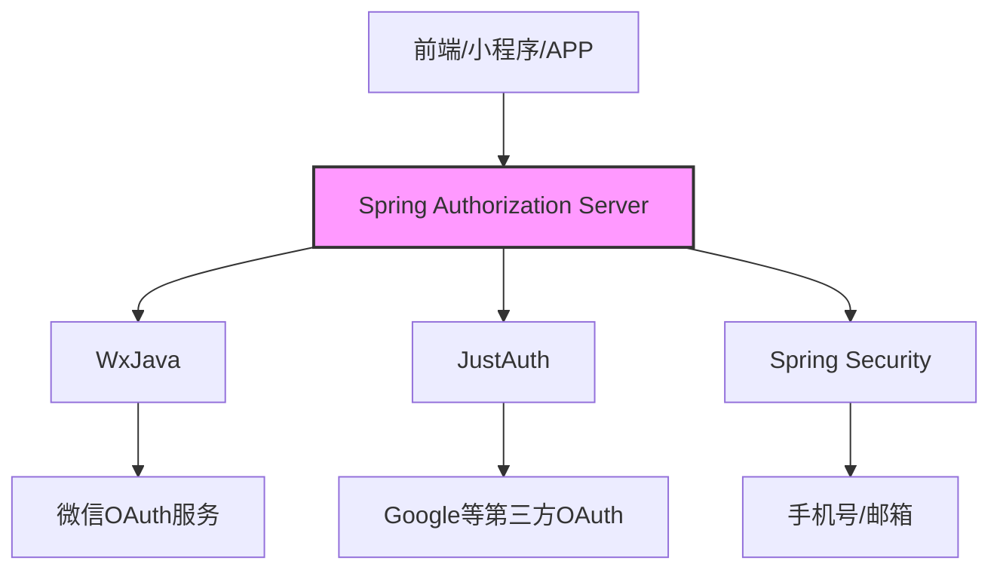
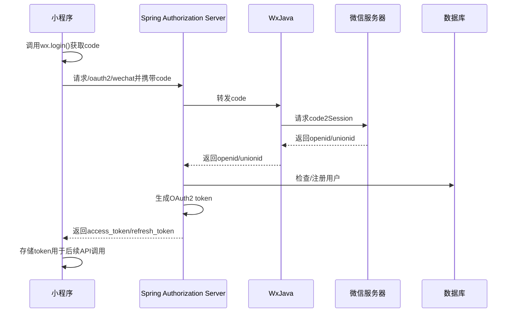
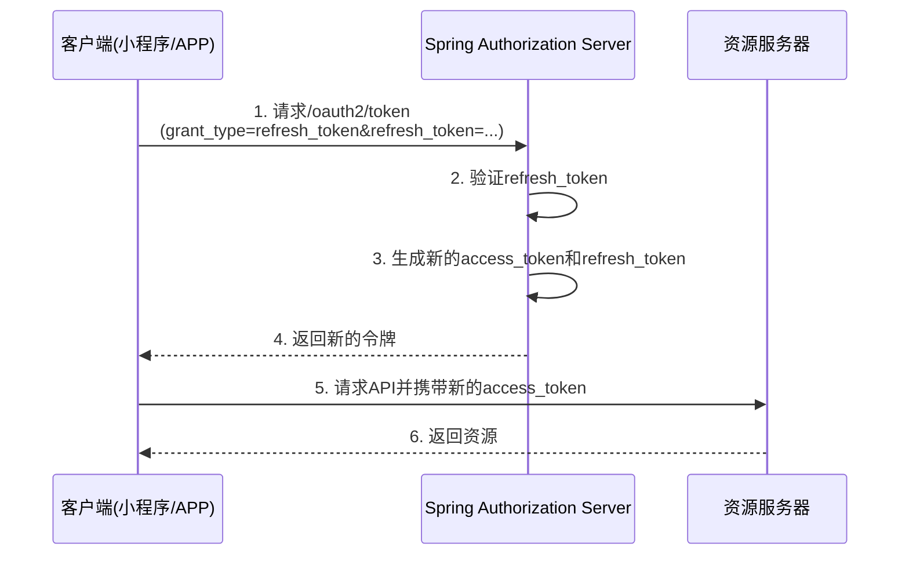
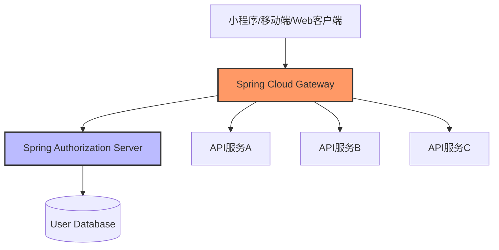

# 微信登录支持

[](https://spring.io/projects/spring-boot)
[](https://github.com/Wechat-Group/WxJava)
[](https://spring.io/projects/spring-authorization-server)


实现一个现代化、可扩展的统一认证体系，支持微信小程序登录（含 UnionID）、手机号、邮箱、Google SSO 等多种登录方式，采用 Spring Authorization Server（SAS）作为认证中心，结合 WxJava 等主流库，实现安全、标准、易扩展的认证架构。

**核心目标**：
- 统一多种登录方式的认证流程和凭证管理
- 采用行业标准 OAuth2.1 和 OpenID Connect 保障安全性
- 支持 UnionID 跨多个微信应用的用户打通
- 灵活支持国际化与本地化的登录需求


## 三、统一认证架构设计

### 1. 推荐架构



**核心组件**：
- **Spring Authorization Server**：OAuth2.1 认证中心，统一颁发与管理 Token
- **WxJava**：对接微信API，处理 code2Session 等微信特有流程
- **JustAuth**：可选组件，便于对接 Google、GitHub 等第三方登录

### 2. 认证流程说明（以微信小程序为例）



1. 前端获取 code，调用 SAS 的 `/oauth2/authorize` 或自定义 `/login/wechat`
2. SAS 调用 WxJava 完成 code2Session，获取 openid/unionid
3. SAS 检查/注册用户，生成 OAuth2 token（access_token/refresh_token）
4. 前端拿到 token，后续所有 API 鉴权都走 SAS 颁发的 token

Google/邮箱/手机号登录同理，统一由 SAS 颁发 token。

### 3. 多方式登录的优势

| 特性 | 描述 | 业务价值 |
|------|------|----------|
| **统一认证中心** | 所有登录方式共用一套认证逻辑和Token体系 | 降低开发维护成本，提高系统可扩展性 |
| **微信UnionID打通** | 支持通过UnionID关联同一用户的多个微信账号 | 实现微信小程序、公众号、App等多平台用户数据打通 |
| **国际化支持** | 集成Google、GitHub等国际化登录方式 | 便于产品出海和国际用户使用 |
| **符合行业标准** | 遵循OAuth2.1和OpenID Connect规范 | 提高安全性，与第三方系统更易集成 |

---

## 四、集成代码示例

### 1. 依赖引入（Maven）

<details open>
<summary><b>点击查看必要依赖</b></summary>

```xml
<!-- Spring Boot Starter -->
<dependency>
  <groupId>org.springframework.boot</groupId>
  <artifactId>spring-boot-starter-web</artifactId>
</dependency>

<!-- Spring Authorization Server -->
<dependency>
  <groupId>org.springframework.boot</groupId>
  <artifactId>spring-boot-starter-oauth2-authorization-server</artifactId>
</dependency>

<!-- Spring Security -->
<dependency>
  <groupId>org.springframework.boot</groupId>
  <artifactId>spring-boot-starter-security</artifactId>
</dependency>

<!-- WxJava 微信小程序 SDK -->
<dependency>
  <groupId>com.github.binarywang</groupId>
  <artifactId>wx-java-miniapp</artifactId>
  <version>4.6.0</version>
</dependency>

<!-- 可选组件 -->
<!-- JustAuth - 第三方登录集成库 -->
<dependency>
  <groupId>me.zhyd.oauth</groupId>
  <artifactId>JustAuth</artifactId>
  <version>1.16.7</version>
</dependency>

<!-- Redis 支持 -->
<dependency>
  <groupId>org.springframework.boot</groupId>
  <artifactId>spring-boot-starter-data-redis</artifactId>
</dependency>
```
</details>

### 2. WxJava 配置

```java
@Configuration
public class WxMaConfig {
    @Bean
    public WxMaService wxMaService() {
        WxMaDefaultConfigImpl config = new WxMaDefaultConfigImpl();
        config.setAppid("你的appid");
        config.setSecret("你的secret");
        return new WxMaServiceImpl(config);
    }
}
```

### 3. 微信小程序认证适配器

<details open>
<summary><b>自定义微信认证Token类</b></summary>

```java
/**
 * 微信小程序认证Token，用于标识微信登录请求
 */
public class WechatMiniProgramAuthenticationToken extends AbstractAuthenticationToken {
    private final String code;  // 微信返回的code
    private Object principal;  // 通常是openid或用户对象

    /**
     * 未验证的构造函数，仅包含code
     */
    public WechatMiniProgramAuthenticationToken(String code) {
        super(null);
        this.code = code;
        setAuthenticated(false);
    }
    
    /**
     * 已验证的构造函数，包含用户信息和权限
     */
    public WechatMiniProgramAuthenticationToken(Object principal, String code, 
            Collection<? extends GrantedAuthority> authorities) {
        super(authorities);
        this.code = code;
        this.principal = principal;
        setAuthenticated(true);
    }
    
    @Override
    public Object getCredentials() {
        return this.code;
    }

    @Override
    public Object getPrincipal() {
        return this.principal;
    }
}
```
</details>

<details open>
<summary><b>微信小程序认证提供者</b></summary>

```java
/**
 * 微信小程序登录认证提供者
 * 负责处理微信code换取openid的过程
 */
@Service
public class WechatMiniProgramAuthProvider implements AuthenticationProvider {
    @Autowired
    private WxMaService wxMaService;
    
    @Autowired
    private UserService userService; // 你自己的用户服务

    @Override
    public Authentication authenticate(Authentication authentication) throws AuthenticationException {
        // 获取微信传来的code
        String code = (String) authentication.getCredentials();
        if (StringUtils.isEmpty(code)) {
            throw new BadCredentialsException("微信code不能为空");
        }
        
        try {
            // 调用微信API获取openid和unionid
            WxMaJscode2SessionResult session = wxMaService.getUserService().getSessionInfo(code);
            String openid = session.getOpenid();
            String unionid = session.getUnionid();
            String sessionKey = session.getSessionKey();
            
            // 检查或创建用户
            User user = userService.findOrCreateByOpenidUnionid(openid, unionid);
            
            // 构建用户详情和权限信息
            List<GrantedAuthority> authorities = new ArrayList<>();
            authorities.add(new SimpleGrantedAuthority("ROLE_USER"));
            
            // 可选存储sessionKey到Redis，用于后续加密数据解密
            // redisTemplate.opsForValue().set("wx:session:" + openid, sessionKey, 7, TimeUnit.DAYS);
            
            // 返回已认证的对象
            return new WechatMiniProgramAuthenticationToken(user, code, authorities);
        } catch (WxErrorException e) {
            throw new AuthenticationServiceException("微信认证失败: " + e.getMessage(), e);
        }
    }

    @Override
    public boolean supports(Class<?> authentication) {
        return WechatMiniProgramAuthenticationToken.class.isAssignableFrom(authentication);
    }
}
```
</details>

### 4. 安全配置与自定义认证组件集成

<details open>
<summary><b>完整的SecurityConfig配置</b></summary>

```java
@Configuration
@EnableWebSecurity
public class SecurityConfig {
    
    @Autowired
    private WechatMiniProgramAuthProvider wechatMiniProgramAuthProvider;

    /**
     * 配置安全过滤链
     */
    @Bean
    public SecurityFilterChain defaultSecurityFilterChain(HttpSecurity http) throws Exception {
        http
            // 注册微信认证提供者
            .authenticationProvider(wechatMiniProgramAuthProvider)
            
            // 禁用CSRF，因为我们使用的是JWT/OAuth2 Token
            .csrf().disable()
            
            // 允许匿名访问登录端点
            .authorizeRequests()
                .antMatchers("/oauth2/wechat", "/oauth2/token").permitAll()
                .anyRequest().authenticated()
            
            // 添加微信登录过滤器（可选）
            .and()
            .addFilterBefore(
                new WechatAuthenticationFilter("/oauth2/wechat", authenticationManager),
                UsernamePasswordAuthenticationFilter.class
            )
            
            // 如需要支持表单登录，可以配置表单登录
            .formLogin()
                .loginProcessingUrl("/oauth2/login")
                .permitAll();
            
        return http.build();
    }
    
    /**
     * 密码编码器配置，用于加密密码和OAuth2客户端密钥
     */
    @Bean
    public PasswordEncoder passwordEncoder() {
        return new BCryptPasswordEncoder();
    }
}
```
</details>

<details>
<summary><b>可选：微信认证过滤器</b></summary>

```java
/**
 * 微信认证过滤器，拦截微信登录请求并创建Token
 */
public class WechatAuthenticationFilter extends AbstractAuthenticationProcessingFilter {

    public WechatAuthenticationFilter(String defaultFilterProcessesUrl, AuthenticationManager authManager) {
        super(defaultFilterProcessesUrl);
        setAuthenticationManager(authManager);
    }

    @Override
    public Authentication attemptAuthentication(HttpServletRequest request,
                                               HttpServletResponse response) {
        // 获取微信code
        String code = request.getParameter("code");
        if (code == null) {
            throw new AuthenticationServiceException("微信code不能为空");
        }
        
        // 创建未认证的Token
        WechatMiniProgramAuthenticationToken authRequest = new WechatMiniProgramAuthenticationToken(code);
        
        // 允许子类设置详细属性
        setDetails(request, authRequest);
        
        // 将认证请求交给AuthenticationManager处理
        return this.getAuthenticationManager().authenticate(authRequest);
    }

    protected void setDetails(HttpServletRequest request, WechatMiniProgramAuthenticationToken authRequest) {
        authRequest.setDetails(authenticationDetailsSource.buildDetails(request));
    }
}
```
</details>

### 5. 其他登录方式集成

<details>
<summary><b>Google 认证集成</b></summary>

```yaml
# application.yml 配置示例

spring:
  security:
    oauth2:
      client:
        registration:
          google:
            client-id: ${GOOGLE_CLIENT_ID}
            client-secret: ${GOOGLE_CLIENT_SECRET}
            scope:
              - email
              - profile
```

```java
@Configuration
public class GoogleOAuth2SecurityConfig {

    @Bean
    public OAuth2UserService<OAuth2UserRequest, OAuth2User> oauth2UserService(UserService userService) {
        DefaultOAuth2UserService delegate = new DefaultOAuth2UserService();
        
        return request -> {
            OAuth2User oauth2User = delegate.loadUser(request);
            
            // 提取用户信息
            String email = oauth2User.getAttribute("email");
            String name = oauth2User.getAttribute("name");
            String sub = oauth2User.getAttribute("sub"); // Google的唯一ID
            
            // 查找或创建用户
            User user = userService.findOrCreateByEmail(email, sub);
            
            // 加入自定义属性
            Map<String, Object> attributes = new HashMap<>(oauth2User.getAttributes());
            attributes.put("user_id", user.getId());
            
            return new DefaultOAuth2User(
                    oauth2User.getAuthorities(),
                    attributes,
                    "sub"
            );
        };
    }
}
```
</details>

<details>
<summary><b>手机号登录集成</b></summary>

```java
/**
 * 手机号验证码登录认证提供者
 */
@Service
public class PhoneAuthenticationProvider implements AuthenticationProvider {

    @Autowired
    private UserService userService;
    
    @Autowired
    private RedisTemplate<String, String> redisTemplate;

    @Override
    public Authentication authenticate(Authentication authentication) {
        String phone = (String) authentication.getPrincipal();
        String code = (String) authentication.getCredentials();
        
        // 从 Redis 中获取发送的验证码
        String cacheKey = "sms:code:" + phone;
        String cacheCode = redisTemplate.opsForValue().get(cacheKey);
        
        if (cacheCode == null || !cacheCode.equals(code)) {
            throw new BadCredentialsException("验证码错误或已过期");
        }
        
        // 验证通过后删除验证码
        redisTemplate.delete(cacheKey);
        
        // 查找或创建用户
        User user = userService.findOrCreateByPhone(phone);
        
        List<GrantedAuthority> authorities = new ArrayList<>();
        authorities.add(new SimpleGrantedAuthority("ROLE_USER"));
        
        return new UsernamePasswordAuthenticationToken(user, null, authorities);
    }

    @Override
    public boolean supports(Class<?> authentication) {
        return PhoneAuthenticationToken.class.isAssignableFrom(authentication);
    }
}
```
</details>

---

## 五、现成库与工具推荐

### 1. 核心组件

| 库名称 | 版本 | 用途 | 文档链接 |
|---------|------|------|--------|
| **Spring Authorization Server** | 0.4.0+ | OAuth2.1 认证服务器 | [官方文档](https://docs.spring.io/spring-authorization-server/docs/current/reference/html/) |
| **WxJava** | 4.6.0+ | 微信开发Java SDK | [官方文档](https://github.com/Wechat-Group/WxJava) |
| **Spring Security** | 5.7+ | 安全框架 | [官方文档](https://docs.spring.io/spring-security/reference/index.html) |

### 2. 可选组件

| 库名称 | 版本 | 用途 | 文档链接 |
|---------|------|------|--------|
| **JustAuth** | 1.16.0+ | 第三方登录集成库 | [官方文档](https://justauth.wiki/) |
| **Spring Security OAuth2 Client** | 5.7+ | OAuth2 客户端 | [官方文档](https://docs.spring.io/spring-security/reference/servlet/oauth2/client/index.html) |

### 3. 云服务选项

如果需要快速集成或者无法自建服务，可以考虑以下云服务：

- **Authing**：国内领先的身份认证平台，支持微信/Google/手机号/邮箱/企业微信等多种身份源  
  [官方网站](https://authing.cn/)  
  [文档中心](https://docs.authing.cn/v2/)

- **FusionAuth**：国际化的身份解决方案，有免费开源版本  
  [官方网站](https://fusionauth.io/)  
  [微信集成文档](https://fusionauth.io/docs/v1/tech/identity-providers/wechat/)

- **Auth0**：国际知名的身份平台，适合国际化产品  
  [官方网站](https://auth0.com/)

---

## 六、最佳实践建议

### 1. 核心原则

<div style="background-color: #f8f9fa; padding: 15px; border-radius: 5px; margin-bottom: 20px;">
<p>以下原则可确保您的微信登录集成方案安全、可扩展并符合行业最佳实践：</p>

<ul>
<li><b>统一认证中心</b>：采用 Spring Authorization Server，支持 OAuth2.1/OpenID Connect 标准</li>
<li><b>专业集成库</b>：微信登录使用 WxJava，支持 UnionID、手机号、敏感数据解密等</li>
<li><b>多渠道整合</b>：其他第三方登录使用 JustAuth 或 Spring Security OAuth2 Client</li>
<li><b>双令牌机制</b>：采用 access_token + refresh_token 双 token 模式，提升安全性</li>
</ul>
</div>
### 2. 双 Token 模式实现

<details open>
<summary><b>双 Token机制设计</b></summary>

#### 什么是双 Token模式？

<div style="background-color: #f5f5ff; padding: 15px; border-left: 4px solid #5b69bc; margin: 10px 0;">
双 Token模式是 OAuth2 中的最佳实践，用于提高安全性和用户体验：

- <b>短期 access_token</b>：通常只有几分钟或几小时有效期，用于访问受保护资源
- <b>长期 refresh_token</b>：通常有效期 7-30 天，并且只能用于获取新的 access_token
</div>

#### 为什么需要双 Token模式？

- 高安全性：缩短 access_token 生命周期将降低令牌被盗用的风险
- 无感刷新：用户无需重新登录即可获取新的 access_token
- 支持令牌撤销：通过将 refresh_token 置为不可重用，可实现全局会话管理

</details>

<details open>
<summary><b>Spring Authorization Server 配置示例</b></summary>

```java
@Configuration
public class TokenConfig {
    @Autowired
    private PasswordEncoder passwordEncoder;
    
    @Bean
    public RegisteredClientRepository registeredClientRepository() {
        RegisteredClient client = RegisteredClient.withId(UUID.randomUUID().toString())
                .clientId("your-client-id")
                .clientSecret(passwordEncoder.encode("your-client-secret"))
                .authorizationGrantType(AuthorizationGrantType.PASSWORD)
                .authorizationGrantType(AuthorizationGrantType.REFRESH_TOKEN)
                .scope(OidcScopes.OPENID)
                .tokenSettings(TokenSettings.builder()
                        // 短期访问令牌 (30分钟)
                        .accessTokenTimeToLive(Duration.ofMinutes(30))    
                        // 长期刷新令牌 (14天)
                        .refreshTokenTimeToLive(Duration.ofDays(14))      
                        // 关键设置：刷新令牌不可重用，每次刷新都会生成新的refresh_token
                        .reuseRefreshTokens(false)                        
                        .build())
                .build();
        return new InMemoryRegisteredClientRepository(client);
    }
}
```
</details>

<details open>
<summary><b>安全最佳实践</b></summary>

#### 刷新流程



#### 安全注意事项

- 存储刷新 Token 时必须加密（如 Redis 加密存储）
- 启用 `reuseRefreshTokens=false` 防止刷新令牌重放攻击
- 考虑使用 JTI (令牌标识符) 跟踪并支持令牌撤销
- 根据安全需求调整 Token 有效期，更敏感的系统应缩短 access_token 生命周期

</details>
### 3. 用户信息数据库设计

<details open>
<summary><b>用户信息表设计的关键思考</b></summary>

#### 设计原则

多渠道用户模型必须计划这些身份标识的处理方式：

- 微信小程序的 <b>openid</b> （每个小程序唯一）
- 微信生态系统的 <b>unionid</b> （一个微信账号在多个应用下的统一标识）
- <b>手机号</b> （全球标准的用户标识）
- <b>邮箱</b> （全球标准的用户标识）

#### 数据模型目标

- 能够支持多种身份标识和登录渠道
- 支持用户身份打通，便于一个微信号、多渠道登录映射到同一用户
- 保证符合安全最佳实践如密码存储和设计原则

</details>

<details open>
<summary><b>SQL 表结构设计示例</b></summary>

```sql
CREATE TABLE user_account (
  id BIGINT PRIMARY KEY AUTO_INCREMENT COMMENT '用户主键',
  openid VARCHAR(64) COMMENT '微信小程序Δ公众号的openid',
  unionid VARCHAR(64) COMMENT '微信平台统一的unionid',
  phone VARCHAR(20) COMMENT '手机号',
  email VARCHAR(100) COMMENT '邮箱',
  nickname VARCHAR(50) COMMENT '昵称',
  avatar_url VARCHAR(255) COMMENT '头像地址',
  password VARCHAR(255) COMMENT '哈希密码，仅用于邮箱/手机号密码登录',
  last_login_time DATETIME COMMENT '最近登录时间',
  last_login_ip VARCHAR(50) COMMENT '最近登录IP',
  status TINYINT(1) DEFAULT 1 COMMENT '状态(0:禁用, 1:正常)',
  created_at DATETIME NOT NULL COMMENT '创建时间',
  updated_at DATETIME NOT NULL COMMENT '更新时间',
  
  -- 唯一索引
  UNIQUE KEY idx_openid (openid),
  UNIQUE KEY idx_unionid (unionid),
  UNIQUE KEY idx_phone (phone),
  UNIQUE KEY idx_email (email),
  
  -- 普通索引
  KEY idx_created_at (created_at)
) ENGINE=InnoDB DEFAULT CHARSET=utf8mb4 COMMENT='用户信息表';
```

</details>

<details open>
<summary><b>JPA 实体类设计</b></summary>

```java
@Entity
@Table(name = "user_account")
@EntityListeners(AuditingEntityListener.class)
public class UserAccount implements Serializable {
    
    @Id
    @GeneratedValue(strategy = GenerationType.IDENTITY)
    private Long id;
    
    // 微信标识
    @Column(unique = true)
    private String openid;
    
    @Column(unique = true)
    private String unionid;
    
    // 其他登录标识
    @Column(unique = true)
    private String phone;
    
    @Column(unique = true)
    private String email;
    
    // 用户信息
    private String nickname;
    private String avatarUrl;
    private String password;  // 经过哈希的密码
    
    // 登录相关
    private LocalDateTime lastLoginTime;
    private String lastLoginIp;
    private Boolean status = true;
    
    // 审计字段
    @CreatedDate
    @Column(nullable = false, updatable = false)
    private LocalDateTime createdAt;
    
    @LastModifiedDate
    @Column(nullable = false)
    private LocalDateTime updatedAt;
    
    // Getters and Setters
}
```

</details>

<details open>
<summary><b>用户身份管理最佳实践</b></summary>

#### 多标识绑定核心逻辑

```java
@Service
public class UserService {
    
    @Autowired
    private UserRepository userRepository;
    
    /**
     * 微信小程序登录时查找或创建用户
     */
    @Transactional
    public UserAccount findOrCreateByWechat(String openid, String unionid) {
        // 1. 先通过 openid 查找
        UserAccount user = userRepository.findByOpenid(openid);
        if (user != null) {
            return user;
        }
        
        // 2. 如果有unionid，再通过unionid查找
        if (unionid != null && !unionid.isEmpty()) {
            user = userRepository.findByUnionid(unionid);
            if (user != null) {
                // 将该openid关联到该账号
                user.setOpenid(openid);
                return userRepository.save(user);
            }
        }
        
        // 3. 创建新用户
        user = new UserAccount();
        user.setOpenid(openid);
        user.setUnionid(unionid);
        user.setStatus(true);
        return userRepository.save(user);
    }
    
    /**
     * 手机号登录时查找或创建用户
     */
    @Transactional
    public UserAccount findOrCreateByPhone(String phone) {
        // 实现同上，优先级：手机号 > unionid > openid
    }
}
```

#### 实际应用策略

- **新用户注册**：用户首次使用微信登录或手机号登录时，根据标识查找或创建用户
- **账号关联**：用户已登录状态下，可增加逻辑允许关联其他登录方式
- **标识优先级**：建议优先级为手机号 > unionid > openid > 邮箱，有利于账号整合
- **自助管理**：提供绑定/解绑接口让用户自行管理登录方式

</details>
### 4. 微服务架构下的认证方案

<details open>
<summary><b>微服务架构下的权限设计</b></summary>

<div style="background-color: #f5fff5; padding: 15px; border-left: 4px solid #28a745; margin: 10px 0;">
微服务架构中，将认证与授权统一管理是关键挑战。Spring Authorization Server 结合 Spring Cloud Gateway 是理想的解决方案。
</div>

#### 微服务架构示意图



#### 关键组件说明

- **API 网关**：使用 Spring Cloud Gateway 作为统一入口
- **认证中心**：单独部署 Spring Authorization Server 服务
- **微服务**：纯尚业务服务，不包含认证逻辑
</details>

<details open>
<summary><b>Spring Cloud Gateway 配置示例</b></summary>

```yaml
spring:
  cloud:
    gateway:
      routes:
        # 认证服务路由
        - id: auth-service
          uri: lb://auth-service
          predicates:
            - Path=/oauth2/**
          filters:
            - StripPrefix=0
        
        # 用户服务路由
        - id: user-service
          uri: lb://user-service
          predicates:
            - Path=/api/users/**
          filters:
            - StripPrefix=1
            - name: TokenRelay
            - name: RequestRateLimiter
              args:
                redis-rate-limiter.replenishRate: 10
                redis-rate-limiter.burstCapacity: 20
        
        # 其他业务服务...

      default-filters:
        - name: Retry
          args:
            retries: 3
            statuses: BAD_GATEWAY
        - AddResponseHeader=X-Response-By, Spring Cloud Gateway
```
</details>

<details>
<summary><b>微服务架构下的认证最佳实践</b></summary>

1. **集中式认证**：所有认证都由 Spring Authorization Server 处理

2. **Token 传递**：使用 TokenRelay 过滤器将令牌传递给下游服务

3. **秘钥管理**：使用 JWK (与微服务共享的 JSON Web Key) 验证令牌

4. **上下文传递**：将用户信息嵌入令牌，避免服务间多次查询数据库

5. **缓存优化**：使用 Redis 缓存常用的用户信息和令牌等

```java
// 资源服务中的 JWT 验证配置示例
@Configuration
public class ResourceServerConfig {

    @Bean
    public SecurityFilterChain securityFilterChain(HttpSecurity http) throws Exception {
        http
            .authorizeRequests(authorize -> authorize
                .anyRequest().authenticated()
            )
            .oauth2ResourceServer(oauth2 -> oauth2
                .jwt(jwt -> jwt
                    .jwkSetUri("http://auth-service/.well-known/jwks.json")
                )
            );
        return http.build();
    }
}
```
</details>

### 5. 国际化与企业需求

<details>
<summary><b>国际化与多区域支持</b></summary>

如果您的应用需要面向国际市场或需要尽快上线，可考虑以下方案：

- **第三方认证云服务**：使用 Authing、FusionAuth 或 Auth0 等云服务
- **多区域部署**：在不同地区部署认证服务和全球负载均衡
- **协议标准化**：由于连接企业内部通常需要 SAML 等协议，认证系统需支持多协议

例如，引入 Authing 可以快速支持：
- 微信、企业微信等国内身份源
- Google、GitHub、Facebook 等国际身份源
- SAML、OIDC、LDAP 等企业身份源
</details>

---

## 七、官方文档与资源

### 1. 微信开发资料

| 资源名称 | 说明 | 链接 |
|---------|------|--------|
| 微信小程序登录 | 官方文档 | [点击查看](https://developers.weixin.qq.com/miniprogram/dev/framework/open-ability/login.html) |
| UnionID 机制说明 | 如何打通微信平台的用户数据 | [点击查看](https://developers.weixin.qq.com/miniprogram/dev/framework/open-ability/union-id.html) |
| 会话密钥加解密 | 敏感数据解密方案 | [点击查看](https://developers.weixin.qq.com/miniprogram/dev/framework/open-ability/signature.html) |
| WxJava | Java SDK | [点击查看](https://github.com/Wechat-Group/WxJava) |

### 2. Spring 生态系统

| 资源名称 | 说明 | 链接 |
|---------|------|--------|
| Spring Authorization Server | 官方文档 | [点击查看](https://docs.spring.io/spring-authorization-server/docs/current/reference/html/) |
| Spring Security | 安全框架 | [点击查看](https://docs.spring.io/spring-security/reference/index.html) |
| Spring Cloud Gateway | API 网关 | [点击查看](https://docs.spring.io/spring-cloud-gateway/docs/current/reference/html/) |
| OAuth2 Client | 客户端集成 | [点击查看](https://docs.spring.io/spring-security/reference/servlet/oauth2/client/index.html) |

### 3. 协议和标准

| 资源名称 | 说明 | 链接 |
|---------|------|--------|
| OAuth2.1 | 最新授权框架标准 | [点击查看](https://oauth.net/2.1/) |
| OpenID Connect | 身份层规范 | [点击查看](https://openid.net/connect/) |
| JustAuth | 多平台 OAuth2 登录 | [点击查看](https://justauth.wiki/) |

### 4. 其他解决方案

| 资源名称 | 说明 | 链接 |
|---------|------|--------|
| Authing | 中国身份云 | [点击查看](https://docs.authing.cn/v2/guides/login/) |
| FusionAuth | 开源身份解决方案 | [点击查看](https://fusionauth.io/docs/) |
| Auth0 | 专业身份平台 | [点击查看](https://auth0.com/docs/) |

---

## 八、自建 Spring Authorization Server (SAS) + WxJava 支持微信登录的端到端实现

### 1. 关键依赖

```xml
<!-- Spring Authorization Server -->
<dependency>
  <groupId>org.springframework.boot</groupId>
  <artifactId>spring-boot-starter-oauth2-authorization-server</artifactId>
</dependency>
<!-- WxJava -->
<dependency>
  <groupId>com.github.binarywang</groupId>
  <artifactId>wx-java-miniapp</artifactId>
  <version>4.6.0</version>
</dependency>
```

### 2. WxJava 配置

```java
@Configuration
public class WxMaConfig {
    @Bean
    public WxMaService wxMaService() {
        WxMaDefaultConfigImpl config = new WxMaDefaultConfigImpl();
        config.setAppid("你的appid");
        config.setSecret("你的secret");
        return new WxMaServiceImpl(config);
    }
}
```

### 3. 微信小程序登录端点（Controller）

```java
@RestController
@RequestMapping("/oauth2")
public class WechatLoginController {
    @Autowired
    private WxMaService wxMaService;
    @Autowired
    private OAuth2TokenService tokenService; // 你需要实现的token生成逻辑
    @Autowired
    private UserService userService; // 你自己的用户服务

    @PostMapping("/wechat")
    public ResponseEntity<?> wechatLogin(@RequestParam String code) {
        try {
            WxMaJscode2SessionResult session = wxMaService.getUserService().getSessionInfo(code);
            String openid = session.getOpenid();
            String unionid = session.getUnionid();
            // 1. 检查/注册用户
            User user = userService.findOrCreateByOpenidUnionid(openid, unionid);
            // 2. 生成OAuth2 Token
            TokenResponse token = tokenService.createTokenForUser(user);
            return ResponseEntity.ok(token);
        } catch (WxErrorException e) {
            return ResponseEntity.status(HttpStatus.UNAUTHORIZED).body("微信登录失败: " + e.getMessage());
        }
    }
}
```

### 4. OAuth2 Token 生成逻辑（示例）

```java
@Service
public class OAuth2TokenService {
    @Autowired
    private AuthorizationServerTokenServices tokenServices;
    @Autowired
    private ClientDetailsService clientDetailsService;

    public TokenResponse createTokenForUser(User user) {
        // 构造OAuth2请求
        Map<String, String> requestParameters = new HashMap<>();
        String clientId = "your-client-id";
        Set<String> scopes = new HashSet<>(Arrays.asList("openid"));
        TokenRequest tokenRequest = new TokenRequest(requestParameters, clientId, scopes, "password");
        OAuth2Request oAuth2Request = tokenRequest.createOAuth2Request(clientDetailsService.loadClientByClientId(clientId));
        UsernamePasswordAuthenticationToken authenticationToken = new UsernamePasswordAuthenticationToken(user, null, user.getAuthorities());
        OAuth2Authentication authentication = new OAuth2Authentication(oAuth2Request, authenticationToken);
        OAuth2AccessToken token = tokenServices.createAccessToken(authentication);
        return new TokenResponse(token.getValue(), token.getRefreshToken().getValue(), token.getExpiresIn());
    }
}
```

### 5. 用户服务（核心逻辑）

```java
@Service
public class UserService {
    @Autowired
    private UserRepository userRepository;

    public User findOrCreateByOpenidUnionid(String openid, String unionid) {
        User user = userRepository.findByOpenid(openid);
        if (user == null && unionid != null) {
            user = userRepository.findByUnionid(unionid);
        }
        if (user == null) {
            user = new User();
            user.setOpenid(openid);
            user.setUnionid(unionid);
            userRepository.save(user);
        }
        return user;
    }
}
```

### 6. SAS 配置（关键配置）

```java
@Configuration
public class AuthorizationServerConfig {
    @Bean
    public RegisteredClientRepository registeredClientRepository() {
        RegisteredClient client = RegisteredClient.withId(UUID.randomUUID().toString())
                .clientId("your-client-id")
                .clientSecret("your-client-secret")
                .authorizationGrantType(AuthorizationGrantType.PASSWORD)
                .authorizationGrantType(AuthorizationGrantType.REFRESH_TOKEN)
                .scope("openid")
                .tokenSettings(TokenSettings.builder()
                        .accessTokenTimeToLive(Duration.ofHours(2))    // Access Token 有效期
                        .refreshTokenTimeToLive(Duration.ofDays(14))      // Refresh Token 有效期
                        .reuseRefreshTokens(false)                        // 刷新 Token 不可重用
                        .build())
                .build();
        return new InMemoryRegisteredClientRepository(client);
    }
    // 其他 SAS 必要配置略，可参考官方文档
}
```

#### 6.1 持久化 RegisteredClient
- **为什么使用持久化？**  
  InMemory 仅适用于开发或测试；生产环境通常需要动态注册、管理与扩展客户端配置。
- **JdbcRegisteredClientRepository 配置示例**：
```java
@Configuration
public class AuthorizationServerJdbcConfig {
    @Bean
    public RegisteredClientRepository registeredClientRepository(DataSource dataSource, PasswordEncoder passwordEncoder) {
        JdbcRegisteredClientRepository repository = new JdbcRegisteredClientRepository(dataSource, new Jackson2RegisteredClientConverter());
        // 启动时可预加载：若表为空，则初始化默认客户端
        if(repository.findByClientId("your-client-id") == null) {
            RegisteredClient client = RegisteredClient.withId(UUID.randomUUID().toString())
                    .clientId("your-client-id")
                    .clientSecret(passwordEncoder.encode("your-client-secret"))
                    .authorizationGrantType(AuthorizationGrantType.PASSWORD)
                    .authorizationGrantType(AuthorizationGrantType.REFRESH_TOKEN)
                    .scope(OidcScopes.OPENID)
                    .tokenSettings(TokenSettings.builder()
                            .accessTokenTimeToLive(Duration.ofMinutes(30))
                            .refreshTokenTimeToLive(Duration.ofDays(14))
                            .reuseRefreshTokens(false)
                            .build())
                    .build();
            repository.save(client);
        }
        return repository;
    }
}
```
- **数据库表结构 DDL（示例）**：  
  以下脚本基于官方 `oauth2-authorization-schema.sql`，将自动创建 `oauth2_registered_client` 表。
```sql
CREATE TABLE IF NOT EXISTS oauth2_registered_client (
    id VARCHAR(100) PRIMARY KEY,
    client_id VARCHAR(100) NOT NULL,
    client_id_issued_at TIMESTAMP,
    client_secret VARCHAR(200),
    client_secret_expires_at TIMESTAMP,
    client_name VARCHAR(200),
    client_authentication_methods VARCHAR(100),
    authorization_grant_types VARCHAR(100),
    redirect_uris VARCHAR(1000),
    scopes VARCHAR(1000),
    client_settings VARCHAR(2000),
    token_settings VARCHAR(2000),
    UNIQUE (client_id)
);
```

#### 6.2 RegisteredClient 字段说明  
- **内部 ID (`id`)**：  
  - 使用 `UUID.randomUUID().toString()` 生成，作为主键存储在 `oauth2_registered_client.id`，不对外暴露。  
- **clientId**：  
  - OAuth2 客户端的唯一标识，用于用户授权、Token 请求时携带（相当于应用账号）。  
  - 需与前端或调用方（如小程序、移动端、Web 应用）保持一致。  
  - **与微信 Appid 区别**：微信小程序登录所用的 `appid`/`secret` 配置在 `WxMaConfig`，用于调用微信接口；而 SAS `clientId` 是 OAuth2 客户端的标识，两者互不冲突。  
- **clientSecret**：  
  - OAuth2 客户端的机密，用于 Token 请求时进行客户端认证。  
  - 建议使用 `PasswordEncoder` 加密后存储，如 `passwordEncoder.encode(...)`。  
- **scope**：  
  - 授权范围，如 `openid`, `profile`, `email` 等，决定 Token 的权限。  
- **authorizationGrantType**：  
  - 支持的授权类型，如 `PASSWORD`, `REFRESH_TOKEN`, `AUTHORIZATION_CODE` 等。  
  
### Google SSO 示例  
如果要支持 Google 登录，需要在 Google Cloud Console 创建 OAuth 2.0 Client 后，获取 `clientId`/`clientSecret`，并在 SAS 中注册：  
```java
@Bean
public RegisteredClientRepository registeredClientRepository(DataSource dataSource, PasswordEncoder passwordEncoder) {
    JdbcRegisteredClientRepository repo = new JdbcRegisteredClientRepository(dataSource, new Jackson2RegisteredClientConverter());
    // Google 客户端示例
    if (repo.findByClientId("google-client-id-from-console") == null) {
        RegisteredClient googleClient = RegisteredClient.withId(UUID.randomUUID().toString())
                .clientId("google-client-id-from-console")
                .clientSecret(passwordEncoder.encode("google-client-secret"))
                .clientAuthenticationMethod(ClientAuthenticationMethod.CLIENT_SECRET_BASIC)
                .authorizationGrantType(AuthorizationGrantType.AUTHORIZATION_CODE)
                .redirectUri("https://your-app.com/login/oauth2/code/google")
                .scope(OidcScopes.OPENID)
                .scope("profile")
                .scope("email")
                .clientSettings(ClientSettings.builder().requireAuthorizationConsent(true).build())
                .build();
        repo.save(googleClient);
    }
    return repo;
}
```  
- 配置 Spring Security OAuth2 Client：  
```yaml
spring:
  security:
    oauth2:
      client:
        registration:
          google:
            client-id: google-client-id-from-console
            client-secret: google-client-secret
            scope:
              - openid
              - profile
              - email
        provider:
          google:
            issuer-uri: https://accounts.google.com
```  

继续使用 SAS 统一鉴权，Google 登录后也可获得 `access_token`/`refresh_token` 并调用受保护的资源。

### 7. 前端小程序端调用示例

```js
// 微信小程序端调用自建SAS
wx.login({
  success(res) {
    if (res.code) {
      wx.request({
        url: 'https://your-server.com/oauth2/wechat',
        method: 'POST',
        data: { code: res.code },
        success: function(resp) {
          // resp.data.access_token
          wx.setStorageSync('access_token', resp.data.access_token)
        }
      })
    }
  }
})
```

### 8. 端到端流程说明

1. 小程序端调用 `wx.login()` 获取 code。
2. 前端将 code POST 到 SAS `/oauth2/wechat`。
3. SAS 用 WxJava 调用微信 code2Session，获取 openid/unionid。
4. SAS 检查/注册用户，生成 OAuth2 token。
5. 前端获得 access_token，后续所有 API 鉴权统一使用该 token。

---

> 以上为自建 Spring Authorization Server + WxJava 支持微信登录的端到端实现关键代码及配置说明。实际生产环境需完善安全性、异常处理、用户绑定策略、token 生命周期管理等细节。

