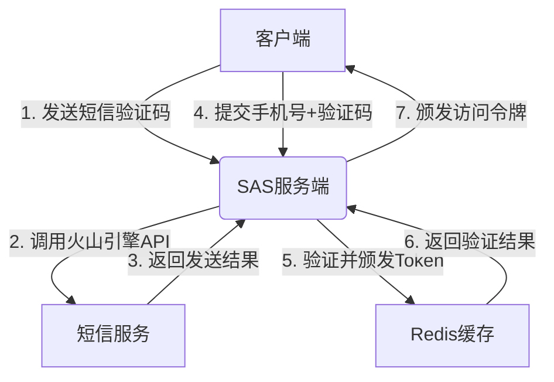

# 基于Spring Authorization Server的短信验证码登录解决方案

本文提供了一个使用Spring Authorization Server (SAS)实现短信验证码登录的详尽指南，以整合"火山引擎"短信服务为例，构建企业级身份认证体系。

## 一、核心架构设计

整体架构遵循OAuth2.1标准流程，通过自定义grant_type实现手机号+验证码的登录认证：



## 二、环境配置

### 1. 依赖管理

```xml
<dependencies>
    <!-- Spring Authorization Server -->
    <dependency>
        <groupId>org.springframework.security</groupId>
        <artifactId>spring-security-oauth2-authorization-server</artifactId>
        <version>1.1.0</version>
    </dependency>
    
    <!-- 火山引擎短信SDK -->
    <dependency>
        <groupId>com.volcengine</groupId>
        <artifactId>volc-sdk-java</artifactId>
        <version>2.8.8</version>
    </dependency>
    
    <!-- Redis支持 -->
    <dependency>
        <groupId>org.springframework.boot</groupId>
        <artifactId>spring-boot-starter-data-redis</artifactId>
    </dependency>
</dependencies>
```

### 2. 火山引擎配置

```yaml
volc:
  sms:
    ak: ${VOLC_AK}
    sk: ${VOLC_SK}
    sign-name: 【AppSign】
    template-code: VT_001
    region: cn-beijing
    endpoint: sms.volcengineapi.com
    expire-time: 300  # 验证码有效期(秒)
```

## 三、自定义授权类型实现

### 1. Grant Type常量定义

```java
public class SecurityConstants {
    // 自定义短信认证grant_type
    public static final String GRANT_TYPE_SMS_CODE = "urn:ietf:params:oauth:grant-type:sms_code";
    // 请求参数名
    public static final String OAUTH_PARAMETER_NAME_PHONE = "phone";
    public static final String OAUTH_PARAMETER_NAME_SMS_CODE = "sms_code";
}
```

### 2. 短信认证Token类

```java
public class SmsCodeAuthenticationToken extends AbstractAuthenticationToken {
    private final Object principal;  // 手机号
    private final String code;       // 验证码
    
    // 未认证构造函数
    public SmsCodeAuthenticationToken(String phone, String code) {
        super(null);
        this.principal = phone;
        this.code = code;
        setAuthenticated(false);
    }
    
    // 已认证构造函数
    public SmsCodeAuthenticationToken(Object principal, 
                                     Collection<? extends GrantedAuthority> authorities) {
        super(authorities);
        this.principal = principal;
        this.code = null;
        super.setAuthenticated(true);
    }
    
    @Override
    public Object getCredentials() {
        return this.code;
    }
    
    @Override
    public Object getPrincipal() {
        return this.principal;
    }
}
```

### 3. 认证请求转换器

```java
@Component
public class SmsCodeAuthenticationConverter implements AuthenticationConverter {
    
    @Override
    public Authentication convert(HttpServletRequest request) {
        // 提取请求参数
        Map<String, String[]> parameterMap = request.getParameterMap();
        String grantType = request.getParameter(OAuth2ParameterNames.GRANT_TYPE);
        
        // 仅处理短信验证码授权类型
        if (!SecurityConstants.GRANT_TYPE_SMS_CODE.equals(grantType)) {
            return null;
        }
        
        // 提取手机号和验证码
        String phone = request.getParameter(SecurityConstants.OAUTH_PARAMETER_NAME_PHONE);
        String code = request.getParameter(SecurityConstants.OAUTH_PARAMETER_NAME_SMS_CODE);
        
        if (StringUtils.isEmpty(phone) || StringUtils.isEmpty(code)) {
            return null;
        }
        
        // 构建认证token
        return new SmsCodeAuthenticationToken(phone, code);
    }
}
```

### 4. 认证逻辑提供者

```java
@Component
public class SmsCodeAuthenticationProvider implements AuthenticationProvider {
    
    @Autowired
    private UserDetailsService userDetailsService;
    
    @Autowired
    private SmsCodeService smsCodeService;

    @Override
    public Authentication authenticate(Authentication authentication) {
        SmsCodeAuthenticationToken authToken = (SmsCodeAuthenticationToken) authentication;
        
        String phone = (String) authToken.getPrincipal();
        String code = (String) authToken.getCredentials();
        
        // 验证码校验
        if (!smsCodeService.validateCode(phone, code)) {
            throw new BadCredentialsException("验证码错误或已过期");
        }
        
        // 加载用户信息
        UserDetails user = userDetailsService.loadUserByUsername(phone);
        if (user == null) {
            throw new UsernameNotFoundException("用户不存在");
        }
        
        // 创建已认证的Token
        SmsCodeAuthenticationToken authenticatedToken = 
            new SmsCodeAuthenticationToken(user, user.getAuthorities());
        authenticatedToken.setDetails(authToken.getDetails());
        
        return authenticatedToken;
    }

    @Override
    public boolean supports(Class<?> authentication) {
        return SmsCodeAuthenticationToken.class.isAssignableFrom(authentication);
    }
}
```

## 四、验证码服务实现

### 1. 短信验证码服务

```java
@Service
public class SmsCodeService {
    @Autowired
    private RedisTemplate<String, String> redisTemplate;
    
    @Autowired
    private VolcSmsSender smsSender;
    
    @Value("${volc.sms.expire-time:300}")
    private int expireSeconds;
    
    private static final String SMS_CODE_PREFIX = "sms:code:";

    /**
     * 生成并发送验证码
     */
    public void sendCode(String mobile) {
        // 生成6位随机验证码
        String code = RandomStringUtils.randomNumeric(6);
        
        // 存储到Redis并设置过期时间
        redisTemplate.opsForValue().set(
            SMS_CODE_PREFIX + mobile,
            code,
            expireSeconds,
            TimeUnit.SECONDS
        );
        
        // 发送短信
        smsSender.sendVerificationCode(mobile, code);
    }

    /**
     * 验证短信验证码（一次性验证）
     */
    public boolean validateCode(String mobile, String code) {
        String key = SMS_CODE_PREFIX + mobile;
        
        // 原子操作：获取并删除验证码
        String storedCode = redisTemplate.execute(new RedisCallback<String>() {
            @Override
            public String doInRedis(RedisConnection connection) {
                byte[] keyBytes = key.getBytes();
                byte[] valueBytes = connection.get(keyBytes);
                
                // 验证后立即删除，防止重复使用
                connection.del(keyBytes);
                
                return valueBytes != null ? new String(valueBytes) : null;
            }
        });
        
        return code != null && code.equals(storedCode);
    }
}
```

### 2. 火山引擎短信发送器

```java
@Service
public class VolcSmsSender {
    @Autowired
    private VolcSmsProperties config;
    
    private final SmsService smsService;
    
    public VolcSmsSender(VolcSmsProperties config) {
        // 初始化火山引擎短信服务
        this.smsService = SmsServiceImpl.getInstance(
            new SmsServiceInfoConfig(config.getAk(), config.getSk())
        );
    }
    
    @Retryable(maxAttempts = 3, backoff = @Backoff(delay = 1000))
    public void sendVerificationCode(String mobile, String code) {
        SmsSendRequest request = new SmsSendRequest()
            .setPhoneNumbers(mobile)
            .setSignName(config.getSignName())
            .setTemplateId(config.getTemplateCode())
            .setTemplateParamMap(Collections.singletonMap("code", code));
        
        SmsSendResponse response = smsService.sendV2(request);
        if (!"OK".equals(response.getCode())) {
            throw new SmsException("短信发送失败: " + response.getMessage());
        }
    }
}
```

## 五、Spring Authorization Server配置

### 1. SAS核心配置

```java
@Configuration
@EnableWebSecurity
public class AuthorizationServerConfig {

    @Autowired
    private PasswordEncoder passwordEncoder;
    
    @Autowired
    private SmsCodeAuthenticationConverter smsCodeAuthenticationConverter;
    
    @Autowired
    private SmsCodeAuthenticationProvider smsCodeAuthenticationProvider;
    
    @Bean
    @Order(Ordered.HIGHEST_PRECEDENCE)
    public SecurityFilterChain authorizationServerSecurityFilterChain(
            HttpSecurity http) throws Exception {
        
        OAuth2AuthorizationServerConfiguration.applyDefaultSecurity(http);
        
        http.getConfigurer(OAuth2AuthorizationServerConfigurer.class)
            // 注册自定义认证转换器
            .tokenEndpoint(tokenEndpoint -> 
                tokenEndpoint.accessTokenRequestConverter(smsCodeAuthenticationConverter))
            // 自定义令牌生成器
            .tokenGenerator(createTokenGenerator());
            
        http.authenticationProvider(smsCodeAuthenticationProvider);
            
        return http.build();
    }
    
    @Bean
    public RegisteredClientRepository registeredClientRepository() {
        RegisteredClient smsClient = RegisteredClient.withId(UUID.randomUUID().toString())
            .clientId("sms-client")
            .clientSecret(passwordEncoder.encode("secret"))
            // 注册自定义授权类型
            .authorizationGrantType(new AuthorizationGrantType(SecurityConstants.GRANT_TYPE_SMS_CODE))
            .authorizationGrantType(AuthorizationGrantType.REFRESH_TOKEN)
            .scope("read")
            .scope("write")
            .tokenSettings(TokenSettings.builder()
                .accessTokenTimeToLive(Duration.ofHours(1))
                .refreshTokenTimeToLive(Duration.ofDays(30))
                .reuseRefreshTokens(true)
                .build())
            .build();
            
        return new InMemoryRegisteredClientRepository(smsClient);
    }
    
    // JWT令牌生成器
    private OAuth2TokenGenerator<? extends OAuth2Token> createTokenGenerator() {
        JwtEncoder jwtEncoder = new NimbusJwtEncoder(jwkSource());
        JwtGenerator jwtGenerator = new JwtGenerator(jwtEncoder);
        OAuth2AccessTokenGenerator accessTokenGenerator = new OAuth2AccessTokenGenerator();
        OAuth2RefreshTokenGenerator refreshTokenGenerator = new OAuth2RefreshTokenGenerator();
        return new DelegatingOAuth2TokenGenerator(
            jwtGenerator, accessTokenGenerator, refreshTokenGenerator);
    }
    
    // 配置JWK源，用于签名JWT
    @Bean
    public JWKSource<SecurityContext> jwkSource() {
        KeyPair keyPair = generateRsaKey();
        RSAPublicKey publicKey = (RSAPublicKey) keyPair.getPublic();
        RSAPrivateKey privateKey = (RSAPrivateKey) keyPair.getPrivate();
        
        RSAKey rsaKey = new RSAKey.Builder(publicKey)
            .privateKey(privateKey)
            .keyID(UUID.randomUUID().toString())
            .build();
            
        JWKSet jwkSet = new JWKSet(rsaKey);
        return (jwkSelector, securityContext) -> jwkSelector.select(jwkSet);
    }
    
    private static KeyPair generateRsaKey() {
        try {
            KeyPairGenerator keyPairGenerator = KeyPairGenerator.getInstance("RSA");
            keyPairGenerator.initialize(2048);
            return keyPairGenerator.generateKeyPair();
        } catch (Exception ex) {
            throw new IllegalStateException(ex);
        }
    }
}
```

### 2. 安全配置

```java
@Configuration
public class SecurityConfig {

    @Bean
    @Order(2)
    public SecurityFilterChain defaultSecurityFilterChain(HttpSecurity http) throws Exception {
        http
            .authorizeHttpRequests(authorize -> authorize
                // 开放短信验证码发送接口
                .antMatchers("/api/sms/send").permitAll()
                .anyRequest().authenticated()
            )
            .csrf().disable()
            .cors().and()
            .formLogin();
            
        return http.build();
    }
    
    @Bean
    public PasswordEncoder passwordEncoder() {
        return new BCryptPasswordEncoder();
    }
}
```

## 六、业务接口实现

### 1. 验证码发送接口

```java
@RestController
@RequestMapping("/api/sms")
public class SmsController {
    
    @Autowired
    private SmsCodeService smsCodeService;
    
    @RateLimiter(name = "smsRateLimiter", fallbackMethod = "sendCodeFallback")
    @PostMapping("/send")
    public ResponseEntity<?> sendCode(@Valid @RequestBody SmsRequest request) {
        try {
            // 发送验证码
            smsCodeService.sendCode(request.getMobile());
            return ResponseEntity.ok(new ApiResponse(true, "验证码已发送"));
        } catch (Exception e) {
            return ResponseEntity.status(HttpStatus.INTERNAL_SERVER_ERROR)
                .body(new ApiResponse(false, "验证码发送失败: " + e.getMessage()));
        }
    }
    
    // 限流降级方法
    public ResponseEntity<?> sendCodeFallback(SmsRequest request, Throwable throwable) {
        return ResponseEntity.status(HttpStatus.TOO_MANY_REQUESTS)
            .body(new ApiResponse(false, "发送频率过高，请稍后再试"));
    }
    
    // 请求体封装
    @Data
    public static class SmsRequest {
        @NotBlank(message = "手机号不能为空")
        @Pattern(regexp = "^1[3-9]\\d{9}$", message = "手机号格式不正确")
        private String mobile;
    }
    
    // 响应体封装
    @Data
    @AllArgsConstructor
    public static class ApiResponse {
        private boolean success;
        private String message;
    }
}
```

## 七、客户端调用示例

### 1. 发送验证码

```http
POST /api/sms/send
Content-Type: application/json

{
  "mobile": "13812345678"
}
```

### 2. 获取令牌

```http
POST /oauth2/token
Content-Type: application/x-www-form-urlencoded

grant_type=urn:ietf:params:oauth:grant-type:sms_code
&phone=13812345678
&sms_code=123456
&client_id=sms-client
&client_secret=secret
```

成功响应：

```json
{
  "access_token": "eyJhbGciOiJSUzI1NiIsInR5cCI6IkpXVCJ9...",
  "token_type": "Bearer",
  "expires_in": 3600,
  "refresh_token": "eyJhbGciOiJSUzI1NiIsInR5cCI6IkpXVCJ9...",
  "scope": "read write"
}
```

## 八、安全增强措施

### 1. 防重放攻击

```java
// 验证码校验（改进版）
public boolean validateCode(String mobile, String code) {
    String key = SMS_CODE_PREFIX + mobile;
    
    // 使用Redis原子操作，避免重放攻击
    Boolean matched = redisTemplate.execute(new RedisCallback<Boolean>() {
        @Override
        public Boolean doInRedis(RedisConnection connection) {
            byte[] keyBytes = key.getBytes();
            byte[] valueBytes = connection.get(keyBytes);
            
            if (valueBytes == null) {
                return false;
            }
            
            boolean isMatch = code.equals(new String(valueBytes));
            
            // 无论验证是否成功，都删除验证码，确保一次性使用
            connection.del(keyBytes);
            
            return isMatch;
        }
    });
    
    return matched != null && matched;
}
```

### 2. 短信轰炸防护

```java
@Configuration
public class RateLimiterConfig {

    @Bean
    public RateLimiter<String> smsRateLimiter(RedisTemplate<String, String> redisTemplate) {
        return new RedisRateLimiter(redisTemplate, "sms:rate:", 60) {
            @Override
            public boolean allow(String key) {
                // 同一手机号1分钟内最多发送1次
                String redisKey = getPrefix() + key;
                Long count = redisTemplate.opsForValue().increment(redisKey);
                
                if (count == 1) {
                    // 设置过期时间
                    redisTemplate.expire(redisKey, getTimeWindow(), TimeUnit.SECONDS);
                }
                
                return count != null && count <= 1;
            }
        };
    }
}
```

### 3. 设备指纹校验

```java
@Service
public class DeviceFingerprintService {

    @Autowired
    private RedisTemplate<String, Object> redisTemplate;
    
    // 同一设备对同一手机号发送验证码的次数限制
    public boolean validateDeviceAndPhone(String deviceId, String phone) {
        String key = "sms:device:" + deviceId + ":" + phone;
        Long count = redisTemplate.opsForValue().increment(key);
        
        // 首次设置过期时间（24小时）
        if (count == 1) {
            redisTemplate.expire(key, 24, TimeUnit.HOURS);
        }
        
        // 每天最多发送5次
        return count != null && count <= 5;
    }
}
```

## 九、性能优化与高可用

### 1. 异步短信发送

```java
@Service
public class AsyncSmsService {

    @Autowired
    private VolcSmsSender smsSender;
    
    @Async("smsExecutor")
    public CompletableFuture<Boolean> sendVerificationCodeAsync(String mobile, String code) {
        try {
            smsSender.sendVerificationCode(mobile, code);
            return CompletableFuture.completedFuture(true);
        } catch (Exception e) {
            log.error("短信发送失败: {}", e.getMessage(), e);
            return CompletableFuture.completedFuture(false);
        }
    }
}

@Configuration
public class AsyncConfig {
    
    @Bean
    public Executor smsExecutor() {
        ThreadPoolTaskExecutor executor = new ThreadPoolTaskExecutor();
        executor.setCorePoolSize(5);
        executor.setMaxPoolSize(10);
        executor.setQueueCapacity(25);
        executor.setThreadNamePrefix("sms-executor-");
        executor.initialize();
        return executor;
    }
}
```

### 2. 熔断保护

```java
@Configuration
public class ResilienceConfig {

    @Bean
    public CircuitBreakerFactory<?, ?> circuitBreakerFactory() {
        // 创建断路器工厂
        SimpleCircuitBreakerFactory circuitBreakerFactory = new SimpleCircuitBreakerFactory();
        
        // 配置断路器
        circuitBreakerFactory.configureDefault(id -> new Resilience4JConfigBuilder(id)
            .circuitBreakerConfig(CircuitBreakerConfig.custom()
                .slidingWindowSize(10)
                .failureRateThreshold(50.0f)
                .waitDurationInOpenState(Duration.ofSeconds(10))
                .permittedNumberOfCallsInHalfOpenState(5)
                .build())
            .build());
            
        return circuitBreakerFactory;
    }
}
```

## 十、最佳实践与注意事项

1. **安全性考虑**：
   - 使用HTTPS加密传输验证码
   - 实施IP黑名单和风控策略
   - 定期轮换JWT签名密钥

2. **性能优化**：
   - Redis集群确保验证码存储高可用
   - 考虑使用本地缓存降级策略
   - 短信发送接口做好限流保护

3. **监控告警**：
   - 监控短信发送成功率
   - 设置验证码使用率阈值告警
   - 关注异常登录行为

4. **合规要求**：
   - 手机号使用加密存储
   - 验证码有效期不超过5分钟
   - 符合相关数据保护法规

## 十一、使用SQL数据库的替代实现

虽然Redis在高频读写的验证码场景中表现优异，但引入额外的缓存中间件会增加系统的复杂性和运维成本。以下提供一个仅使用SQL数据库实现短信验证码登录的替代方案，适合用户量不大的应用场景。

### 1. 数据库表设计

```sql
CREATE TABLE sms_verification_code (
    id BIGINT PRIMARY KEY AUTO_INCREMENT,
    mobile VARCHAR(20) NOT NULL COMMENT '手机号',
    code VARCHAR(10) NOT NULL COMMENT '验证码',
    create_time TIMESTAMP NOT NULL DEFAULT CURRENT_TIMESTAMP COMMENT '创建时间',
    expire_time TIMESTAMP NOT NULL COMMENT '过期时间',
    used BOOLEAN NOT NULL DEFAULT FALSE COMMENT '是否已使用',
    ip_address VARCHAR(50) COMMENT '请求IP',
    device_id VARCHAR(100) COMMENT '设备ID',
    INDEX idx_mobile (mobile),
    INDEX idx_mobile_code (mobile, code),
    INDEX idx_expire_time (expire_time)
) ENGINE=InnoDB DEFAULT CHARSET=utf8mb4 COMMENT='短信验证码';

CREATE TABLE sms_send_record (
    id BIGINT PRIMARY KEY AUTO_INCREMENT,
    mobile VARCHAR(20) NOT NULL COMMENT '手机号',
    send_time TIMESTAMP NOT NULL DEFAULT CURRENT_TIMESTAMP COMMENT '发送时间',
    ip_address VARCHAR(50) COMMENT '请求IP',
    device_id VARCHAR(100) COMMENT '设备ID',
    INDEX idx_mobile (mobile),
    INDEX idx_send_time (send_time)
) ENGINE=InnoDB DEFAULT CHARSET=utf8mb4 COMMENT='短信发送记录';
```

### 2. 验证码服务实现

```java
@Service
@Transactional
public class SqlSmsCodeService {

    @Autowired
    private JdbcTemplate jdbcTemplate;
    
    @Autowired
    private VolcSmsSender smsSender;
    
    @Value("${sms.code.expire-seconds:300}")
    private int expireSeconds;
    
    /**
     * 生成并发送验证码
     */
    public void sendCode(String mobile, String deviceId, String ipAddress) {
        // 检查频率限制
        checkSendFrequency(mobile, deviceId, ipAddress);
        
        // 生成6位随机验证码
        String code = RandomStringUtils.randomNumeric(6);
        
        // 计算过期时间
        LocalDateTime expireTime = LocalDateTime.now().plusSeconds(expireSeconds);
        
        // 存储到数据库
        jdbcTemplate.update(
            "INSERT INTO sms_verification_code (mobile, code, expire_time, ip_address, device_id) VALUES (?, ?, ?, ?, ?)",
            mobile, code, Timestamp.valueOf(expireTime), ipAddress, deviceId
        );
        
        // 记录发送历史
        jdbcTemplate.update(
            "INSERT INTO sms_send_record (mobile, ip_address, device_id) VALUES (?, ?, ?)",
            mobile, ipAddress, deviceId
        );
        
        // 发送短信
        smsSender.sendVerificationCode(mobile, code);
    }
    
    /**
     * 验证短信验证码（一次性验证）
     */
    public boolean validateCode(String mobile, String code) {
        // 使用悲观锁防止并发问题
        return jdbcTemplate.execute(
            (Connection conn) -> {
                try (
                    // 使用FOR UPDATE锁定记录，防止并发验证
                    PreparedStatement ps = conn.prepareStatement(
                        "SELECT id FROM sms_verification_code " +
                        "WHERE mobile = ? AND code = ? AND expire_time > NOW() AND used = FALSE " +
                        "ORDER BY create_time DESC LIMIT 1 FOR UPDATE"
                    )
                ) {
                    ps.setString(1, mobile);
                    ps.setString(2, code);
                    
                    try (ResultSet rs = ps.executeQuery()) {
                        if (rs.next()) {
                            long id = rs.getLong("id");
                            
                            // 标记为已使用
                            try (PreparedStatement updatePs = conn.prepareStatement(
                                "UPDATE sms_verification_code SET used = TRUE WHERE id = ?"
                            )) {
                                updatePs.setLong(1, id);
                                updatePs.executeUpdate();
                                return true;
                            }
                        }
                        return false;
                    }
                }
            }
        );
    }
    
    /**
     * 检查发送频率限制
     */
    private void checkSendFrequency(String mobile, String deviceId, String ipAddress) {
        // 1分钟内同一手机号限制
        int countLastMinute = jdbcTemplate.queryForObject(
            "SELECT COUNT(*) FROM sms_send_record WHERE mobile = ? AND send_time > DATE_SUB(NOW(), INTERVAL 1 MINUTE)",
            Integer.class,
            mobile
        );
        
        if (countLastMinute >= 1) {
            throw new RateLimitExceededException("发送过于频繁，请稍后再试");
        }
        
        // 一小时内同一手机号限制
        int countLastHour = jdbcTemplate.queryForObject(
            "SELECT COUNT(*) FROM sms_send_record WHERE mobile = ? AND send_time > DATE_SUB(NOW(), INTERVAL 1 HOUR)",
            Integer.class,
            mobile
        );
        
        if (countLastHour >= 5) {
            throw new RateLimitExceededException("已达到短信发送限制，请稍后再试");
        }
        
        // 一天内同一设备ID限制
        if (deviceId != null) {
            int countSameDeviceDaily = jdbcTemplate.queryForObject(
                "SELECT COUNT(*) FROM sms_send_record WHERE device_id = ? AND send_time > DATE_SUB(NOW(), INTERVAL 1 DAY)",
                Integer.class,
                deviceId
            );
            
            if (countSameDeviceDaily >= 10) {
                throw new RateLimitExceededException("此设备已达到发送限制");
            }
        }
        
        // IP限制
        if (ipAddress != null) {
            int countSameIp = jdbcTemplate.queryForObject(
                "SELECT COUNT(*) FROM sms_send_record WHERE ip_address = ? AND send_time > DATE_SUB(NOW(), INTERVAL 10 MINUTE)",
                Integer.class,
                ipAddress
            );
            
            if (countSameIp >= 20) {
                throw new RateLimitExceededException("请求过于频繁，请稍后再试");
            }
        }
    }
    
    /**
     * 数据清理任务
     * 建议通过定时任务定期执行，清理过期数据
     */
    @Scheduled(cron = "0 0 3 * * ?") // 每天凌晨3点执行
    public void cleanExpiredCodes() {
        // 清理过期且已使用的验证码(保留7天内的数据用于审计)
        jdbcTemplate.update(
            "DELETE FROM sms_verification_code WHERE " +
            "(expire_time < DATE_SUB(NOW(), INTERVAL 7 DAY) AND used = TRUE) OR " +
            "(expire_time < DATE_SUB(NOW(), INTERVAL 1 DAY) AND used = FALSE)"
        );
        
        // 清理30天前的发送记录
        jdbcTemplate.update(
            "DELETE FROM sms_send_record WHERE send_time < DATE_SUB(NOW(), INTERVAL 30 DAY)"
        );
    }
}
```

### 3. 业务接口调整

```java
@RestController
@RequestMapping("/api/sms")
public class SqlSmsController {
    
    @Autowired
    private SqlSmsCodeService smsCodeService;
    
    @PostMapping("/send")
    public ResponseEntity<?> sendCode(
        @Valid @RequestBody SmsRequest request,
        HttpServletRequest httpRequest
    ) {
        try {
            // 提取设备信息
            String deviceId = extractDeviceId(httpRequest);
            String ipAddress = getClientIp(httpRequest);
            
            // 发送验证码
            smsCodeService.sendCode(request.getMobile(), deviceId, ipAddress);
            return ResponseEntity.ok(new ApiResponse(true, "验证码已发送"));
        } catch (RateLimitExceededException e) {
            return ResponseEntity.status(HttpStatus.TOO_MANY_REQUESTS)
                .body(new ApiResponse(false, e.getMessage()));
        } catch (Exception e) {
            return ResponseEntity.status(HttpStatus.INTERNAL_SERVER_ERROR)
                .body(new ApiResponse(false, "验证码发送失败"));
        }
    }
    
    // 其他代码与RedisTemplate版本相同
}
```

### 4. 认证提供者调整

```java
@Component
public class SqlSmsCodeAuthenticationProvider implements AuthenticationProvider {
    
    @Autowired
    private UserDetailsService userDetailsService;
    
    @Autowired
    private SqlSmsCodeService smsCodeService;

    @Override
    public Authentication authenticate(Authentication authentication) {
        SmsCodeAuthenticationToken authToken = (SmsCodeAuthenticationToken) authentication;
        
        String phone = (String) authToken.getPrincipal();
        String code = (String) authToken.getCredentials();
        
        // 使用SQL数据库验证码校验
        if (!smsCodeService.validateCode(phone, code)) {
            throw new BadCredentialsException("验证码错误或已过期");
        }
        
        // 加载用户信息
        UserDetails user = userDetailsService.loadUserByUsername(phone);
        if (user == null) {
            throw new UsernameNotFoundException("用户不存在");
        }
        
        // 创建已认证的Token
        SmsCodeAuthenticationToken authenticatedToken = 
            new SmsCodeAuthenticationToken(user, user.getAuthorities());
        authenticatedToken.setDetails(authToken.getDetails());
        
        return authenticatedToken;
    }

    @Override
    public boolean supports(Class<?> authentication) {
        return SmsCodeAuthenticationToken.class.isAssignableFrom(authentication);
    }
}
```

### 5. SQL实现方案的优缺点分析

#### 优点

1. **简化基础设施**：不需要额外维护Redis服务，减少部署复杂度和运维成本
2. **数据持久化**：验证码记录默认持久化存储，方便审计和问题排查
3. **事务一致性**：可以与业务数据库使用同一事务，确保数据一致性
4. **低使用门槛**：大多数项目已有关系型数据库，无需学习新技术
5. **容量规划简单**：不需要额外考虑缓存容量和内存占用

#### 缺点

1. **性能较低**：对于高频验证场景，SQL数据库的读写性能不如Redis
2. **连接数压力**：短信验证会增加数据库连接数和负载
3. **死锁风险**：并发验证时可能出现行锁等待和死锁
4. **扩展性限制**：在超大规模应用场景下，水平扩展比Redis复杂

#### 适用场景

- **中小规模应用**：日活用户在10万以下的应用
- **验证频率不高**：登录验证场景，而非高频业务验证
- **资源受限环境**：无法额外部署Redis等缓存服务的场景
- **追求部署简单性**：希望减少技术栈复杂度的场景

### 6. 性能优化建议

对于使用SQL数据库实现的短信验证码服务，以下优化措施可以提升性能：

1. **索引优化**：确保mobile、code、expire_time字段有适当的索引
2. **连接池调优**：增加数据库连接池大小，应对验证码发送高峰
3. **批量清理**：分批次清理过期数据，避免长事务
4. **读写分离**：验证码查询可以走从库，减轻主库压力
5. **表分区**：按时间或手机号范围对表进行分区，提升查询效率
6. **本地缓存**：对于极端场景，可以增加应用级别的短期内存缓存

```java
// 使用本地缓存优化的验证码服务示例
@Service
public class OptimizedSqlSmsCodeService extends SqlSmsCodeService {
    
    // 通过Caffeine实现的本地缓存，仅缓存30秒，用于应对短时间内的验证洪峰
    private Cache<String, Boolean> recentValidationCache = Caffeine.newBuilder()
        .expireAfterWrite(30, TimeUnit.SECONDS)
        .maximumSize(10_000)
        .build();
    
    @Override
    public boolean validateCode(String mobile, String code) {
        // 缓存键
        String cacheKey = mobile + ":" + code;
        
        // 检查是否最近验证过(防止重放)
        Boolean usedRecently = recentValidationCache.getIfPresent(cacheKey);
        if (Boolean.TRUE.equals(usedRecently)) {
            return false;
        }
        
        // 调用数据库验证
        boolean valid = super.validateCode(mobile, code);
        
        // 如果验证成功，加入本地缓存防止重放
        if (valid) {
            recentValidationCache.put(cacheKey, true);
        }
        
        return valid;
    }
}
```

通过以上方案，可以在不引入Redis的情况下，使用纯SQL数据库实现短信验证码服务，满足中小规模应用的需求。

## 结论

本方案通过整合Spring Authorization Server与"火山引擎"短信服务，提供了完整的短信验证码登录解决方案。采用OAuth2.1标准的自定义grant_type实现，可与现有认证体系无缝集成，同时提供高安全性和可扩展性。

系统设计重点关注了验证码防重放、短信轰炸防护等安全场景，并针对高并发场景进行了性能优化，可满足企业级应用的身份认证需求。

无论选择Redis还是SQL数据库作为验证码存储方案，都应根据项目实际情况和用户规模做出权衡，避免过度设计或性能瓶颈。
